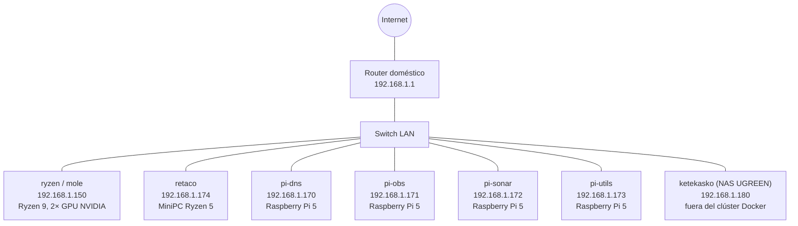
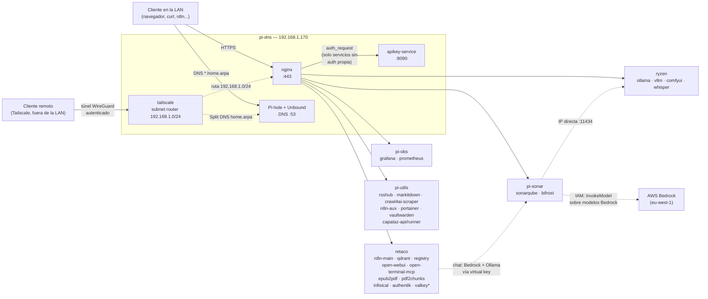
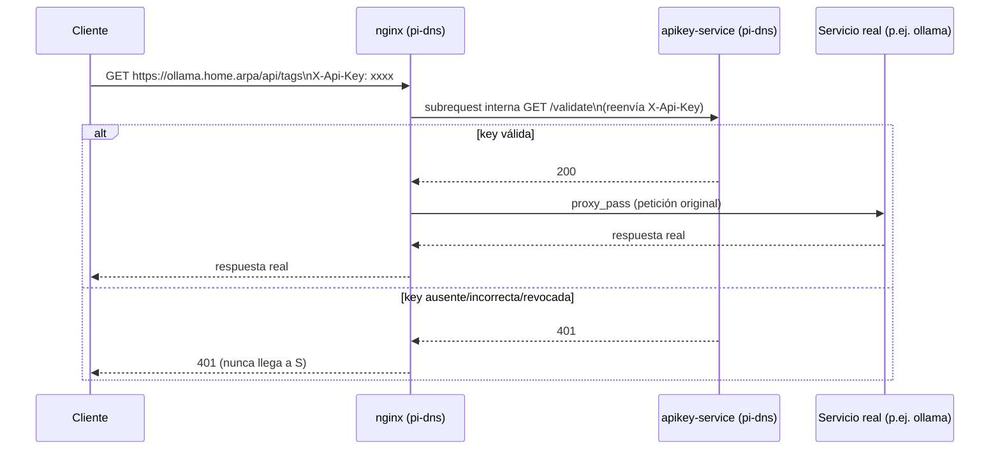
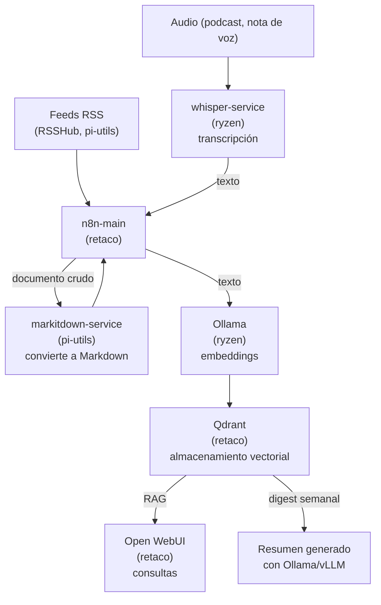
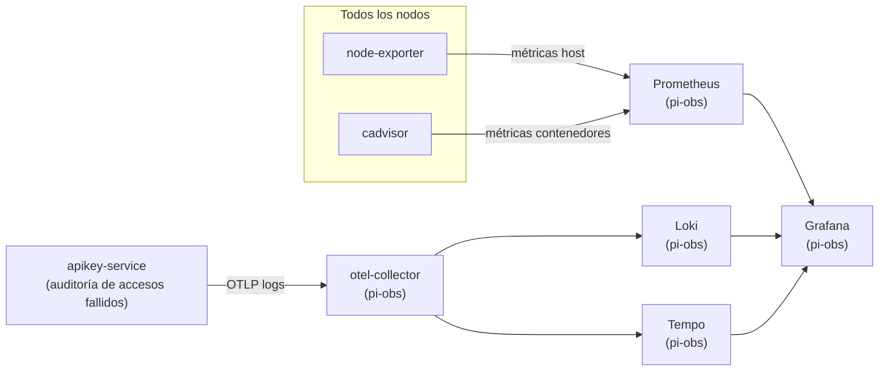

# 01 — Topología del clúster

## Qué es este clúster

Se trata de seis nodos conectados a la misma red local doméstica, sin Kubernetes ni Docker Swarm: cada nodo tiene su propio fichero `docker-compose.yml` independiente, y se gestiona a mano (o mediante los scripts de `shared/scripts/`) por SSH. El nodo `pi-dns` actúa como única "puerta de entrada", mediante nginx y un sistema propio de claves de API (`apikey-service`); el resto de los nodos no son directamente accesibles por su nombre de host sin pasar antes por ese punto.

| Nodo | IP | Función en una frase |
|---|---|---|
| `ryzen` (alias `mole`) | 192.168.1.150 | Cómputo con GPU: modelos de lenguaje (Ollama/vLLM), transcripción de audio, generación de imágenes |
| `retaco` | 192.168.1.174 | Datos y automatización: PostgreSQL compartido, Qdrant, n8n, Open WebUI, gestor de secretos (Infisical), SSO (Authentik) |
| `pi-dns` | 192.168.1.170 | DNS interno y puerta de entrada HTTPS de todo el clúster |
| `pi-obs` | 192.168.1.171 | Observabilidad: métricas, registros, trazas, paneles |
| `pi-sonar` | 192.168.1.172 | Análisis estático de código (SonarQube) + gateway LLM hacia AWS Bedrock y Ollama (Bifrost) |
| `pi-utils` | 192.168.1.173 | Utilidades: RSS, conversión/scraping de documentos, gestión de Docker, contraseñas, consola de automatización del clúster (Capataz) |

> La misma red local aloja además un séptimo dispositivo, el NAS UGREEN NASync `ketekasko` (192.168.1.180) — no es un nodo del clúster Docker (no tiene `docker-compose.yml` ni directorio propio en este repo), pero sí resuelve por DNS interno y aparece como tarjeta en el panel `index.home.arpa`. Detalle completo en `docs/21-configuracion-nas-ugreen.md`.

## Diagrama físico



## Arquitectura de servicios — pi-dns como puerta de entrada

Todo acceso HTTPS por nombre de host (`*.home.arpa`) entra por `nginx`, en `pi-dns`, que lo reenvía al nodo correspondiente. Los servicios que carecen de autenticación propia pasan, además, por `apikey-service` (también en `pi-dns`) antes de llegar al servicio real — ver `docs/06-instalacion-pi1-dns.md`.



> `qdrant` y `postgres-main` (en retaco) tienen su **propia** autenticación nativa (clave de API en el caso de Qdrant, usuario y contraseña en el de Postgres): no pasan por `apikey-service`, ya que sería una capa redundante. Consulta `docs/06-instalacion-pi1-dns.md` para ver el detalle de qué servicio está protegido con qué mecanismo.

> `valkey*` (retaco, marcado con asterisco en el diagrama) **no** pasa por `nginx` en absoluto — es un alias DNS directo (`valkey.home.arpa` → IP de retaco), igual que `postgresql.home.arpa`: el protocolo RESP no es HTTP, así que no puede convivir con los vhosts del proxy inverso. Protegido por ACL propia + TLS con la CA interna, no por `apikey-service`. Detalle completo en `shared/dns/dns-records.md` (sección "Alias directos") y `docs/25-valkey-cache.md`.

> `capataz-api`/`capataz-runner` (pi-utils) tampoco tienen hostname `*.home.arpa` propio — el frontend de Capataz se sirve estático desde `nginx` en `index.home.arpa` (sin contenedor propio, ver `docs/28-capataz-consola-automatizacion.md`), y ese mismo bloque de `nginx` reenvía `index.home.arpa/api/` directo a `pi-utils:8000` (`capataz-api`). `capataz-runner` no expone ningún puerto en absoluto, solo consume la cola de Valkey.

> El acceso remoto autenticado (desde fuera de la LAN) se hace mediante Tailscale, con un enrutador de subred en `pi-dns` — el detalle completo está en `docs/18-tailscale.md`.

## Inventario de servicios por nodo

Extraído directamente de los 7 ficheros `docker-compose.yml`/`docker-compose.observability.yml` del repositorio y del `nginx.conf` real desplegado en `pi-dns` (verificado por SSH, sin drift frente al versionado en `pi-dns/config/nginx/nginx.conf` en el momento de escribir esto). "Sin límite" significa que el servicio no fija `mem_limit`/`mem_reservation`/`cpus` (sintaxis Compose v2) — nada en este repo usa `deploy.resources.limits`, que es sintaxis de Swarm y `docker compose up` la ignora en silencio.

### `ryzen` (192.168.1.150)

| Servicio | Restricciones | Volúmenes | Puerto en nodo | Domain name (nginx) |
|---|---|---|---|---|
| `ollama` | Sin límite mem/CPU; reserva GPU NVIDIA (`count: all`) | `ryzen/ollama/models:/root/.ollama` | `11434:11434` | `ollama.home.arpa` (protegido con `apikey-service`) |
| `whisper-service` | Sin límite mem/CPU; reserva GPU NVIDIA fija (`device_ids: ["1"]`, RTX 3070) | `ryzen/whisper/models:/root/.cache/whisper`; `ryzen/whisper/cache:/tmp/whisper-cache` | `9800:9800` | `whisper.home.arpa` |
| `vllm` | Sin límite mem/CPU; reserva GPU NVIDIA fija (`device_ids: ["0"]`, RTX 5070) | `ryzen/vllm/models:/root/.cache/huggingface` | `8010:8000` | `vllm.home.arpa` (protegido con `apikey-service`) |
| `comfyui` | Sin límite mem/CPU; reserva GPU NVIDIA fija (`device_ids: ["1"]`, RTX 3070) | `ryzen/comfyui/{models,input,output,user,custom_nodes}` | `8188:8188` | `comfyui.home.arpa` (protegido con `apikey-service`) |
| `node-exporter` | Sin límite | `/proc`, `/sys`, `/` (todos `:ro`) | `9100:9100` | No expuesto vía nginx |
| `cadvisor` | Sin límite | `/`, `/var/run`, `/sys`, `/var/lib/docker`, `/dev/disk` (todos `:ro`) | `8081:8080` | No expuesto vía nginx |
| `portainer-agent` | Sin límite | `docker.sock`; `/var/lib/docker/volumes` | `9001:9001` | No expuesto vía nginx |
| `watchtower` | Sin límite | `docker.sock:ro` | Sin puerto publicado | No expuesto vía nginx |
| `promtail` | Sin límite | `promtail-config.yaml:ro`; `data`; `docker.sock:ro`; `/var/lib/docker/containers:ro` | Sin puerto publicado | No expuesto vía nginx |

### `retaco` (192.168.1.174)

| Servicio | Restricciones | Volúmenes | Puerto en nodo | Domain name (nginx) |
|---|---|---|---|---|
| `postgres-main` | Sin límite | `postgres/data`; `postgres/init:ro` | `5432:5432` | No expuesto vía nginx — alias directo `postgresql.home.arpa` (protocolo no-HTTP) |
| `n8n-main` | Sin límite | `n8n/data`; `n8n/ca/homelab-ca.crt:ro`; `infisical-cli/infisical:ro` | `5678:5678` | `n8n.home.arpa` |
| `qdrant` | Sin límite | `qdrant/storage`; `qdrant/snapshots`; `qdrant/ca/homelab-ca.crt:ro`; `infisical-cli/infisical:ro` | `6333:6333`; `127.0.0.1:6334:6334` | `qdrant.home.arpa` |
| `registry` | Sin límite | `registry/data`; `registry/auth:ro` | `5000:5000` | `registry.home.arpa` (auth propia htpasswd, sin `apikey-service`) |
| `epub2pdf-service` | Sin límite | NFS NAS: `/mnt/nfs-data/epub2pdf/input:ro`, `/output` | `8003:8003` | `epub2pdf.home.arpa` (protegido con `apikey-service`) |
| `pdf2chunks-service` | Sin límite | NFS NAS: `/mnt/nfs-data/pdf2chunks/input:ro`, `/output` | `8004:8004` | `pdf2chunks.home.arpa` (protegido con `apikey-service`) |
| `open-webui` | Sin límite | `open-webui/data`; `open-webui/homelab-ca.crt:ro`; `infisical-cli/infisical:ro` | `8080:8080` | `openwebui.home.arpa` |
| `open-terminal-mcp` | Sin límite | `open-terminal-mcp/home`; `.../ca/homelab-ca.crt:ro`; `infisical-cli/infisical:ro` | `8005:8000` | `open-terminal.home.arpa` (protegido con `apikey-service`, obligatorio) |
| `valkey` | Sin límite Compose (límite propio de la app: `--maxmemory 256mb`) | `valkey/users.acl:ro`; `valkey/tls:ro` | `6379:6379` | No expuesto vía nginx — alias directo `valkey.home.arpa` (protocolo RESP, ACL + TLS) |
| `postgres-infisical` | Sin límite | `postgres-infisical/data` | Sin puerto publicado | No expuesto vía nginx |
| `infisical` | Sin límite | `infisical/ca/homelab-ca.crt:ro` | `8006:8080` | `infisical.home.arpa` (auth propia) |
| `authentik-server` | Sin límite; `shm_size: 512mb` | `infisical-cli/infisical:ro`; `authentik/ca/homelab-ca.crt:ro`; `authentik/data` | `9000:9000` | `authentik.home.arpa` (auth propia) |
| `authentik-worker` | Sin límite; `shm_size: 512mb` | `infisical-cli/infisical:ro`; `authentik/ca/homelab-ca.crt:ro`; `authentik/data`; `authentik/certs` | Sin puerto publicado | No expuesto vía nginx |
| `node-exporter` | Sin límite | `/proc`, `/sys`, `/` (todos `:ro`) | `9100:9100` | No expuesto vía nginx |
| `cadvisor` | Sin límite | `/`, `/var/run`, `/sys`, `/var/lib/docker`, `/dev/disk` (todos `:ro`) | `8081:8080` | No expuesto vía nginx |
| `portainer-agent` | Sin límite | `docker.sock`; `/var/lib/docker/volumes` | `9001:9001` | No expuesto vía nginx |
| `watchtower` | Sin límite | `docker.sock:ro` | Sin puerto publicado | No expuesto vía nginx |
| `promtail` | Sin límite | `promtail-config.yaml:ro`; `data`; `docker.sock:ro`; `/var/lib/docker/containers:ro` | Sin puerto publicado | No expuesto vía nginx |

### `pi-dns` (192.168.1.170)

| Servicio | Restricciones | Volúmenes | Puerto en nodo | Domain name (nginx) |
|---|---|---|---|---|
| `unbound` | Sin límite | `unbound/config/unbound.conf:ro` | Sin puerto publicado (red interna `pi-dns-net`) | No expuesto vía nginx (upstream de Pi-hole) |
| `pihole` | Sin límite | `pihole/etc-pihole`; `pihole/etc-dnsmasq.d` | `53:53/tcp`; `53:53/udp`; `127.0.0.1:8053:80` | `pihole.home.arpa` |
| `apikey-service` | Sin límite | `infisical-cli/infisical:ro`; `apikey-service/ca/homelab-ca.crt:ro` | Sin puerto publicado (solo red interna `pi-dns-net`) | `apikey.home.arpa` |
| `nginx` | Sin límite | Confs (`nginx.conf`, `proxy-common.conf`, `apikey-auth.conf`, `authentik-auth.conf`, todos `:ro`); `certs:ro`; `ca.crt:ro`; `nginx/html:ro` (panel estático, ahora `old.index.home.arpa`); `nginx/capataz-html:ro` (`index.home.arpa`) | `80:80`; `443:443` | Sirve `index.home.arpa` y `old.index.home.arpa` de forma estática; hace de proxy inverso a todos los `*.home.arpa` del resto de esta tabla |
| `tailscale` | Sin límite; `network_mode: host` | `tailscale/state`; `/lib/modules:ro` | Sin `ports:` (red del host) | No expuesto vía nginx |
| `node-exporter` | Sin límite | `/proc`, `/sys`, `/` (todos `:ro`) | `9100:9100` | No expuesto vía nginx |
| `cadvisor` | Sin límite | `/`, `/var/run`, `/sys`, `/var/lib/docker`, `/dev/disk` (todos `:ro`) | `8081:8080` | No expuesto vía nginx |
| `portainer-agent` | Sin límite | `docker.sock`; `/var/lib/docker/volumes` | `9001:9001` | No expuesto vía nginx |
| `watchtower` | Sin límite | `docker.sock:ro` | Sin puerto publicado | No expuesto vía nginx |
| `promtail` | Sin límite | `promtail-config.yaml:ro`; `data`; `docker.sock:ro`; `/var/lib/docker/containers:ro` | Sin puerto publicado | No expuesto vía nginx |

### `pi-obs` (192.168.1.171)

| Servicio | Restricciones | Volúmenes | Puerto en nodo | Domain name (nginx) |
|---|---|---|---|---|
| `loki` | Sin límite | `loki/loki.yaml:ro`; `loki/data` | `3100:3100` | No expuesto vía nginx (consultado desde Grafana) |
| `tempo` | Sin límite | `tempo/tempo.yaml:ro`; `tempo/data` | `127.0.0.1:3200:3200` | No expuesto vía nginx |
| `prometheus` | Sin límite | `prometheus/prometheus.yml:ro`; `prometheus/data` | `9090:9090` | `prometheus.home.arpa` (protegido con Authentik forward-auth) |
| `otel-collector` | Sin límite | `otel/config/otel-collector.yaml:ro` | `4317:4317`; `4318:4318`; `127.0.0.1:8889:8889` | No expuesto vía nginx |
| `grafana` | Sin límite | `grafana/data`; `datasources.yml:ro`; `alerting/undervoltage.yml:ro`; `dashboards.yml:ro`; `dashboards/json:ro` | `3000:3000` | `grafana.home.arpa` |
| `node-exporter` | Sin límite | `/proc`, `/sys`, `/` (todos `:ro`); `node-exporter-textfile:ro` (métricas de `check-image-updates.sh`) | `127.0.0.1:9100:9100` | No expuesto vía nginx |
| `cadvisor` | Sin límite | `/`, `/var/run`, `/sys`, `/var/lib/docker`, `/dev/disk` (todos `:ro`) | `127.0.0.1:8080:8080` | No expuesto vía nginx |
| `postgres-exporter` | Sin límite | — | `127.0.0.1:9187:9187` | No expuesto vía nginx |
| `portainer-agent` | Sin límite | `docker.sock`; `/var/lib/docker/volumes` | `9001:9001` | No expuesto vía nginx |
| `watchtower` | Sin límite | `docker.sock:ro` | Sin puerto publicado | No expuesto vía nginx |
| `promtail` | Sin límite | `promtail-config.yaml:ro`; `data`; `docker.sock:ro`; `/var/lib/docker/containers:ro` | Sin puerto publicado | No expuesto vía nginx |

### `pi-sonar` (192.168.1.172)

| Servicio | Restricciones | Volúmenes | Puerto en nodo | Domain name (nginx) |
|---|---|---|---|---|
| `sonarqube` | Sin `mem_limit`/`cpus`; `ulimits` (`nofile` 131072, `nproc` 8192) y heap JVM fijado por variables (`-Xmx512m`/`-Xmx1g` según proceso) | `sonarqube/{data,extensions,logs,temp}`; `ca/homelab-ca.crt:ro`; `infisical-cli/infisical:ro` | `9000:9000` | `sonarqube.home.arpa` |
| `bifrost` | Sin límite | `bifrost/data`; `bifrost/ca/homelab-ca.crt:ro`; `infisical-cli/infisical:ro` | `8080:8080` | `bifrost.home.arpa` (auth propia — virtual keys) |
| `node-exporter` | Sin límite | `/proc`, `/sys`, `/` (todos `:ro`) | `9100:9100` | No expuesto vía nginx |
| `cadvisor` | Sin límite | `/`, `/var/run`, `/sys`, `/var/lib/docker`, `/dev/disk` (todos `:ro`) | `8081:8080` | No expuesto vía nginx |
| `portainer-agent` | Sin límite | `docker.sock`; `/var/lib/docker/volumes` | `9001:9001` | No expuesto vía nginx |
| `watchtower` | Sin límite | `docker.sock:ro` | Sin puerto publicado | No expuesto vía nginx |
| `promtail` | Sin límite | `promtail-config.yaml:ro`; `data`; `docker.sock:ro`; `/var/lib/docker/containers:ro` | Sin puerto publicado | No expuesto vía nginx |

### `pi-utils` (192.168.1.173)

| Servicio | Restricciones | Volúmenes | Puerto en nodo | Domain name (nginx) |
|---|---|---|---|---|
| `rsshub` | Sin límite | `rsshub/data`; `rsshub/ca/homelab-ca.crt:ro`; `infisical-cli/infisical:ro` | `1200:1200` | `rsshub.home.arpa` |
| `markitdown-service` | Sin límite | `markitdown/cache` | `8001:8001` | `markitdown.home.arpa` (protegido con `apikey-service`) |
| `crawl4ai-scraper-service` | `mem_limit: 2g` (red de seguridad ante fugas de memoria del navegador) | Sin bind mounts propios | `8002:8000` | `crawl4ai.scraper.home.arpa` (protegido con `apikey-service`) |
| `n8n-aux` | Sin límite | `n8n-aux/data`; `n8n-aux/ca/homelab-ca.crt:ro`; `infisical-cli/infisical:ro` | `5679:5679` | `n8n-aux.home.arpa` |
| `capataz-api` | `mem_limit: 768m`; `read_only: true`; `cap_drop: ALL` | `capataz/catalog:ro`; `capataz/api/alembic.ini:ro`; `capataz/api/alembic:ro`; `capataz/certs:ro`; 4 secrets de Compose (`database_url`, `redis_url`, `portainer_token`, `cognito_client_secret`) | `8000:8000` | Sin hostname propio — `index.home.arpa/api/` (nginx, pi-dns) reenvía aquí |
| `capataz-runner` | `mem_limit: 1024m`; `read_only: true`; `cap_drop: ALL` | `capataz/certs:ro`; 6 secrets de Compose (`database_url`, `redis_url`, `portainer_token`, `runner_ssh_private_key`, `runner_known_hosts`, `ansible_vault_password`) | Sin puerto publicado | No expuesto vía nginx |
| `node-exporter` | Sin límite | `/proc`, `/sys`, `/` (todos `:ro`) | `9100:9100` | No expuesto vía nginx |
| `cadvisor` | Sin límite | `/`, `/var/run`, `/sys`, `/var/lib/docker`, `/dev/disk` (todos `:ro`) | `8081:8080` | No expuesto vía nginx |
| `vaultwarden` | Sin límite | `vaultwarden/data`; `vaultwarden/ca/homelab-ca.crt:ro`; `infisical-cli/infisical:ro` | `8222:80` | `vaultwarden.home.arpa` |
| `portainer` | Sin límite | `portainer/data` | `9000:9000` | `portainer.home.arpa` |
| `portainer-agent` | Sin límite | `docker.sock`; `/var/lib/docker/volumes` | `9001:9001` | No expuesto vía nginx |
| `watchtower` | Sin límite | `docker.sock:ro` | Sin puerto publicado | No expuesto vía nginx |
| `promtail` | Sin límite | `promtail-config.yaml:ro`; `data`; `docker.sock:ro`; `/var/lib/docker/containers:ro` | Sin puerto publicado | No expuesto vía nginx |

## Cómo se protege un servicio sin autenticación propia

`nginx` delega en `apikey-service` la decisión de dejar pasar una petición o no, mediante el mecanismo `auth_request` de nginx — un patrón estándar, no algo exclusivo de este clúster:



El servicio real (`S`) nunca llega a ver una petición sin autenticar: `apikey-service` la corta antes de que `nginx` reenvíe nada. El detalle completo, la gestión de las claves y la lista de qué servicios están protegidos hoy se encuentran en `docs/06-instalacion-pi1-dns.md`.

## Flujo de datos previsto (pipeline de contenido)

Este es el diseño original del pipeline de ingestión. A día de hoy solo existe un flujo de trabajo real en n8n (`RSS Fetch & Store`, inactivo por el momento), que cubre la primera mitad de este proceso (RSS → markitdown → Qdrant); la generación del resumen semanal y la transcripción de audio son piezas ya desplegadas, pero todavía sin ningún flujo de trabajo que las active.



## Flujo de telemetría (métricas, registros, trazas)



Hoy por hoy, `apikey-service` es el único servicio que envía trazas y registros por OTLP al recolector: el resto de los contenedores llegan a Grafana solo a través de las métricas (Prometheus) o, en el caso del propio `journalctl` del host, ni siquiera eso (consulta la limitación anotada en `docs/14-monitorizacion-completa-cluster.md` sobre la alerta de baja tensión).

## Red

- Todos los nodos están en `192.168.1.0/24`, sin VLAN, sin balanceadores de carga y sin alta disponibilidad formal: es una red doméstica, no un centro de datos.
- El NAS UGREEN (`ketekasko`, 192.168.1.180) comparte esa misma red y ese mismo rango de IP, aunque no forme parte del clúster Docker — ver `docs/21-configuracion-nas-ugreen.md`.
- El DNS interno es `home.arpa`, servido por Pi-hole y Unbound en `pi-dns`. La tabla completa y actualizada de registros está en `shared/dns/dns-records.md` (no se duplica aquí, porque se desincroniza con facilidad si vive en dos sitios a la vez).
- TLS: el certificado está firmado por una entidad certificadora interna propia (`docs/15-ca-interna.md`), no autofirmado, lo que evita el aviso de "certificado no confiable" una vez instalada esa entidad certificadora en cada dispositivo.
- El acceso directo por IP y puerto (saltándose nginx y apikey-service) está disponible por diseño para casi todos los servicios HTTP, y se puede cerrar nodo a nodo con `shared/scripts/toggle-direct-access.sh` — consulta `docs/17-firewall-acceso-directo.md`.

## Acceso SSH a los nodos

Cada nodo (salvo `ryzen`) tiene su propio usuario de administración dedicado, distinto en cada uno — no hay un usuario compartido entre nodos. Acceso por clave SSH, sin contraseña. Esta tabla centraliza lo que hasta ahora estaba solo disperso en el documento de instalación de cada nodo (`docs/05` a `docs/10`) y en los scripts de `shared/scripts/` (p. ej. el mapa `NODE_SSH` de `toggle-direct-access.sh`).

| Nodo | Usuario SSH | Comando | Grupos relevantes |
|---|---|---|---|
| `ryzen` (`mole`) | — (acceso local) | — | — |
| `retaco` | `u-data` | `ssh u-data@192.168.1.174` | `sudo`, `docker` |
| `pi-dns` | `u-dns` | `ssh u-dns@192.168.1.170` | `sudo`, `docker` |
| `pi-obs` | `u-obs` | `ssh u-obs@192.168.1.171` | `sudo`, `docker` |
| `pi-sonar` | `u-sonar` | `ssh u-sonar@192.168.1.172` | `sudo`, `docker` |
| `pi-utils` | `u-utils` | `ssh u-utils@192.168.1.173` | `sudo`, `docker` |

`ryzen` (alias `mole`) es también el puesto de trabajo físico del usuario — los comandos que en el resto de nodos requieren `ssh <usuario>@<ip>` se ejecutan ahí directamente en local, sin salto de red. Todos los usuarios de las Raspberry Pi/`retaco` están en el grupo `sudo` (tareas de sistema: `apt`, `systemctl`, edición de `/etc/fstab`...) y en el grupo `docker` (gestionar contenedores sin anteponer `sudo` a cada `docker compose`).

Cada usuario tiene además acceso de escritura a su propio `/srv/homelab/<nodo>/` (sección siguiente) — no hace falta `sudo` para editar `docker-compose.yml`/`.env` ni para copiar ficheros de configuración, solo para operaciones a nivel de sistema operativo.

### `ryzen` es distinto: es esta misma máquina

`ryzen` (`mole`) no se administra por SSH desde el resto de nodos porque **es el propio puesto de trabajo** — si estás trabajando desde `mole`, ya estás "dentro" de `ryzen`: `docker`/`docker compose` se ejecutan directamente, sin `ssh` de por medio, y `/srv/homelab/ryzen/` es una ruta local, no remota. Es también el único nodo que se apaga cuando no se usa (`docs/19-wake-on-lan.md`) — si no responde, probablemente esté dormido, no averiado; despertarlo desde otro nodo con `shared/scripts/wake-mole.sh`.

### Desplegar un fichero cambiado a un nodo

Patrón estándar, válido para cualquier nodo, que evita sorpresas de permisos:

```bash
rsync -av <fichero-local> u-<x>@192.168.1.17x:/tmp/<nombre>
ssh u-<x>@192.168.1.17x "sudo cp /tmp/<nombre> <ruta-real-destino> && rm /tmp/<nombre>"
```

Aterrizar primero en `/tmp` y hacer `sudo cp` a la ruta final, en vez de `rsync`/`scp` directo contra el destino — evita además el problema ya conocido de los *bind mounts* de un solo fichero (`docs/13-troubleshooting.md`): `rsync`/`scp` sustituyen el fichero renombrando-y-reemplazando por debajo, lo que cambia el inodo y deja al contenedor en marcha mirando al fichero viejo; `cp` sobre un fichero ya existente reescribe el mismo inodo, así que el contenedor lo ve al momento. Para rutas que ya son propiedad del usuario SSH (la mayoría de `/srv/homelab/<nodo>/`), un `rsync -av <fichero-local> u-<x>@192.168.1.17x:/srv/homelab/<nodo>/<ruta>` directo vale igual y ahorra un paso — usar la versión con `/tmp` + `sudo cp` en cuanto el destino pueda ser de `root` o de un UID de contenedor concreto, o ante cualquier duda.

⚠️ **En `pi-dns`, la ruta real donde vive la configuración de nginx en el disco NO coincide con la estructura de este repo.** El repo versiona esa configuración en `pi-dns/config/nginx/`, pero los *bind mounts* reales de `pi-dns/docker-compose.yml` en el host apuntan a `/srv/homelab/pi-dns/nginx/conf/` (los ficheros de configuración: `nginx.conf`, `proxy-common.conf`, `apikey-auth.conf`) y a `/srv/homelab/pi-dns/nginx/html/` (la página estática de `index.home.arpa` y sus iconos) — **no** a `/srv/homelab/pi-dns/config/nginx/...`. Desplegar a la ruta con forma de repo no da ningún error — simplemente no hace nada: nginx sigue sirviendo el fichero antiguo, y `nginx -s reload` "funciona" sin quejarse porque no había nada que recargar. Ya ha causado 404 reales más de una vez. Antes de desplegar cualquier configuración a cualquier nodo, confirma la ruta real del *bind mount* en el `docker-compose.yml` de ese nodo (`grep -A3 '<servicio>:' <nodo>/docker-compose.yml`, bloque `volumes:`) en vez de asumir que coincide con el nombre de carpeta del repo — `pi-dns` es el caso confirmado, pero es motivo para comprobarlo siempre, no una garantía de que el resto de nodos sí coincidan con su propio repo.

Tras desplegar configuración de nginx en concreto, validar antes de recargar:

```bash
ssh u-dns@192.168.1.170 "cd /srv/homelab/pi-dns && docker compose exec nginx nginx -t && docker compose exec nginx nginx -s reload"
```

## Ruta base en todos los nodos

```
/srv/homelab/
```

Todos los datos persistentes, las configuraciones y los ficheros `docker-compose.yml` viven bajo esta ruta, en todos los nodos.

## Orden de instalación

Los documentos de `docs/` están numerados siguiendo el orden real en que hay que instalar y configurar cada cosa. No es un orden alfabético ni cronológico según cuándo se escribió cada documento, sino el que marcan las dependencias reales entre los nodos:

1. **Fundamentos** (`docs/02` a `docs/04`) — planificación de IP y DNS, instalación base del sistema operativo, servicios comunes a todos los nodos. No tienen dependencias entre sí, así que se hacen antes que cualquier nodo.
2. **`retaco` en primer lugar** (`docs/05`) — aunque `pi-dns` es, conceptualmente, la "puerta de entrada" del clúster, su propio `docker-compose.yml` **no arranca correctamente si `retaco` no está ya en marcha**: `apikey-service` (en `pi-dns`) necesita que su base de datos ya exista en `postgres-main` (retaco), y `nginx` (también en `pi-dns`) no arranca hasta que `apikey-service` esté en estado `healthy` (mediante `depends_on`). `retaco` también aloja el registro de imágenes privado (`registry.home.arpa`), que varios nodos necesitan más adelante para publicar y descargar imágenes (`apikey-service`, `markitdown-service`, `whisper-service`).
3. **`pi-dns` en segundo lugar** (`docs/06`) — con `retaco` ya en marcha, `apikey-service` puede arrancar correctamente, y `nginx` con él. A partir de aquí, el resto del clúster ya puede resolver `*.home.arpa` y pasar por la puerta de entrada HTTPS.
4. **El resto de los nodos, en cualquier orden entre sí** (`docs/07` a `docs/10`) — `ryzen`, `pi-obs`, `pi-sonar` y `pi-utils`. Todos dan por hecho que `pi-dns` y `retaco` ya están en marcha (entidad certificadora interna, DNS, registro privado, bases de datos aisladas en `postgres-main`), pero no dependen unos de otros.
5. **Operación** (`docs/11` en adelante) — una vez el clúster está en pie: uso diario, copias de seguridad, resolución de problemas, monitorización, entidad certificadora interna, mantenimiento, cortafuegos, acceso remoto, Wake-on-LAN, y el apagado y encendido ordenado para tareas de mantenimiento físico (`docs/20-apagado-y-encendido-cluster.md`, que sigue exactamente este mismo orden de dependencias al volver a encender el clúster), además de la configuración del NAS UGREEN (`docs/21-configuracion-nas-ugreen.md`, un dispositivo adicional de la red local, fuera del clúster de Docker). El documento `docs/22-mejoras-futuras.md` cierra la documentación a propósito: es un listado de tareas pendientes, no un paso más a seguir.

## Índice de documentación

| # | Documento | Contenido |
|---|---|---|
| 01 | `docs/01-topologia.md` | Este documento: arquitectura, diagramas, índice y orden de instalación |
| 02 | `docs/02-plan-ip-y-dns.md` | Plan de IP fijas y nombres `*.home.arpa` |
| 03 | `docs/03-instalacion-base-ubuntu-raspi.md` | Instalación base de Ubuntu Server en las Raspberry Pi 5 |
| 04 | `docs/04-servicios-comunes.md` | node-exporter, cadvisor, portainer-agent, watchtower: comunes a los 6 nodos |
| 05 | `docs/05-instalacion-retaco.md` | Instalación de `retaco`: postgres-main, Qdrant, n8n-main, registro privado |
| 06 | `docs/06-instalacion-pi1-dns.md` | Instalación de `pi-dns`: Unbound, Pi-hole, nginx, apikey-service |
| 07 | `docs/07-instalacion-ryzen.md` | Instalación de `ryzen`: Ollama, vLLM, whisper-service, ComfyUI (Open WebUI se instaló aquí originalmente, migrado a `retaco` después — ver `docs/23`) |
| 08 | `docs/08-instalacion-pi2-observabilidad.md` | Instalación de `pi-obs`: OTel, Prometheus, Grafana, Loki, Tempo |
| 09 | `docs/09-instalacion-pi3-sonarqube.md` | Instalación de `pi-sonar`: SonarQube |
| 10 | `docs/10-instalacion-pi4-utils.md` | Instalación de `pi-utils`: RSSHub, markitdown-service, n8n-aux, Portainer, Vaultwarden |
| 11 | `docs/11-operacion-diaria.md` | Operación diaria del clúster |
| 12 | `docs/12-backups-y-restore.md` | Copias de seguridad y restauración |
| 13 | `docs/13-troubleshooting.md` | Resolución de problemas |
| 14 | `docs/14-monitorizacion-completa-cluster.md` | Monitorización completa del clúster en Grafana |
| 15 | `docs/15-ca-interna.md` | Entidad certificadora interna del clúster: cómo eliminar los avisos de certificado |
| 16 | `docs/16-mantenimiento-actualizaciones.md` | Mantenimiento: actualizaciones de sistema y de contenedores |
| 17 | `docs/17-firewall-acceso-directo.md` | Cortafuegos: cómo cerrar el acceso directo por IP y puerto |
| 18 | `docs/18-tailscale.md` | Tailscale: acceso remoto autenticado al clúster |
| 19 | `docs/19-wake-on-lan.md` | Wake-on-LAN: cómo encender `mole`/`ryzen` en remoto |
| 20 | `docs/20-apagado-y-encendido-cluster.md` | Apagado y encendido ordenado del clúster (mantenimiento físico) |
| 21 | `docs/21-configuracion-nas-ugreen.md` | NAS UGREEN NASync DH2300 (`ketekasko`): DNS, SMB, NFSv4, carpetas compartidas |
| 22 | `docs/22-mejoras-futuras.md` | Mejoras futuras propuestas (backlog) — no todo lo que sale de aquí acaba con un documento numerado propio; cuando pasa (como el 23), este índice se actualiza |
| 23 | `docs/23-bifrost-gateway-llm.md` | Bifrost: gateway LLM hacia AWS Bedrock y Ollama (`pi-sonar`), conectado a Open WebUI y n8n; incluye la migración de Open WebUI de `ryzen` a `retaco` |
| 24 | `docs/24-open-terminal-mcp.md` | Open Terminal en modo MCP (`retaco`): terminal/ficheros expuestos a Open WebUI y n8n; incluye el hallazgo de que el transporte MCP no tiene auth propia |
| 25 | `docs/25-valkey-cache.md` | Valkey (`retaco`): caché clave-valor compartido, sin persistencia, ACL sin usuario por defecto |
| 26 | `docs/26-infisical-secretos.md` | Infisical (`retaco`): gestor de secretos para consumo entre máquinas — Postgres dedicado, Valkey reutilizado, `apikey-service` migrado como piloto. Decisiones formales en `docs/adr/` (0001: mecanismo de inyección; 0002: Postgres dedicado) |
| 27 | `docs/27-authentik-sso.md` | Authentik (`retaco`): SSO/authn para personas — Postgres compartido con `postgres-main`, sin Redis, secretos vía Infisical desde el arranque. `prometheus.home.arpa` protegido con forward-auth como piloto |
