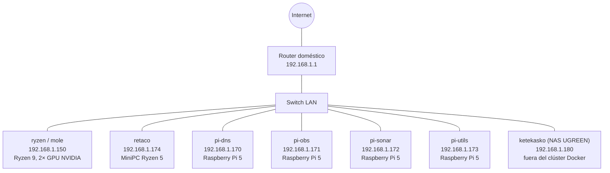
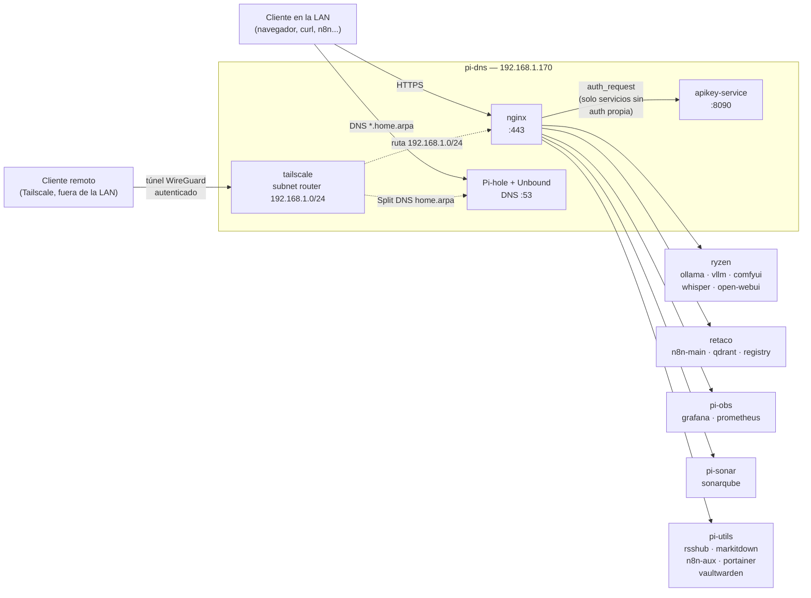
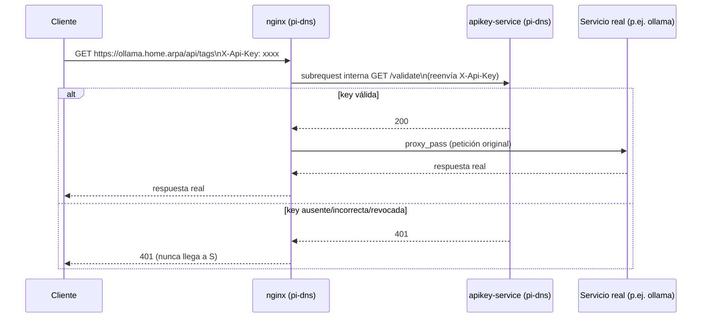
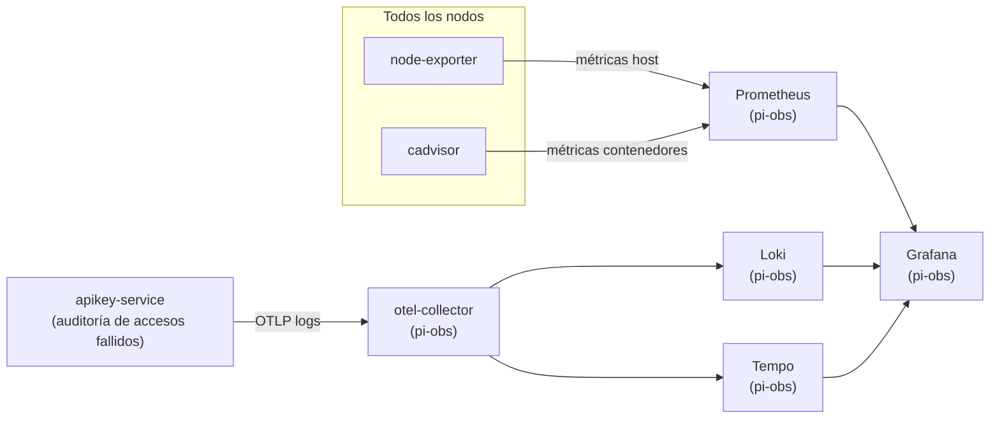

# 01 — Topología del clúster

## Qué es este clúster

Se trata de seis nodos conectados a la misma red local doméstica, sin Kubernetes ni Docker Swarm: cada nodo tiene su propio fichero `docker-compose.yml` independiente, y se gestiona a mano (o mediante los scripts de `shared/scripts/`) por SSH. El nodo `pi-dns` actúa como única "puerta de entrada", mediante nginx y un sistema propio de claves de API (`apikey-service`); el resto de los nodos no son directamente accesibles por su nombre de host sin pasar antes por ese punto.

| Nodo | IP | Función en una frase |
|---|---|---|
| `ryzen` (alias `mole`) | 192.168.1.150 | Cómputo con GPU: modelos de lenguaje (Ollama/vLLM), transcripción de audio, generación de imágenes |
| `retaco` | 192.168.1.174 | Datos y automatización: PostgreSQL compartido, Qdrant, n8n |
| `pi-dns` | 192.168.1.170 | DNS interno y puerta de entrada HTTPS de todo el clúster |
| `pi-obs` | 192.168.1.171 | Observabilidad: métricas, registros, trazas, paneles |
| `pi-sonar` | 192.168.1.172 | Análisis estático de código (SonarQube) |
| `pi-utils` | 192.168.1.173 | Utilidades: RSS, conversión de documentos, gestión de Docker, contraseñas |

> La misma red local aloja además un séptimo dispositivo, el NAS UGREEN NASync `ketekasko` (192.168.1.180) — no es un nodo del clúster Docker (no tiene `docker-compose.yml` ni directorio propio en este repo), pero sí resuelve por DNS interno y aparece como tarjeta en el panel `index.home.arpa`. Detalle completo en `docs/21-configuracion-nas-ugreen.md`.

## Diagrama físico



## Arquitectura de servicios — pi-dns como puerta de entrada

Todo acceso HTTPS por nombre de host (`*.home.arpa`) entra por `nginx`, en `pi-dns`, que lo reenvía al nodo correspondiente. Los servicios que carecen de autenticación propia pasan, además, por `apikey-service` (también en `pi-dns`) antes de llegar al servicio real — ver `docs/06-instalacion-pi1-dns.md`.



> `qdrant` y `postgres-main` (en retaco) tienen su **propia** autenticación nativa (clave de API en el caso de Qdrant, usuario y contraseña en el de Postgres): no pasan por `apikey-service`, ya que sería una capa redundante. Consulta `docs/06-instalacion-pi1-dns.md` para ver el detalle de qué servicio está protegido con qué mecanismo.

> El acceso remoto autenticado (desde fuera de la LAN) se hace mediante Tailscale, con un enrutador de subred en `pi-dns` — el detalle completo está en `docs/18-tailscale.md`.

## Cómo se protege un servicio sin autenticación propia

`nginx` delega en `apikey-service` la decisión de dejar pasar una petición o no, mediante el mecanismo `auth_request` de nginx — un patrón estándar, no algo exclusivo de este clúster:



El servicio real (`S`) nunca llega a ver una petición sin autenticar: `apikey-service` la corta antes de que `nginx` reenvíe nada. El detalle completo, la gestión de las claves y la lista de qué servicios están protegidos hoy se encuentran en `docs/06-instalacion-pi1-dns.md`.

## Flujo de datos previsto (pipeline de contenido)

Este es el diseño original del pipeline de ingestión. A día de hoy solo existe un flujo de trabajo real en n8n (`RSS Fetch & Store`, inactivo por el momento), que cubre la primera mitad de este proceso (RSS → markitdown → Qdrant); la generación del resumen semanal y la transcripción de audio son piezas ya desplegadas, pero todavía sin ningún flujo de trabajo que las active.


## Flujo de telemetría (métricas, registros, trazas)



Hoy por hoy, `apikey-service` es el único servicio que envía trazas y registros por OTLP al recolector: el resto de los contenedores llegan a Grafana solo a través de las métricas (Prometheus) o, en el caso del propio `journalctl` del host, ni siquiera eso (consulta la limitación anotada en `docs/14-monitorizacion-completa-cluster.md` sobre la alerta de baja tensión).

## Red

- Todos los nodos están en `192.168.1.0/24`, sin VLAN, sin balanceadores de carga y sin alta disponibilidad formal: es una red doméstica, no un centro de datos.
- El NAS UGREEN (`ketekasko`, 192.168.1.180) comparte esa misma red y ese mismo rango de IP, aunque no forme parte del clúster Docker — ver `docs/21-configuracion-nas-ugreen.md`.
- El DNS interno es `home.arpa`, servido por Pi-hole y Unbound en `pi-dns`. La tabla completa y actualizada de registros está en `shared/dns/dns-records.md` (no se duplica aquí, porque se desincroniza con facilidad si vive en dos sitios a la vez).
- TLS: el certificado está firmado por una entidad certificadora interna propia (`docs/15-ca-interna.md`), no autofirmado, lo que evita el aviso de "certificado no confiable" una vez instalada esa entidad certificadora en cada dispositivo.
- El acceso directo por IP y puerto (saltándose nginx y apikey-service) está disponible por diseño para casi todos los servicios HTTP, y se puede cerrar nodo a nodo con `shared/scripts/toggle-direct-access.sh` — consulta `docs/17-firewall-acceso-directo.md`.

## Ruta base en todos los nodos

```
/srv/homelab/
```

Todos los datos persistentes, las configuraciones y los ficheros `docker-compose.yml` viven bajo esta ruta, en todos los nodos.

## Orden de instalación

Los documentos de `docs/` están numerados siguiendo el orden real en que
hay que instalar y configurar cada cosa. No es un orden alfabético ni
cronológico según cuándo se escribió cada documento, sino el que marcan
las dependencias reales entre los nodos:

1. **Fundamentos** (`docs/02` a `docs/04`) — planificación de IP y DNS,
   instalación base del sistema operativo, servicios comunes a todos los
   nodos. No tienen dependencias entre sí, así que se hacen antes que
   cualquier nodo.
2. **`retaco` en primer lugar** (`docs/05`) — aunque `pi-dns` es,
   conceptualmente, la "puerta de entrada" del clúster, su propio
   `docker-compose.yml` **no arranca correctamente si `retaco` no está ya
   en marcha**: `apikey-service` (en `pi-dns`) necesita que su base de
   datos ya exista en `postgres-main` (retaco), y `nginx` (también en
   `pi-dns`) no arranca hasta que `apikey-service` esté en estado
   `healthy` (mediante `depends_on`). `retaco` también aloja el registro
   de imágenes privado (`registry.home.arpa`), que varios nodos necesitan
   más adelante para publicar y descargar imágenes (`apikey-service`,
   `markitdown-service`, `whisper-service`).
3. **`pi-dns` en segundo lugar** (`docs/06`) — con `retaco` ya en marcha,
   `apikey-service` puede arrancar correctamente, y `nginx` con él. A
   partir de aquí, el resto del clúster ya puede resolver `*.home.arpa` y
   pasar por la puerta de entrada HTTPS.
4. **El resto de los nodos, en cualquier orden entre sí** (`docs/07` a
   `docs/10`) — `ryzen`, `pi-obs`, `pi-sonar` y `pi-utils`. Todos dan por
   hecho que `pi-dns` y `retaco` ya están en marcha (entidad certificadora
   interna, DNS, registro privado, bases de datos aisladas en
   `postgres-main`), pero no dependen unos de otros.
5. **Operación** (`docs/11` en adelante) — una vez el clúster está en
   pie: uso diario, copias de seguridad, resolución de problemas,
   monitorización, entidad certificadora interna, mantenimiento,
   cortafuegos, acceso remoto, Wake-on-LAN, y el apagado y encendido
   ordenado para tareas de mantenimiento físico
   (`docs/20-apagado-y-encendido-cluster.md`, que sigue exactamente este
   mismo orden de dependencias al volver a encender el clúster), además
   de la configuración del NAS UGREEN
   (`docs/21-configuracion-nas-ugreen.md`, un dispositivo adicional de la
   red local, fuera del clúster de Docker). El documento
   `docs/22-mejoras-futuras.md` cierra la documentación a propósito: es
   un listado de tareas pendientes, no un paso más a seguir.

## Índice de documentación

| # | Documento | Contenido |
|---|---|---|
| 01 | `docs/01-topologia.md` | Este documento: arquitectura, diagramas, índice y orden de instalación |
| 02 | `docs/02-plan-ip-y-dns.md` | Plan de IP fijas y nombres `*.home.arpa` |
| 03 | `docs/03-instalacion-base-ubuntu-raspi.md` | Instalación base de Ubuntu Server en las Raspberry Pi 5 |
| 04 | `docs/04-servicios-comunes.md` | node-exporter, cadvisor, portainer-agent, watchtower: comunes a los 6 nodos |
| 05 | `docs/05-instalacion-retaco.md` | Instalación de `retaco`: postgres-main, Qdrant, n8n-main, registro privado |
| 06 | `docs/06-instalacion-pi1-dns.md` | Instalación de `pi-dns`: Unbound, Pi-hole, nginx, apikey-service |
| 07 | `docs/07-instalacion-ryzen.md` | Instalación de `ryzen`: Ollama, vLLM, Open WebUI, whisper-service, ComfyUI |
| 08 | `docs/08-instalacion-pi2-observabilidad.md` | Instalación de `pi-obs`: OTel, Prometheus, Grafana, Loki, Tempo |
| 09 | `docs/09-instalacion-pi3-sonarqube.md` | Instalación de `pi-sonar`: SonarQube |
| 10 | `docs/10-instalacion-pi4-utils.md` | Instalación de `pi-utils`: RSSHub, markitdown-service, n8n-aux, Portainer, Vaultwarden |
| 11 | `docs/11-operacion-diaria.md` | Operación diaria del clúster |
| 12 | `docs/12-backups-y-restore.md` | Copias de seguridad y restauración |
| 13 | `docs/13-troubleshooting.md` | Resolución de problemas |
| 14 | `docs/14-monitorizacion-completa-cluster.md` | Monitorización completa del clúster en Grafana |
| 15 | `docs/15-ca-interna.md` | Entidad certificadora interna del clúster: cómo eliminar los avisos de certificado |
| 16 | `docs/16-mantenimiento-actualizaciones.md` | Mantenimiento: actualizaciones de sistema y de contenedores |
| 17 | `docs/17-firewall-acceso-directo.md` | Cortafuegos: cómo cerrar el acceso directo por IP y puerto |
| 18 | `docs/18-tailscale.md` | Tailscale: acceso remoto autenticado al clúster |
| 19 | `docs/19-wake-on-lan.md` | Wake-on-LAN: cómo encender `mole`/`ryzen` en remoto |
| 20 | `docs/20-apagado-y-encendido-cluster.md` | Apagado y encendido ordenado del clúster (mantenimiento físico) |
| 21 | `docs/21-configuracion-nas-ugreen.md` | NAS UGREEN NASync DH2300 (`ketekasko`): DNS, SMB, NFSv4, carpetas compartidas |
| 22 | `docs/22-mejoras-futuras.md` | Mejoras futuras propuestas (lista de tareas pendientes): deliberadamente, el último documento |
