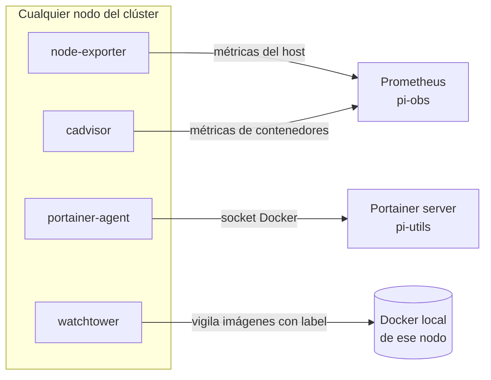

# 04 — Servicios comunes a todos los nodos

Hay cuatro servicios que se repiten, casi sin cambios, en el `docker-compose.yml` de **todos** los nodos (o casi todos: se indica la excepción en cada caso). Se documentan aquí una sola vez, en vez de repetir la misma explicación en el documento de cada nodo; cada documento de nodo enlaza a este y solo detalla lo que tiene de distinto (puerto, red, algún volumen adicional).

## Diagrama



## node-exporter — ¿para qué sirve?

Expone métricas del **sistema operativo del host** (CPU, RAM, disco, red, temperatura y voltaje en el caso de la Raspberry Pi) en formato Prometheus. No hace nada por sí mismo, solo expone `/metrics`; es Prometheus, en `pi-obs`, quien lo consulta periódicamente y convierte esos datos en series temporales que se pueden consultar desde Grafana.

```yaml
node-exporter:
  image: prom/node-exporter:v1.8.0
  container_name: node-exporter
  restart: unless-stopped
  labels:
    - "com.centurylinklabs.watchtower.enable=true"
  command:
    - "--path.procfs=/host/proc"
    - "--path.rootfs=/rootfs"
    - "--path.sysfs=/host/sys"
    - "--collector.filesystem.mount-points-exclude=^/(sys|proc|dev|host|etc)($$|/)"
  volumes:
    - /proc:/host/proc:ro
    - /sys:/host/sys:ro
    - /:/rootfs:ro
  ports:
    - "9100:9100"
  networks:
    - <red-del-nodo>
  pid: host
```

**Puerto**: `9100` en todos los nodos, publicado a la LAN (en `0.0.0.0`, no en loopback), porque Prometheus vive en *otro* host (`pi-obs`) y necesita alcanzarlo por IP. La única excepción es el propio `pi-obs`: como Prometheus está en ese mismo nodo, su `node-exporter` puede quedarse en `127.0.0.1:9100`, sin que nadie externo lo necesite.

**`pid: host`**: necesario para que pueda ver los procesos del host real, y no solo los del propio contenedor.

En la Raspberry Pi 5 expone, además, la métrica `node_hwmon_in_lcrit_alarm_volts` (del chip `firmware_raspberrypi_hwmon`), que es la que hay detrás de la alerta de baja tensión — consulta `docs/14-monitorizacion-completa-cluster.md`.

## cadvisor — ¿para qué sirve?

Es el equivalente a `node-exporter`, pero para **contenedores Docker** en vez de para el sistema operativo: mide CPU, RAM, red y disco por cada contenedor individual, no de forma agregada por host. Junto con `node-exporter`, es lo que permite ver en Grafana "qué contenedor concreto se está comiendo la RAM", y no solo "este nodo está al 80 % de RAM".

```yaml
cadvisor:
  image: gcr.io/cadvisor/cadvisor:v0.49.1
  container_name: cadvisor
  restart: unless-stopped
  labels:
    - "com.centurylinklabs.watchtower.enable=true"
  volumes:
    - /:/rootfs:ro
    - /var/run:/var/run:ro
    - /sys:/sys:ro
    - /var/lib/docker/:/var/lib/docker:ro
    - /dev/disk/:/dev/disk:ro
  ports:
    - "8081:8080"
  networks:
    - <red-del-nodo>
  privileged: true
  devices:
    - /dev/kmsg
```

**Puerto `8081` (en el host) → `8080` (en el contenedor), y no `8080:8080`**: en `ryzen`, el puerto `8080` ya lo usa `open-webui`. Para no tener que hacer una excepción distinta solo en ese nodo, **todos** los nodos usan `8081:8080` por coherencia, aunque solo `ryzen` lo necesite en realidad.

**`privileged: true`**: cadvisor necesita acceso profundo al cgroup y al espacio de nombres del host para poder leer las métricas de todos los demás contenedores; no hay forma de acotarlo más sin perder esa visibilidad.

## portainer-agent — ¿para qué sirve?

Le da al servidor de Portainer (que hay uno solo, en `pi-utils` — ver `docs/10-instalacion-pi4-utils.md`) acceso al Docker de este nodo en concreto: arrancar y parar contenedores, ver registros, abrir una consola interactiva, todo desde la interfaz web y sin necesidad de SSH. El agente es el que hace el trabajo pesado (monta `docker.sock`); el servidor central solo habla con los agentes, nunca directamente con el Docker de los nodos remotos.

```yaml
portainer-agent:
  image: portainer/agent:2.42.0
  container_name: portainer-agent
  restart: unless-stopped
  labels:
    - "com.centurylinklabs.watchtower.enable=true"
  environment:
    AGENT_CLUSTER_ADDR: ""
  volumes:
    - /var/run/docker.sock:/var/run/docker.sock
    - /var/lib/docker/volumes:/var/lib/docker/volumes
  ports:
    - "9001:9001"
  networks:
    - <red-del-nodo>
```

⚠️ Monta `/var/run/docker.sock`, lo que da control total sobre Docker en ese host, equivalente en la práctica a acceso como root. Es aceptable en este clúster porque ya se exige estar dentro de la LAN doméstica; conviene tenerlo presente si `portainer.home.arpa` llegara a exponerse alguna vez fuera de la red de casa.

## watchtower — ¿para qué sirve?

Actualiza automáticamente los contenedores **sin estado** cuando aparece una imagen nueva para la misma etiqueta de versión, pero **solo** los que llevan explícitamente la etiqueta `com.centurylinklabs.watchtower.enable=true` (los cuatro de esta misma página —`node-exporter`, `cadvisor`, `portainer-agent`— y también `postgres-exporter`, en `pi-obs`). Todo lo demás (bases de datos, n8n, SonarQube, Vaultwarden, Ollama, etcétera) se actualiza siempre a mano, porque son servicios con estado en los que una actualización sin supervisión puede romper algo. Consulta `docs/16-mantenimiento-actualizaciones.md` para el detalle completo de la estrategia de actualizaciones.

```yaml
watchtower:
  image: nickfedor/watchtower:latest
  container_name: watchtower
  restart: unless-stopped
  environment:
    WATCHTOWER_LABEL_ENABLE: "true"
    WATCHTOWER_CLEANUP: "true"
    WATCHTOWER_SCHEDULE: "0 0 4 * * *"
    WATCHTOWER_INCLUDE_RESTARTING: "true"
  volumes:
    - /var/run/docker.sock:/var/run/docker.sock:ro
  networks:
    - <red-del-nodo>
```

> Imagen `nickfedor/watchtower`, no `containrrr/watchtower` — el proyecto original está archivado (diciembre 2025); este es el fork activamente mantenido.

Se ejecuta a las `04:00` cada noche, en cada nodo, y vigila solo el Docker local de ese host: no existe un watchtower "central" para todo el clúster.

## Resumen de puertos

| Servicio | Puerto | Publicado a la LAN |
|---|---|---|
| node-exporter | 9100 | Sí (excepto en pi-obs, donde queda en `127.0.0.1`, ya que se consulta a sí mismo) |
| cadvisor | 8081→8080 | Sí (excepto en pi-obs, donde queda en `127.0.0.1`) |
| portainer-agent | 9001 | Sí, en los 6 nodos |
| watchtower | — | No expone ningún puerto |

Ninguno de estos cuatro servicios pasa por `nginx` ni por `apikey-service`, porque no están pensados para que una persona acceda a ellos mediante el navegador con un nombre de host (`node-exporter` y `cadvisor` los consulta Prometheus directamente por IP; a `portainer-agent` lo consulta el servidor de Portainer; `watchtower` no expone nada). Por eso tampoco aparecen en `docs/17-firewall-acceso-directo.md` como puertos que se puedan cerrar: cerrarlos rompería una integración legítima entre nodos, no supondría evitar el paso por nginx.
