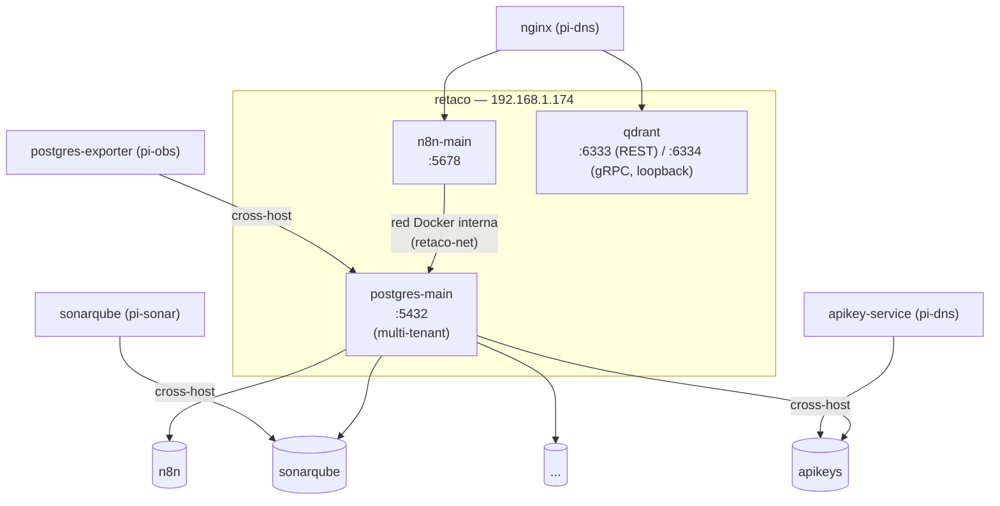

# 05 — Instalación y migración: retaco (192.168.1.174)

## Rol del nodo

`retaco` es el nodo de **datos y automatización** del clúster:

- **postgres-main** — PostgreSQL compartido y multi-tenant: una base aislada por proyecto (`n8n`, `sonarqube`, y cualquiera creada con `create-postgres-db.sh`).
- **qdrant** — Motor de búsqueda vectorial.
- **n8n-main** — Automatización de flujos de trabajo, co-localizado con `postgres-main`. Vive aquí (no en `ryzen`) para que las automatizaciones con disparador cron/webhook sigan funcionando aunque el stack de IA esté parado — `retaco` está siempre encendido, `ryzen` no.

Centralizar los datos aquí deja a `ryzen` dedicado exclusivamente a cómputo con GPU, y a las Raspberry Pi dedicadas solo a ejecución, sin datos de por medio — ver `docs/01-topologia.md`. `node-exporter`, `cadvisor`, `portainer-agent` y `watchtower` también se ejecutan aquí, consulta `docs/04-servicios-comunes.md`.

## Diagrama del nodo



`postgresql.home.arpa` es un **alias DNS directo** a esta IP (no pasa por nginx — Postgres no es HTTP); `qdrant.home.arpa` y `n8n.home.arpa` sí pasan por el proxy inverso normal.

Este documento cubre:
- **Instalación en vacío** (secciones 1–5): si `retaco` arranca sin datos previos.
- **Migración desde `ryzen`** (postgres-main + qdrant, sección 6) — histórica, ya aplicada en este clúster.
- **Migración desde `pi-sonar`** (sección 10) — histórica, ya aplicada.
- **Migración desde `ryzen`** (n8n-main, sección 11) — histórica, ya aplicada.

Se conservan como referencia — el mismo patrón sirve para migrar cualquier servicio con estado a `postgres-main` en el futuro. Si vienes a instalar desde cero, sigue solo las secciones 1–5.

## Requisitos previos

- Ubuntu Server 24.04 LTS (o Desktop), 64-bit x86_64
- Sin requisitos de GPU
- IP estática: `192.168.1.174`

---

## 1. Preparación del sistema base

```bash
sudo apt update && sudo apt upgrade -y
sudo apt install -y curl git htop iotop lsof net-tools unzip jq
```

### 1.1 IP estática (Netplan)

```yaml
network:
  version: 2
  renderer: networkd
  ethernets:
    eth0:
      dhcp4: false
      addresses:
        - 192.168.1.174/24
      routes:
        - to: default
          via: 192.168.1.1
      nameservers:
        addresses:
          - 192.168.1.170
          - 1.1.1.1
        search:
          - home.arpa
```

```bash
sudo netplan apply
```

## 2. Docker Engine

```bash
bash /srv/homelab/shared/scripts/install-docker-ubuntu.sh
```

No hace falta NVIDIA Container Toolkit — ni postgres ni qdrant usan GPU.

## 3. Preparar directorios de datos

```bash
sudo bash /srv/homelab/shared/scripts/prepare-host.sh retaco
```

Crea `postgres/{data,init}`, `n8n/data`, `qdrant/{storage,snapshots}`.

> ⚠️ Volver a ejecutar este script en un nodo con datos reales (p. ej. para añadir un directorio nuevo) puede romper la propiedad de directorios con UID propio si no tienen su excepción explícita — ver aviso en `shared/scripts/prepare-host.sh` y `docs/13-troubleshooting.md`.

## 4. Parámetros del kernel

```bash
sudo tee /etc/sysctl.d/99-homelab-retaco.conf <<'EOF'
vm.max_map_count=262144
vm.swappiness=10
net.core.somaxconn=65535
EOF
sudo sysctl --system
```

## 5. Desplegar el stack

```bash
cd /srv/homelab/retaco
cp .env.example .env
nano .env
```

### 5.1 Generar los valores `CHANGE_ME`

**Si se migra desde `ryzen`**: copiar literal `POSTGRES_ADMIN_PASSWORD`, `N8N_DB_*`, `QDRANT_API_KEY`, `QDRANT_READONLY_KEY` de `ryzen/.env` — así ningún workflow necesita reconfigurar credenciales.

**Instalación nueva sin datos previos**:

| Variable | Generar con |
|---|---|
| `POSTGRES_ADMIN_PASSWORD` | `openssl rand -base64 24` |
| `N8N_DB_PASSWORD` | `openssl rand -base64 24` |
| `N8N_ENCRYPTION_KEY` | `openssl rand -hex 16` — **irreversible, no cambiar tras guardar el primer workflow con credenciales** |
| `N8N_BASIC_AUTH_PASSWORD` | `openssl rand -base64 18` |
| `QDRANT_API_KEY` | `openssl rand -hex 16` |
| `QDRANT_READONLY_KEY` | `openssl rand -hex 16` (distinta de la anterior) |

**Antes** del primer arranque:

```bash
cp /srv/homelab/retaco/config/postgres/init/01-init-n8n.sh /srv/homelab/retaco/postgres/init/
```

> ⚠️ Si se va a migrar desde `ryzen` (sección 6), **no** copiar este script todavía — el volcado ya recrea rol y base de n8n, copiarlo antes provoca conflicto.

```bash
docker compose up -d
docker compose ps
```

**Antes** del primer arranque, o en cuanto un workflow de n8n llame a otro `*.home.arpa` (p.ej. `markitdown.home.arpa`, `ollama.home.arpa`) y falle con `unable to verify the first certificate` / `UNABLE_TO_VERIFY_LEAF_SIGNATURE`: n8n (Node.js/axios) no usa el almacén de certificados del sistema para sus propias peticiones HTTP salientes — mismo problema que `pysonar` con `REQUESTS_CA_BUNDLE` (`docs/09-instalacion-pi3-sonarqube.md`, sección 8.1), aquí resuelto con la variable nativa de Node `NODE_EXTRA_CA_CERTS`:

```bash
mkdir -p /srv/homelab/retaco/n8n/ca
curl -s http://192.168.1.170/ca.crt -o /srv/homelab/retaco/n8n/ca/homelab-ca.crt
docker compose up -d n8n-main   # recrea el contenedor con el volumen/env nuevos
```

`docker-compose.yml` ya monta ese fichero de solo lectura en `/etc/ssl/certs/homelab-ca.crt` y fija `NODE_EXTRA_CA_CERTS` a esa misma ruta — no hace falta tocar el compose, solo depositar el `.crt` antes de (re)arrancar el contenedor. No confundir con instalar la CA en el *host* de `retaco` (`docs/15-ca-interna.md`) — eso cubre `curl`/`dockerd`, no las peticiones que hace la propia aplicación Node.js dentro del contenedor.

### 5.2 PostgreSQL multi-tenant

`postgres-main` no es exclusivo de n8n — servidor compartido, una base+usuario aislados por proyecto:

```bash
bash /srv/homelab/shared/scripts/create-postgres-db.sh postgres-main dbadmin <nueva-db> <nuevo-usuario>
```

Conectar desde otro nodo: `postgresql://<usuario>:<password>@192.168.1.174:5432/<db>` — la conexión entre nodos siempre se hace por IP, no por nombre de contenedor.

### 5.3 registry — registro Docker privado

Almacena las imágenes construidas localmente del clúster (`apikey-service`, `markitdown-service`, `whisper-service`) para no tener que compilarlas en cada nodo — build en un sitio, `docker pull` en el resto. Imagen oficial `registry:2.8.3`, sin dependencias externas (no usa `postgres-main`, a propósito — mismo criterio de aislamiento que Vaultwarden).

**Autenticación**: htpasswd (bcrypt), un único usuario compartido para pull y push por ahora — separar lectura de escritura necesitaría un servicio de autenticación por tokens aparte (consulta `docs/22-mejoras-futuras.md`). Generar el fichero de credenciales **antes** del primer arranque:

```bash
mkdir -p /srv/homelab/retaco/registry/{data,auth}

REG_USER=admin
REG_PASS=$(openssl rand -base64 24)
docker run --rm httpd:2.4-alpine htpasswd -Bbn "${REG_USER}" "${REG_PASS}" \
  > /srv/homelab/retaco/registry/auth/htpasswd

echo "Usuario: ${REG_USER}"
echo "Password: ${REG_PASS}"   # guardar en Vaultwarden — no queda en ningún otro sitio en claro
```

`-B` fuerza bcrypt — es el único hash que entiende `REGISTRY_AUTH=htpasswd`, no vale un `htpasswd` genérico sin ese flag.

`REGISTRY_HTTP_SECRET` (en `.env`, `openssl rand -hex 32`) solo importa si algún día hay varias réplicas detrás de un balanceador — con una sola instancia, fijarlo solo evita un aviso en el log, no es funcionalmente necesario.

```bash
docker compose up -d registry
```

No va protegido con `apikey-service` en nginx (`registry.home.arpa`) — los clientes Docker (`docker login`/`push`/`pull`) hablan Basic Auth nativo contra el propio registry, no mandan la cabecera `X-Api-Key`; un `auth_request` ahí rompería `docker login`. La autenticación la resuelve el propio registry.

**Build y push van en el Makefile de cada servicio, no a mano** — `services/<nombre>/` (raíz del repo), `make build`. Lee la versión de `pyproject.toml`, hace login con `REGISTRY_USER`/`REGISTRY_PASSWORD` (de `.env`) y sube `:<versión>` + `:latest`. Ningún `docker-compose.yml` de ningún nodo construye estas imágenes — todos usan `image: registry.home.arpa/<nombre>:latest` y hacen `pull`.

```bash
cd services/markitdown-service
cp .env.example .env   # REGISTRY_USER/REGISTRY_PASSWORD desde Vaultwarden ("Docker Registry (registry.home.arpa)")
make build
```

Estado actual: `apikey-service`, `markitdown-service` y `whisper-service` ya están publicados y son los que consumen `pi-dns`/`pi-utils`/`ryzen` respectivamente — ver `docs/06`/`docs/09`/`docs/05` para el `pull` en cada nodo.

#### Multi-arch: `apikey-service`/`markitdown-service` sí, `whisper-service` no

`apikey-service` se ejecuta en `pi-dns` y `markitdown-service` en `pi-utils` — ambas Raspberry Pi 5, **arm64**. Sus `Makefile` usan `docker buildx build --platform linux/amd64,linux/arm64 --push` (no el `docker build` clásico, que no genera manifiestos multi-plataforma), con emulación QEMU para la parte arm64 si se construye desde una máquina x86. `whisper-service` se queda **solo en amd64, con `docker build` normal** — necesita CUDA/GPU NVIDIA, que las Pi no tienen, y solo se ejecuta en `ryzen` (x86).

Preparación (una vez por máquina de build):

```bash
docker run --privileged --rm tonistiigi/binfmt --install all
docker buildx create --driver docker-container --use
```

⚠️ **El builder `docker-container` se ejecuta en un contenedor BuildKit aparte, con su propio almacén de certificados — NO hereda la CA del host** aunque el host ya la tenga instalada (`update-ca-certificates`). El push a `registry.home.arpa` falla con `x509: certificate signed by unknown authority` hasta meter la CA dentro de ese contenedor (es Alpine, sin `update-ca-certificates`, hay que anexar el PEM a mano):

```bash
curl -s http://192.168.1.170/ca.crt -o /tmp/homelab-ca.crt
docker cp /tmp/homelab-ca.crt buildx_buildkit_<nombre-del-builder>0:/tmp/homelab-ca.crt
docker exec buildx_buildkit_<nombre-del-builder>0 sh -c "cat /tmp/homelab-ca.crt >> /etc/ssl/certs/ca-certificates.crt"
docker restart buildx_buildkit_<nombre-del-builder>0   # el almacén de certificados se lee una vez, hace falta reiniciar
```

Se pierde si el contenedor del builder se recrea (`docker buildx rm` + `create` de nuevo) — hay que repetirlo. Encontrado en vivo construyendo `apikey-service`/`markitdown-service`.

#### Requisitos en cada nodo que hace `docker pull` del registry

No basta con que `nginx` tenga el certificado — `dockerd` valida TLS contra el almacén de certificados **del sistema operativo del nodo**, no contra el de nginx. Dos pasos, una sola vez por nodo:

```bash
# 1. CA interna a nivel de sistema + reiniciar Docker (dockerd solo lee el almacén al arrancar)
curl -s http://192.168.1.170/ca.crt -o /tmp/homelab-ca.crt
sudo cp /tmp/homelab-ca.crt /usr/local/share/ca-certificates/homelab-cluster-ca.crt
sudo update-ca-certificates
sudo systemctl restart docker

# 2. Inicio de sesión (una vez, persiste en ~/.docker/config.json del usuario que ejecute docker compose)
docker login registry.home.arpa
```

⚠️ **`pi-dns` y `pi-utils` no tenían la CA instalada a nivel de sistema** pese a ser nodos del clúster (solo la tenían `ryzen`/máquinas de desarrollo) — hubo que instalarla ahí para poder hacer `pull`. Si se añade un nodo nuevo que vaya a consumir imágenes del registry, no dar esto por hecho.

⚠️ **`sudo systemctl restart docker` reinicia TODOS los contenedores del nodo**, no solo el que se está actualizando — en `pi-dns` esto corta brevemente `nginx`+Pi-hole (DNS y proxy HTTPS de todo el clúster) mientras vuelven a arrancar (unos segundos, con `restart: unless-stopped` vuelven solos). Hacerlo en una ventana de mantenimiento si el nodo es crítico.

Multi-arch de fábrica en el lado del registry — `registry:2` almacena manifiestos e imágenes de cualquier arquitectura sin configuración extra; toda la complejidad de arriba es de *generar* las imágenes arm64, no de almacenarlas/servirlas.

⚠️ **Limpieza/garbage collection deliberadamente fuera de esta fase** — `REGISTRY_STORAGE_DELETE_ENABLED=true` ya deja la API lista, pero no hay rutina automática que borre capas huérfanas ni imágenes viejas todavía. Ver `docs/22-mejoras-futuras.md`.

---

## 6. Migración desde ryzen (histórica)

Traspaso de `postgres-main`/`qdrant` desde `ryzen` a `retaco`, con una interrupción breve de ambos servicios.

### 6.0 Antes de empezar

- `retaco` desplegado (secciones 1–5), arrancado y sano, **sin** haber copiado aún `01-init-n8n.sh` (ver 5.1).
- `retaco/.env` con los **mismos** `POSTGRES_ADMIN_USER`/`PASSWORD`/`N8N_DB_*`/`QDRANT_*_KEY` que `ryzen/.env`.

### 6.1 PostgreSQL — volcado completo

```bash
ssh ryzen
source /srv/homelab/ryzen/.env
docker exec postgres-main pg_dumpall -U "${POSTGRES_ADMIN_USER}" \
  | gzip > /srv/homelab/backups/ryzen/postgres-migracion-retaco.sql.gz
```

```bash
scp /srv/homelab/backups/ryzen/postgres-migracion-retaco.sql.gz \
  <usuario>@192.168.1.174:/srv/homelab/backups/retaco/
```

```bash
ssh retaco
source /srv/homelab/retaco/.env
gunzip -c /srv/homelab/backups/retaco/postgres-migracion-retaco.sql.gz \
  | docker exec -i postgres-main psql -U "${POSTGRES_ADMIN_USER}" -d postgres
```

Verificar:

```bash
docker exec postgres-main psql -U "${POSTGRES_ADMIN_USER}" -d postgres -c '\l'
docker exec postgres-main psql -U "${POSTGRES_ADMIN_USER}" -d n8n -c '\dt'
```

### 6.2 Qdrant — copia del almacenamiento

```bash
ssh ryzen "cd /srv/homelab/ryzen && docker compose stop qdrant"
rsync -av /srv/homelab/ryzen/qdrant/storage/ retaco:/srv/homelab/retaco/qdrant/storage/
ssh retaco "cd /srv/homelab/retaco && docker compose up -d qdrant"
```

```bash
source /srv/homelab/retaco/.env
curl -s http://192.168.1.174:6333/collections -H "api-key: ${QDRANT_API_KEY}" | jq .
```

### 6.3–6.9 Resto de la migración

Quedan, además, los siguientes pasos: verificar el stack completo; actualizar `ryzen` (`--remove-orphans`, ya sin `postgres-main`/`qdrant`); actualizar `pi-obs` (`POSTGRES_EXPORTER_DSN`); actualizar `pi-dns` (nginx apuntando a `192.168.1.174`); registrar los cambios en el DNS; revisar las credenciales y las URL en los workflows de n8n; y hacer una verificación final con `check-health.sh` en `retaco`, `ryzen` y `pi-obs`.

### 6.10 Limpieza (solo tras confirmar, con margen de días)

```bash
ssh ryzen "rm -rf /srv/homelab/ryzen/postgres /srv/homelab/ryzen/qdrant"
```

---

## 7. Verificación de servicios

| Servicio | URL interna | Comprobación |
|---|---|---|
| qdrant | https://qdrant.home.arpa | GET /collections |
| postgres-main | `postgresql.home.arpa:5432` (no HTTP) | `pg_isready` vía `check-health.sh` |
| n8n-main | https://n8n.home.arpa | GET /healthz |
| registry | https://registry.home.arpa | GET /v2/ (401 sin credenciales = vivo) |

```bash
curl -s http://192.168.1.174:6333/collections | jq .
curl -sk https://n8n.home.arpa/healthz
curl -sk -o /dev/null -w "%{http_code}\n" https://registry.home.arpa/v2/
```

`postgresql.home.arpa` es alias DNS directo, sin pasar por `pi-dns`/nginx: `postgresql://n8n:<password>@postgresql.home.arpa:5432/n8n`.

## 8. Actualización del stack

```bash
bash /srv/homelab/shared/scripts/update-stack.sh retaco
```

## 9. Healthcheck manual

```bash
bash /srv/homelab/shared/scripts/check-health.sh retaco
```

---

## 10. Migración desde pi-sonar (histórica)

Traspaso de `sonarqube-db` (antes local en `pi-sonar`) a una base aislada dentro de `postgres-main`, ya en uso.

```bash
ssh retaco
source /srv/homelab/retaco/.env
bash /srv/homelab/shared/scripts/create-postgres-db.sh postgres-main "${POSTGRES_ADMIN_USER}" sonarqube sonarqube '<SONARQUBE_DB_PASSWORD-de-pi-sonar>'
```

```bash
ssh pi-sonar "cd /srv/homelab/pi-sonar && docker compose stop sonarqube"
ssh pi-sonar "bash /srv/homelab/shared/scripts/backup-postgres.sh pi-sonar sonarqube-db sonarqube"
```

Copiar el volcado a `retaco` y restaurar; desplegar `pi-sonar/docker-compose.yml` actualizado (sin `sonarqube-db`, `SONAR_JDBC_URL` a `postgresql.home.arpa`).

### ⚠️ Comprobación de DNS antes de dar por buena la migración

SonarQube resuelve `postgresql.home.arpa` **al arrancar** — si `systemd-resolved` de `pi-sonar` está atascado en el DNS secundario, falla con `UnknownHostException` y entra en bucle de reinicio. Ver `docs/13-troubleshooting.md`.

```bash
ssh pi-sonar "resolvectl status eth0 | grep -i 'current dns'"
ssh pi-sonar "sudo systemctl restart systemd-resolved"
ssh pi-sonar "cd /srv/homelab/pi-sonar && docker compose restart sonarqube"
```

---

## 11. Migración desde ryzen — n8n-main (histórica)

Traspaso de `n8n-main`, después de que `postgres-main` ya lleve tiempo en `retaco`. `n8n-main` pasa a conectar por nombre de contenedor (`retaco-net`), y no entre nodos.

Los datos están en dos sitios: los workflows, las credenciales y las ejecuciones (ya en Postgres, migrados en la sección 6); y la configuración local, los logs y los nodos personalizados (bind mount de `ryzen/n8n/data`, que hay que copiar aparte):

```bash
rsync -av --rsync-path="sudo rsync" /srv/homelab/ryzen/n8n/data/ retaco:/srv/homelab/retaco/n8n/data/
ssh retaco "sudo chown -R 1000:1000 /srv/homelab/retaco/n8n/"
```

> ⚠️ **`N8N_ENCRYPTION_KEY` debe ser exactamente la misma que tenía `ryzen`** — cifra las credenciales guardadas; cambiarla las deja ilegibles de forma irreversible.

```bash
cd /srv/homelab/retaco
docker compose up -d n8n-main
```

Tras esto, hay que revisar cualquier workflow que llamara a Ollama o a whisper-service por nombre de contenedor Docker — ya no comparten red, así que hay que usar el nombre de host público (`https://ollama.home.arpa`, `https://whisper.home.arpa`).
