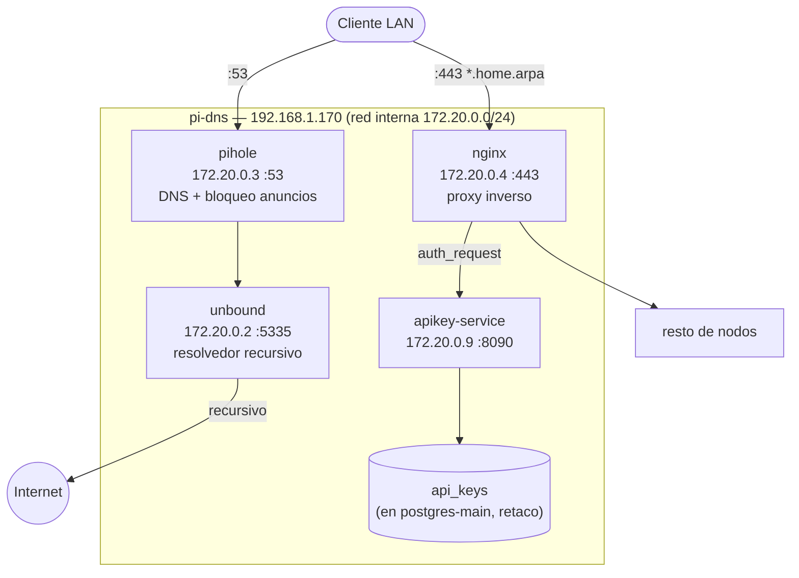
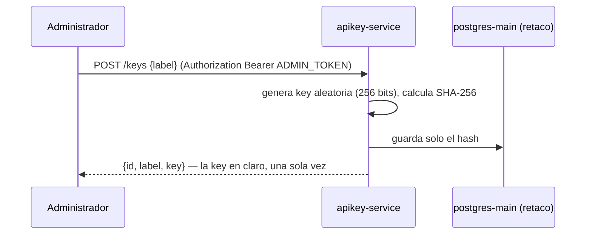

# 06 — Instalación y configuración: pi-dns (192.168.1.170)

## Rol del nodo

`pi-dns` es la **puerta de entrada** de todo el clúster. Aloja:

- **Pi-hole** — Bloqueador de anuncios + servidor DNS autoritativo para `home.arpa`.
- **Unbound** — Resolvedor recursivo local (upstream de Pi-hole), puerto 5335.
- **nginx** — Proxy inverso HTTPS para todos los servicios del clúster, certificado firmado por una CA interna propia (`docs/15-ca-interna.md`).
- **apikey-service** — Emisión/validación de API keys propias, usado por nginx (`auth_request`) para proteger servicios sin autenticación nativa.

> **Crítico:** este nodo debe estar operativo antes de que cualquier otro resuelva hostnames `*.home.arpa` o acceda a un servicio protegido.

## Diagrama del nodo



---

## 1. Preparación del sistema base

Seguir `docs/03-instalacion-base-ubuntu-raspi.md`, con estas particularidades:

### 1.1 IP estática

```yaml
# /etc/netplan/01-netcfg.yaml
network:
  version: 2
  renderer: networkd
  ethernets:
    eth0:
      dhcp4: false
      addresses:
        - 192.168.1.170/24
      routes:
        - to: default
          via: 192.168.1.1
      nameservers:
        addresses:
          - 127.0.0.1    # a sí misma (Pi-hole)
          - 1.1.1.1      # de respaldo durante el arranque inicial
```

```bash
sudo netplan apply
```

## 2. Deshabilitar systemd-resolved

Pi-hole necesita el puerto 53, que `systemd-resolved` ocupa por defecto:

```bash
sudo systemctl stop systemd-resolved
sudo systemctl disable systemd-resolved
sudo rm /etc/resolv.conf
echo "nameserver 1.1.1.1" | sudo tee /etc/resolv.conf
```

## 3. Docker Engine

```bash
bash /srv/homelab/shared/scripts/install-docker-ubuntu.sh
```

## 4. Preparar directorios de datos

```bash
sudo bash /srv/homelab/shared/scripts/prepare-host.sh pi-dns
```

Crea `pihole/{etc-pihole,etc-dnsmasq.d}`, `unbound/config`, `nginx/{conf,certs}`.

## 5. Copiar configuraciones estáticas

```bash
cp /srv/homelab/pi-dns/config/unbound/unbound.conf /srv/homelab/pi-dns/unbound/config/unbound.conf
cp /srv/homelab/pi-dns/config/nginx/nginx.conf /srv/homelab/pi-dns/nginx/conf/nginx.conf
cp /srv/homelab/pi-dns/config/nginx/proxy-common.conf /srv/homelab/pi-dns/nginx/conf/proxy-common.conf
cp /srv/homelab/pi-dns/config/nginx/apikey-auth.conf /srv/homelab/pi-dns/nginx/conf/apikey-auth.conf
```

### 5.1 Generar el certificado TLS

nginx necesita que el certificado exista **antes** del primer arranque (se monta de solo lectura):

```bash
bash /srv/homelab/pi-dns/config/nginx/generate-cert.sh
```

Crea `/srv/homelab/pi-dns/nginx/certs/home-arpa.{crt,key}`, autofirmado por la CA interna, válido 10 años para todos los `*.home.arpa` del clúster — ver `docs/15-ca-interna.md` para el detalle y cómo instalar la CA en tus dispositivos.

## 6. Desplegar el stack

```bash
cd /srv/homelab/pi-dns
cp .env.example .env
nano .env   # PIHOLE_PASSWORD, APIKEY_DATABASE_URL, APIKEY_ADMIN_TOKEN
docker login registry.home.arpa   # una sola vez — ver sección "apikey-service — imagen del registry" más abajo
docker compose pull apikey-service
docker compose up -d
```

> `apikey-service` necesita su base de datos creada de antemano en `postgres-main` (retaco) — ver sección "Despliegue de apikey-service" más abajo, antes del primer arranque.

> ℹ️ `pihole/pihole:latest` es **v6** — usa `FTLCONF_webserver_api_password` (no `WEBPASSWORD`, de v5) y `FTLCONF_dns_listeningMode: ALL` (no `DNSMASQ_LISTENING`) — las variables de v5 existen como nombre pero v6 las ignora en silencio, sin error visible.

Orden de arranque (`depends_on`): `unbound` → `pihole` → `nginx` (que además espera a `apikey-service`, healthy, por el `auth_request`); `apikey-service` arranca en paralelo a `pihole`.

### 6.1 Apuntar la propia Pi a sí misma

```bash
echo "nameserver 127.0.0.1" | sudo tee /etc/resolv.conf
```

Paso manual, nada lo hace automáticamente tras arrancar Pi-hole. Sin esto, herramientas del propio host (no en contenedor) nunca resuelven `*.home.arpa`, aunque `dig algo.home.arpa @192.168.1.170` sí funcione.

---

## 7. Configuración post-arranque de Pi-hole

### 7.1 Añadir registros DNS locales

Antes de que exista cualquier registro, `*.home.arpa` no resuelve en ningún sitio (ni el propio panel de Pi-hole). Primer acceso vía túnel SSH:

```bash
ssh -L 8053:127.0.0.1:8053 u-dns@192.168.1.170
```

Y en el navegador: `http://localhost:8053/admin` (Pi-hole v6: **Settings → DNS Records**, no "Local DNS" como en v5).

**Carga masiva por API (recomendada, evita decenas de clics manuales):**

```bash
PIHOLE_URL="http://localhost:8053" PIHOLE_PASSWORD="<la de .env>" \
  bash /srv/homelab/shared/scripts/load-dns-records.sh
```

En ejecuciones posteriores, ya con DNS funcionando, usar directamente el hostname (`PIHOLE_URL=https://pihole.home.arpa`). El script sustituye la lista completa cada vez — sirve también para restaurar tras un reset de Pi-hole. La tabla completa de hostnames vive en `shared/dns/dns-records.md` (fuente de verdad única, no duplicada aquí).

Verificar:

```bash
dig +short pihole.home.arpa @127.0.0.1
dig +short grafana.home.arpa @127.0.0.1
```

## 8. Configurar el router DHCP

> ⚠️ Este cambio se hace en el panel del router, afecta a **toda** la red doméstica. Durante instalación/pruebas, usar en su lugar la sección 8.1 (solo afecta al PC de gestión).

- DNS primario: `192.168.1.170`
- DNS secundario: `1.1.1.1` (fallback)

## 8.1 (Recomendado durante pruebas) DNS temporal solo en el PC de gestión

`mole` usa NetworkManager + systemd-resolved — gestionar con `nmcli`, no editando netplan a mano.

```bash
nmcli connection show --active
sudo nmcli connection modify "Conexión cableada 1" ipv4.dns "192.168.1.170"
sudo nmcli connection modify "Conexión cableada 1" ipv4.dns-search "~home.arpa"
sudo nmcli connection up "Conexión cableada 1"
```

El prefijo `~` en `ipv4.dns-search` lo convierte en dominio de enrutado — `home.arpa` resuelve contra pi-dns, todo lo demás sigue por el DNS habitual del router/ISP.

Verificar:

```bash
resolvectl status enp6s0
resolvectl query grafana.home.arpa   # → 192.168.1.170
resolvectl query github.com          # → DNS habitual, no pi-dns
```

Revertir cuando el router ya reparta `192.168.1.170` por DHCP (paso 8):

```bash
sudo nmcli connection modify "Conexión cableada 1" ipv4.dns ""
sudo nmcli connection modify "Conexión cableada 1" ipv4.dns-search ""
sudo nmcli connection up "Conexión cableada 1"
```

---

## apikey-service — API keys propias para servicios sin auth nativa

### Por qué existe

Varios servicios del clúster no tienen autenticación propia (Ollama, whisper-service, vLLM, ComfyUI y markitdown-service estaban completamente abiertos a quien alcanzara su nombre de host en la LAN). nginx open-source no soporta JWT nativo (`auth_jwt` es solo de nginx Plus) — la solución elegida es un microservicio propio que emite/valida API keys, integrado con nginx vía `auth_request`.

### Arquitectura



- **Código:** `services/apikey-service/` (raíz del repo, no bajo `pi-dns/`) — FastAPI + SQLAlchemy async + `asyncpg`, arquitectura limpia de 3 capas (`controllers` → `services` → `repositories`), `uv`. Build/push multi-arch (amd64+arm64, esta Pi lo necesita) mediante `make build`, publicado en `registry.home.arpa` — no se construye aquí, ver "apikey-service — imagen del registry" más abajo.
- **Puerto:** `8090` (evita el 8000 y el 9800, ya usados en el clúster).
- **Base de datos:** PostgreSQL, base `apikeys` aislada en `postgres-main` (retaco), creada con `create-postgres-db.sh` — mismo patrón que n8n/SonarQube.
- **Registro de actividad:** `loguru` para los logs generales (stdout); los intentos de acceso fallidos van además por un logger de auditoría separado (`opentelemetry-sdk`) directo al `otel-collector` de `pi-obs` — primer servicio del clúster en usar ese pipeline, hasta ahora sin consumidores.

### Modelo de datos

Tabla única `api_keys`: `id`, `key_hash` (SHA-256, la key en claro nunca se guarda), `label`, `created_at`, `revoked_at` (NULL = activa; revocar es borrado lógico, no se elimina la fila), `last_used_at`.

### Endpoints

| Método | Ruta | Auth | Uso |
|---|---|---|---|
| `GET` | `/health` | Ninguna | Healthcheck |
| `GET` | `/validate` | `X-Api-Key` | Lo llama nginx vía `auth_request`, no un humano |
| `POST` | `/keys` | `Bearer ADMIN_TOKEN` | Crea key nueva — `key` en claro solo en esta respuesta |
| `GET` | `/keys` | `Bearer ADMIN_TOKEN` | Lista keys (sin valor en claro) |
| `DELETE` | `/keys/{id}` | `Bearer ADMIN_TOKEN` | Revoca (no borra) |

`ADMIN_TOKEN` es un secreto propio del servicio (`APIKEY_ADMIN_TOKEN` en `.env`), sin relación con las keys que gestiona — mismo patrón que el token de admin de Vaultwarden.

### Uso desde línea de comandos

```bash
# Crear una key
curl -sk -X POST https://apikey.home.arpa/keys \
  -H "Authorization: Bearer ${APIKEY_ADMIN_TOKEN}" -H "Content-Type: application/json" \
  -d '{"label": "mi-uso"}'
# → {"id":1,"label":"mi-uso","key":"xxxxx"}  — guardar "key" ya, no se repite

# Listar / revocar
curl -sk https://apikey.home.arpa/keys -H "Authorization: Bearer ${APIKEY_ADMIN_TOKEN}"
curl -sk -X DELETE https://apikey.home.arpa/keys/1 -H "Authorization: Bearer ${APIKEY_ADMIN_TOKEN}"

# Probar contra un servicio protegido
curl -sk https://ollama.home.arpa/api/tags -H "X-Api-Key: xxxxx"
```

### Cómo proteger (o no) un servicio en nginx

Ver también el bloque de comentarios en `pi-dns/config/nginx/nginx.conf` y `pi-dns/config/nginx/apikey-auth.conf`. Es opt-in explícito — no rompe nada al desplegarse.

```nginx
server {
    listen 443 ssl;
    server_name mi-servicio.home.arpa;

    include /etc/nginx/apikey-auth.conf;   # define la location interna /_apikey_validate

    location / {
        auth_request /_apikey_validate;    # exige X-Api-Key válida
        proxy_pass http://192.168.1.X:PUERTO;
        include /etc/nginx/proxy-common.conf;
    }
}
```

Si `X-Api-Key` falta, es desconocida o está revocada, nginx devuelve `401` sin llegar al backend real. Para no proteger un servicio, simplemente no añadir esas dos líneas.

**Estado actual** (se actualiza según se van protegiendo servicios): `ollama.home.arpa`, `vllm.home.arpa`, `comfyui.home.arpa` (`docs/07-instalacion-ryzen.md`) y `markitdown.home.arpa`, `crawl4ai.scraper.home.arpa` (`docs/10-instalacion-pi4-utils.md`) están protegidos. La lista viva de verdad es el propio `nginx.conf` — buscar `include /etc/nginx/apikey-auth.conf;`.

### Despliegue de apikey-service (una vez)

```bash
# 1. Crear la base de datos en retaco
ssh u-data@192.168.1.174
bash /srv/homelab/shared/scripts/create-postgres-db.sh postgres-main <admin-user> apikeys apikeys

# 2. Configurar pi-dns/.env con el DSN resultante + un APIKEY_ADMIN_TOKEN (openssl rand -hex 32)
# 3. cd /srv/homelab/pi-dns && docker login registry.home.arpa && docker compose pull apikey-service && docker compose up -d
```

### apikey-service — imagen del registry, no build local

`apikey-service` **no** se construye en `pi-dns` — el `docker-compose.yml` de este nodo solo tiene `image: registry.home.arpa/apikey-service:latest`, nunca `build:`. El build/push real vive en `services/apikey-service/Makefile` (`make build`), ejecutado desde donde se desarrolla el código — ver `docs/05-instalacion-retaco.md` sección 5.3 para el registry en sí.

Para que `docker compose pull`/`up -d` funcione en **este** nodo (o cualquier otro que consuma imágenes del registry), hacen falta dos cosas una sola vez:

1. **La CA interna instalada a nivel de sistema** (no solo el certificado de nginx) — `dockerd` valida TLS contra el almacén de certificados del propio SO, no contra el de nginx. Mismo procedimiento que cualquier dispositivo (`docs/15-ca-interna.md`, sección Linux), **más un reinicio del propio Docker** después:
   ```bash
   curl -s http://192.168.1.170/ca.crt -o /tmp/homelab-ca.crt
   sudo cp /tmp/homelab-ca.crt /usr/local/share/ca-certificates/homelab-cluster-ca.crt
   sudo update-ca-certificates
   sudo systemctl restart docker   # dockerd solo lee el almacén de certs una vez, al arrancar
   ```
   ⚠️ En `pi-dns` esto reinicia también `nginx` y `pihole` (dependen del mismo daemon) — unos segundos de corte para todo el clúster (DNS + proxy HTTPS). Los contenedores con `restart: unless-stopped` vuelven solos.
2. **Inicio de sesión en el registry**, con el usuario que vaya a ejecutar `docker compose` en este nodo (`u-dns`):
   ```bash
   docker login registry.home.arpa   # credenciales en Vaultwarden: "Docker Registry (registry.home.arpa)"
   ```

`apikey-service`/`markitdown-service` se construyen multi-arch (`linux/amd64,linux/arm64`, mediante `docker buildx` + emulación QEMU) precisamente porque se ejecutan en Raspberry Pi (arm64) pero normalmente se compilan desde una máquina x86 — ver `docs/05-instalacion-retaco.md` sección 5.3 para el detalle del build.

### Notas de diseño

- `/validate` no exige `ADMIN_TOKEN` a propósito — lo llama nginx en cada petición de cada servicio protegido, no tiene sentido exigirle un secreto de administración distinto al de la propia key.
- Hash SHA-256 simple (no bcrypt/argon2): las keys son aleatorias de 256 bits, no contraseñas de baja entropía elegidas por un humano — no hay ataque de diccionario que temer.
- Candidato obvio pendiente de proteger: nada más por ahora — revisar `nginx.conf` para el estado actual siempre que se añada un servicio nuevo.

---

## Cortafuegos: acceso directo por IP y puerto

Los servicios protegidos con `apikey-service` también son alcanzables directamente por IP y puerto (saltándose la protección) — se puede cerrar ese acceso, dejando solo `pi-dns` como origen permitido, con `shared/scripts/toggle-direct-access.sh`. El detalle completo (y de por qué `ufw` por sí solo no sirve con Docker) está en `docs/17-firewall-acceso-directo.md`.

---

## Verificación de servicios

| Servicio | URL | Comprobación |
|---|---|---|
| Pi-hole admin (directo) | http://127.0.0.1:8053/admin | Solo desde el propio pi-dns |
| Pi-hole admin (proxy) | https://pihole.home.arpa | Redirect HTTP→HTTPS + proxy |
| nginx | https://openwebui.home.arpa | Proxy a open-webui |
| apikey-service | https://apikey.home.arpa/health | `{"status":"ok"}` |
| Unbound | Interno :5335 | Resolución recursiva |

```bash
dig openwebui.home.arpa @192.168.1.170
curl -sk https://grafana.home.arpa/api/health | jq .
docker exec pihole dig example.com @127.0.0.1 -p 5335
```

## Healthcheck manual

```bash
bash /srv/homelab/shared/scripts/check-health.sh pi-dns
```

---

## Certificado TLS: regeneración

CA interna, no autofirmado por servicio ni Let's Encrypt (`*.home.arpa` no es dominio público) — ver `docs/15-ca-interna.md` para el qué/por qué e instalación por dispositivo. Validez del certificado de servicio: 10 años por defecto, sin necesidad de renovación frecuente.

```bash
ssh u-dns@192.168.1.170
bash /srv/homelab/pi-dns/config/nginx/generate-cert.sh
docker exec nginx nginx -s reload
```

Añadir un hostname nuevo: editar `DOMAINS` en `generate-cert.sh`, regenerar, `nginx -s reload` — no requiere tocar la CA ni reinstalarla en ningún dispositivo.

```bash
openssl x509 -enddate -noout -in /srv/homelab/pi-dns/nginx/certs/home-arpa.crt
```
