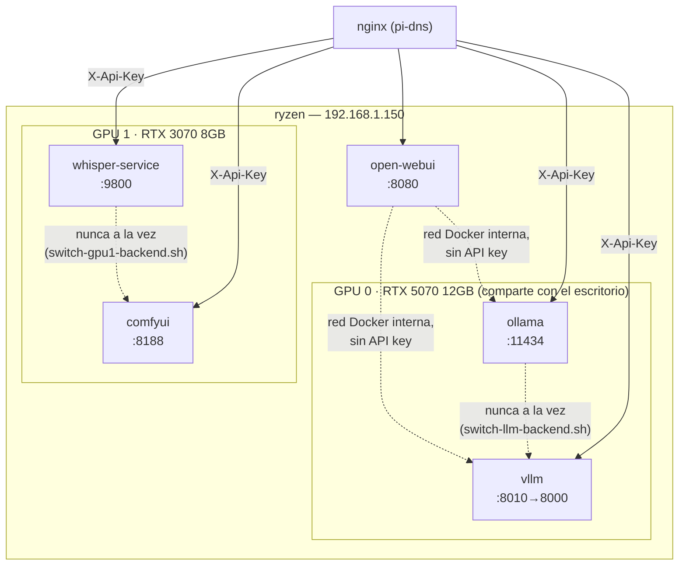

# 07 — Instalación y configuración: ryzen (192.168.1.150)

> **`open-webui` se instaló originalmente aquí (sección de más abajo, histórica), pero se migró después a `retaco`** para que siguiera accesible con este nodo apagado — ver `docs/23-bifrost-gateway-llm.md`. Las instrucciones de instalación de `open-webui` que aparecen en este documento ya no reflejan el despliegue real; se conservan como referencia histórica de cómo se montó la primera vez.

## Rol del nodo

`ryzen` (alias `mole` — es también el puesto de trabajo físico del usuario) es el **único nodo con GPU** del clúster, y por tanto el único que hace cómputo pesado de IA:

- **ollama** — Servidor de inferencia LLM flexible: carga/descarga modelos bajo demanda, cualquier tamaño que quepa en VRAM. Consumido por Open WebUI (en `retaco`) a través de Bifrost (`pi-sonar`), no directo — ver `docs/23-bifrost-gateway-llm.md`.
- **vllm** — Servidor de inferencia de alto rendimiento (API compatible OpenAI), para un único modelo fijo pero con mucho más rendimiento bajo carga concurrente que Ollama (PagedAttention + batching continuo). **Alterna con Ollama, nunca a la vez** — ver sección vLLM más abajo.
- **whisper-service** — Transcripción de audio a texto (FastAPI + faster-whisper). Código en `services/whisper-service/` (raíz del repo); imagen publicada en `registry.home.arpa` — este nodo solo hace `docker compose pull`, no build.
- **comfyui** — Generación de imágenes (Stable Diffusion y derivados). Coexiste con Ollama/vLLM (GPU distinta), pero **alterna con whisper-service**, con quien sí comparte GPU.

No hay ningún servicio de datos ni de automatización en este nodo — `postgres-main`, `qdrant` y `n8n-main` se migraron a `retaco` (192.168.1.174), para que las automatizaciones (cron, webhooks) sigan funcionando aunque `ryzen` esté apagado — `retaco` está siempre encendido, `ryzen` no.

## Hardware de GPU y por qué importa

```
GPU 0: NVIDIA GeForce RTX 5070 — 12 GB (Blackwell, sm120)
GPU 1: NVIDIA GeForce RTX 3070 —  8 GB
```

GPU 0 es también la que tiene el **monitor conectado** (es el puesto de trabajo real del usuario) — el escritorio (Xorg/gnome-shell/navegador) reserva ahí permanentemente ~2,5 GB, un dato que importa a la hora de dimensionar cuánta VRAM le queda realmente disponible a Ollama/vLLM. El CPU (Ryzen 9 5900X) no tiene gráficos integrados, así que no hay forma de mover el vídeo a la placa base — la única forma de recuperar esa VRAM es mover el cable físicamente a la GPU 1, o parar la sesión gráfica temporalmente.

## Diagrama del nodo



Ver también `docs/04-servicios-comunes.md` para `node-exporter`/`cadvisor`/`portainer-agent`/`watchtower`, que se ejecutan aquí igual que en el resto de nodos (en un `docker-compose.observability.yml` **separado**, ver más abajo).

## Dos stacks independientes

```
ryzen/
├── docker-compose.yml                 ← ollama, vllm, open-webui, whisper-service, comfyui (depende de .env)
├── docker-compose.observability.yml   ← node-exporter, cadvisor, portainer-agent, watchtower (sin .env)
├── switch-llm-backend.sh              ← alterna ollama/vllm (GPU 0)
└── switch-gpu1-backend.sh             ← alterna whisper-service/comfyui (GPU 1)
```

`whisper-service` ya **no** tiene código bajo `ryzen/` — vive en `services/whisper-service/` (raíz del repo) y se construye/publica desde ahí (`make build`, `docs/05-instalacion-retaco.md` sección 5.3); este nodo solo consume la imagen de `registry.home.arpa`.

Separados a propósito: se puede dejar la observabilidad del host en marcha (monitorización, gestión Docker) aunque todo el stack de GPU esté parado — útil para ahorrar energía cuando no se está usando activamente.

---

## Requisitos previos

- Ubuntu Server 22.04+ o Desktop (64-bit, x86_64)
- GPU NVIDIA compatible con CUDA 12.x
- Mínimo 32 GB RAM, 500 GB NVMe

## 1. Preparación del sistema base

```bash
sudo apt update && sudo apt upgrade -y
sudo apt install -y curl git htop iotop lsof net-tools unzip jq
```

### 1.1 IP estática (Netplan)

```yaml
network:
  version: 2
  renderer: networkd
  ethernets:
    eth0:
      dhcp4: false
      addresses:
        - 192.168.1.150/24
      routes:
        - to: default
          via: 192.168.1.1
      nameservers:
        addresses:
          - 192.168.1.170   # pi-dns
          - 1.1.1.1
```

```bash
sudo netplan apply
```

## 2. Docker Engine + NVIDIA Container Toolkit

```bash
bash /srv/homelab/shared/scripts/install-docker-ubuntu.sh
```

```bash
curl -fsSL https://nvidia.github.io/libnvidia-container/gpgkey \
  | sudo gpg --dearmor -o /usr/share/keyrings/nvidia-container-toolkit-keyring.gpg

curl -s -L https://nvidia.github.io/libnvidia-container/stable/deb/nvidia-container-toolkit.list \
  | sed 's#deb https://#deb [signed-by=/usr/share/keyrings/nvidia-container-toolkit-keyring.gpg] https://#g' \
  | sudo tee /etc/apt/sources.list.d/nvidia-container-toolkit.list

sudo apt update
sudo apt install -y nvidia-container-toolkit
sudo nvidia-ctk runtime configure --runtime=docker
sudo systemctl restart docker
```

Verificar que Docker ve ambas GPUs:

```bash
docker run --rm --gpus all nvidia/cuda:12.3.1-base-ubuntu22.04 nvidia-smi
```

## 3. Preparar directorios de datos

```bash
sudo bash /srv/homelab/shared/scripts/prepare-host.sh ryzen
```

Crea `ollama/models`, `open-webui/data`, `whisper/models`, `whisper/cache`, `vllm/models`, `comfyui/{models,input,output,user,custom_nodes}`.

## 4. Parámetros del kernel

```bash
sudo tee /etc/sysctl.d/99-homelab-ryzen.conf <<'EOF'
vm.swappiness=10
net.core.somaxconn=65535
EOF
sudo sysctl --system
```

## 5. Desplegar el stack de IA

```bash
cd /srv/homelab/ryzen
cp .env.example .env
nano .env   # OPENWEBUI_SECRET_KEY (obligatorio) + variables de vLLM/ComfyUI si se van a usar
docker compose pull
docker compose up -d ollama open-webui whisper-service
```

> ⚠️ `docker compose up -d` **sin indicar servicios** arranca *todo* lo definido en el fichero — incluidos `vllm` y `comfyui`, que compiten por VRAM con `ollama`/`whisper-service` respectivamente. Arrancar siempre servicios explícitos, o usar los scripts de alternancia (siguiente sección) para `vllm`/`comfyui`.

> `docker compose pull` antes de cada arranque, no solo la primera vez — este stack se para/arranca a demanda (ahorro de GPU) y `ollama/ollama:latest` puede llevar semanas cacheada sin refrescar. Para `whisper-service` (`registry.home.arpa/whisper-service:latest`) hace falta además `docker login registry.home.arpa` una vez en este nodo (credenciales en Vaultwarden, "Docker Registry (registry.home.arpa)") — sin iniciar sesión, el pull falla con `unauthorized`.

```bash
docker compose -f docker-compose.observability.yml up -d
```

## 6. Primer arranque de Ollama

```bash
docker exec -it ollama ollama pull llama3.2:3b
docker exec -it ollama ollama pull nomic-embed-text
```

---

## vLLM — alternar con Ollama para más throughput

### Por qué

Ollama es flexible pero está pensado para baja concurrencia. vLLM usa PagedAttention + batching continuo — mucho más rendimiento bajo carga concurrente, a cambio de servir **un único modelo fijo por proceso** (cambiar de modelo implica pararlo y relanzarlo con otro `--model`, no hay cambio en caliente). **Nunca deben ejecutarse a la vez** — compiten por la GPU 0.

### Elección de modelo y cuantización

Para vLLM, en vLLM 0.11.0 el kernel `gptq_marlin` resultó 8–19% más rápido que `awq_marlin` en el mismo hardware — **GPTQ/W4A16 gana a AWQ** en velocidad de servicio con calidad equivalente. FP8 (soportado nativamente por la RTX 5070/Blackwell) se descarta por ahora por reportes de incompatibilidades puntuales en RTX 50-series a julio de 2026.

Checkpoints elegidos, ambos de **RedHatAI** (antes Neural Magic, mantenedores de `llm-compressor`, más fiable que un checkpoint suelto de usuario):

| Modelo | Checkpoint | Peso (4-bit) | Uso recomendado |
|---|---|---|---|
| **Qwen3-14B** (por defecto) | `RedHatAI/Qwen3-14B-quantized.w4a16` | ~8 GB | Uso general, versátil, function calling |
| **Gemma 3 12B** (alternativa) | `RedHatAI/gemma-3-12b-it-quantized.w4a16` | ~6.5 GB | Más margen de VRAM/contexto; soporte de visión nativo |

### ⚠️ La VRAM real disponible es menor de lo que parece

Con el escritorio compartiendo la GPU 0 (~9 GB libres reales de 12 GB nominales), **ninguno de los dos modelos anteriores carga con holgura** — probado en vivo, ambos fallan con `torch.OutOfMemoryError` a mitad de la carga de pesos si `gpu_memory_utilization` se deja en 0.90 (necesitan ~9,5-10 GB reales, no los ~7-8 GB que calcula el tamaño del checkpoint por sí solo — capas como `lm_head` no van cuantizadas a 4-bit). Solución aplicada: `VLLM_GPU_MEM_UTIL=0.75` como valor de partida seguro, y **Gemma 3 12B** como modelo por defecto operativo hasta que se libere la GPU 0 del todo (moviendo el cable de vídeo a la GPU 1, pendiente). Con la GPU 0 completamente libre, ambos modelos cargan con margen y `gpu_memory_utilization` puede volver a 0.90.

### Servicio (`docker-compose.yml`)

```yaml
vllm:
  image: vllm/vllm-openai:latest
  container_name: vllm
  restart: unless-stopped
  environment:
    HUGGING_FACE_HUB_TOKEN: ${HUGGING_FACE_HUB_TOKEN:-}
  volumes:
    - /srv/homelab/ryzen/vllm/models:/root/.cache/huggingface
  ports:
    - "8010:8000"   # 8010, no 8000 (puerto por defecto de vLLM) — evitar colisiones
  command: >
    --model ${VLLM_MODEL:-RedHatAI/Qwen3-14B-quantized.w4a16}
    --served-model-name ${VLLM_SERVED_NAME:-qwen3-14b}
    --gpu-memory-utilization ${VLLM_GPU_MEM_UTIL:-0.90}
    --max-model-len ${VLLM_MAX_MODEL_LEN:-8192}
  deploy:
    resources:
      reservations:
        devices:
          - driver: nvidia
            device_ids: ["0"]   # fija a la RTX 5070 — nunca "all"
            capabilities: [gpu]
```

Sin `--api-key` nativo de vLLM a propósito — la protección real está en nginx/`apikey-service` (ver más abajo); añadir también auth nativa de vLLM obligaría a Open WebUI a mandar una key incluso en la llamada interna, rompiendo la simetría con cómo está configurado Ollama.

### Script de alternancia — `switch-llm-backend.sh`

```bash
cd /srv/homelab/ryzen
bash switch-llm-backend.sh ollama   # para vllm si está arriba, arranca ollama
bash switch-llm-backend.sh vllm     # para ollama si está arriba, arranca vllm
```

Para el contrario, espera un margen fijo (no usa `nvidia-smi` para confirmar VRAM libre — whisper-service también reserva GPU permanentemente mientras está arriba, así que un umbral de memoria libre daría falsos avisos), arranca el pedido y espera a que su healthcheck esté `healthy`.

---

## ComfyUI — coexiste con Ollama, alterna con whisper-service

### Por qué esta combinación

El objetivo era poder generar imágenes **a la vez** que se usa Ollama para texto — por eso ComfyUI vive en la GPU 1 (la 3070), no en la 0. Ahí comparte tarjeta con `whisper-service` (que sí está siempre arriba por defecto), así que esos dos **alternan** entre sí con su propio script, independiente del de Ollama/vLLM.

### Imagen y modelos

`yanwk/comfyui-boot:cu126-slim` — proyecto comunitario activamente mantenido (`github.com/YanWenKun/ComfyUI-Docker`), no existe imagen oficial del propio proyecto ComfyUI. Modelos recomendados: SD1.5 / SDXL-Turbo / LCM (2-6 GB, cómodos en los ~8 GB de la GPU 1); SDXL completo cabría muy justo. Los checkpoints **no se descargan solos** — colocarlos manualmente en `/srv/homelab/ryzen/comfyui/models/checkpoints/`.

### Servicio (`docker-compose.yml`)

```yaml
comfyui:
  image: yanwk/comfyui-boot:cu126-slim
  container_name: comfyui
  restart: unless-stopped
  environment:
    CLI_ARGS: ${COMFYUI_CLI_ARGS:-}
  volumes:
    - /srv/homelab/ryzen/comfyui/models:/root/ComfyUI/models
    - /srv/homelab/ryzen/comfyui/input:/root/ComfyUI/input
    - /srv/homelab/ryzen/comfyui/output:/root/ComfyUI/output
    - /srv/homelab/ryzen/comfyui/user:/root/ComfyUI/user
    - /srv/homelab/ryzen/comfyui/custom_nodes:/root/ComfyUI/custom_nodes
  ports:
    - "8188:8188"
  deploy:
    resources:
      reservations:
        devices:
          - driver: nvidia
            device_ids: ["1"]   # fija a la RTX 3070 — comparte con whisper-service
            capabilities: [gpu]
```

`whisper-service` está igualmente fijado a `device_ids: ["1"]` (antes `count: all`, lo que hacía que CUDA eligiera por defecto la GPU 0 y chocara con vLLM — corregido en vivo).

### Script de alternancia — `switch-gpu1-backend.sh`

```bash
cd /srv/homelab/ryzen
bash switch-gpu1-backend.sh comfyui           # activa comfyui, para whisper-service si estaba arriba
bash switch-gpu1-backend.sh whisper-service   # activa whisper-service, para comfyui si estaba arriba
```

---

## Autenticación — acceso externo con API key

`ollama.home.arpa`, `vllm.home.arpa` y `comfyui.home.arpa` exigen la cabecera `X-Api-Key` (protegidos con `apikey-service`, ver `docs/06-instalacion-pi1-dns.md`) — cualquier cliente en la LAN o workflow de n8n que los llame por el nombre de host público necesita una key emitida ahí.

**Open WebUI no se ve afectado**: le llega a los tres por la red Docker interna de este nodo (`http://ollama:11434`, `http://vllm:8000`), sin pasar por nginx.

```bash
curl -sk https://ollama.home.arpa/api/tags -H "X-Api-Key: <tu-key>"
curl -sk https://vllm.home.arpa/v1/models -H "X-Api-Key: <tu-key>"
curl -sk https://comfyui.home.arpa/system_stats -H "X-Api-Key: <tu-key>"
```

## Configurar Ollama y vLLM en Open WebUI

**Settings → Connections**, dos conexiones independientes y permanentes — solo funciona la que esté arriba en cada momento, no hace falta tocarlas al alternar:

| | Ollama (ya existente) | vLLM (nueva) |
|---|---|---|
| Tipo | **Ollama** | **OpenAI API** (no "Ollama" — vLLM expone la API compatible OpenAI) |
| Base URL | `http://ollama:11434` | `http://vllm:8000/v1` |
| API Key | Ninguna (tráfico interno) | Cualquier valor no vacío (vLLM no exige una propia) |

Tras guardar, el modelo de vLLM aparece en el selector con el nombre de `VLLM_SERVED_NAME` (por defecto `qwen3-14b`).

## whisper-service — detalle técnico

FastAPI en `services/whisper-service/` (raíz del repo), `uv`. Imagen publicada en `registry.home.arpa/whisper-service` — build/push amd64-only (`make build`, sin `buildx` multi-plataforma: necesita CUDA, las Raspberry Pi del clúster no tienen GPU, y este servicio solo se ejecuta aquí) desde `services/whisper-service/`, nunca desde `ryzen/docker-compose.yml` (solo `image:` + `pull`). `WhisperModel` cargado una vez al arrancar (nunca por request); si falla en el `device`/`compute_type` configurados (típicamente `cuda`/`float16` sin GPU disponible), cae automáticamente a `cpu`/`int8` para no dejar el servicio sin arrancar del todo. Transcripción en `run_in_executor` (hilo aparte, no bloquea el bucle de eventos asíncrono) — importante: `faster-whisper` devuelve los segmentos como generador perezoso, así que hay que envolver tanto la llamada a `transcribe()` como el consumo del generador, no solo la primera. Decodifica el audio internamente mediante PyAV (FFmpeg estático embebido en el wheel de `av`), no con un subproceso `ffmpeg` explícito — soporta la mayoría de contenedores y códecs habituales sin conversión previa en el código. Puerto `9800` (no `8000`, el puerto por defecto de incontables servicios FastAPI/dev). Tarda ~90s en arrancar (carga del modelo en GPU) — el healthcheck tiene `start_period: 90s`.

### Desarrollo local (tests, lint, SonarQube)

`whisper-service` es un proyecto `uv` autocontenido (igual que `apikey-service`, `docs/06-instalacion-pi1-dns.md`, y `markitdown-service`, `docs/10-instalacion-pi4-utils.md`) — no comparte tooling con el resto del monorepo, y comparte la misma estructura en capas (`controllers`/`services`/`infrastructure`, ver `README.md` del servicio). Los tests **no** cargan un `WhisperModel` real ni requieren GPU: `/transcribe` se prueba monkeypatcheando el modelo cargado en `whisper_service.infrastructure.whisper_model` con uno falso.

```bash
cd services/whisper-service
cp .env.example .env    # SONAR_TOKEN, REGISTRY_*

make test        # pytest, cobertura mínima 80% (pyproject.toml)
make test-cov     # igual, además genera coverage.xml (lo consume SonarQube)
make lint         # ruff check
make format       # ruff format
make typecheck    # mypy src/
make sonar-check  # test-cov + análisis SonarQube (docs/09-instalacion-pi3-sonarqube.md, sección 8.1)
make build        # build (solo amd64) + push a registry.home.arpa — docs/05-instalacion-retaco.md sección 5.3
make bump-version # sube la versión en pyproject.toml (patch por defecto — PART=minor|major)
```

---

## Verificación de servicios

| Servicio | URL interna | Comprobación |
|---|---|---|
| open-webui | https://openwebui.home.arpa | Interfaz web |
| ollama | https://ollama.home.arpa (+ API key) | GET /api/tags |
| vllm | https://vllm.home.arpa (+ API key) | GET /v1/models |
| whisper-service | https://whisper.home.arpa (+ API key) | GET /health |
| comfyui | https://comfyui.home.arpa (+ API key) | GET /system_stats |

```bash
bash /srv/homelab/shared/scripts/check-health.sh ryzen
```

## Actualización del stack

```bash
bash /srv/homelab/shared/scripts/update-stack.sh ryzen
```

## Notas

- Si algún workflow de n8n (en `retaco`) llama a `ollama`/`whisper-service` por nombre de contenedor Docker, no funciona — ya no comparten red Docker desde que n8n se migró. Hay que usar el nombre de host público.
- `docker compose up -d` sin servicio arranca *todo* el fichero — ver aviso en la sección 5.
