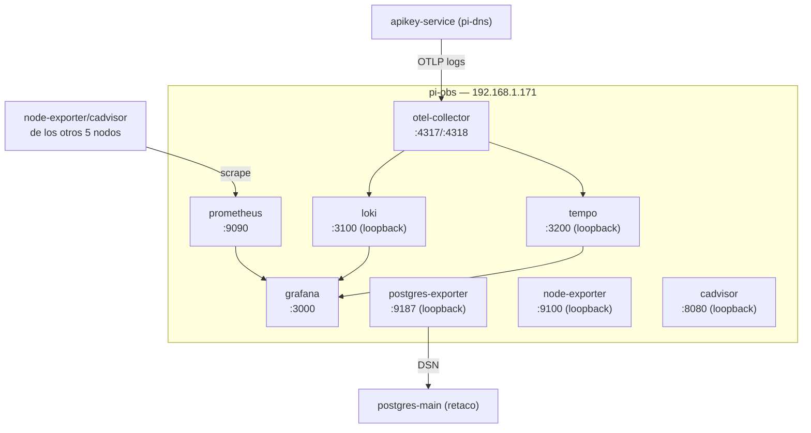

# 08 — Instalación y configuración: pi-obs (192.168.1.171)

## Rol del nodo

`pi-obs` es el nodo de observabilidad del clúster — el único sitio donde se agregan métricas, logs y trazas de **todos** los demás nodos:

- **otel-collector** — Receptor y enrutador central de telemetría (métricas, logs y trazas mediante OTLP).
- **prometheus** — Base de datos de series temporales para métricas.
- **grafana** — Visualización, dashboards y alertas.
- **loki** — Agregación de logs.
- **tempo** — Almacenamiento de trazas distribuidas.
- **postgres-exporter** — Métricas de PostgreSQL, conecta cross-host a `postgres-main` (retaco).

`node-exporter`, `cadvisor`, `portainer-agent` y `watchtower` también se ejecutan aquí — ver `docs/04-servicios-comunes.md`, son idénticos en todos los nodos.

## Diagrama del nodo



> A diferencia del resto de nodos, `node-exporter` y `cadvisor` **aquí** están en `127.0.0.1` (loopback) — Prometheus vive en este mismo host y los consume por red Docker interna, nadie externo los necesita directamente.

---

## 1. Preparación del sistema base

Seguir `docs/03-instalacion-base-ubuntu-raspi.md`.

### 1.1 IP estática

```yaml
# /etc/netplan/01-netcfg.yaml
network:
  version: 2
  renderer: networkd
  ethernets:
    eth0:
      dhcp4: false
      addresses:
        - 192.168.1.171/24
      routes:
        - to: default
          via: 192.168.1.1
      nameservers:
        addresses:
          - 192.168.1.170   # pi-dns
          - 1.1.1.1
```

```bash
sudo netplan apply
```

## 2. Docker Engine

```bash
bash /srv/homelab/shared/scripts/install-docker-ubuntu.sh
```

## 3. Parámetros del kernel

```bash
sudo tee /etc/sysctl.d/99-homelab-obs.conf <<'EOF'
vm.max_map_count=262144
vm.swappiness=10
EOF
sudo sysctl --system
```

## 4. Preparar directorios de datos

```bash
sudo bash /srv/homelab/shared/scripts/prepare-host.sh pi-obs
```

Crea `prometheus/data`, `grafana/data`, `loki/data`, `tempo/data`, `otel/config`.

## 5. Copiar configuraciones estáticas

```bash
cp /srv/homelab/pi-obs/config/otel-collector.yaml /srv/homelab/pi-obs/otel/config/otel-collector.yaml
cp /srv/homelab/pi-obs/config/prometheus.yml /srv/homelab/pi-obs/prometheus/prometheus.yml
cp /srv/homelab/pi-obs/config/loki.yaml /srv/homelab/pi-obs/loki/loki.yaml
cp /srv/homelab/pi-obs/config/tempo.yaml /srv/homelab/pi-obs/tempo/tempo.yaml
```

## 6. Desplegar el stack

```bash
cd /srv/homelab/pi-obs
cp .env.example .env
nano .env   # POSTGRES_EXPORTER_DSN y GF_ADMIN_PASSWORD
docker compose up -d
```

Orden de arranque (`depends_on`): `loki`/`tempo`/`prometheus` (paralelo) → `otel-collector` → `grafana` → `node-exporter`/`cadvisor`/`postgres-exporter` (independientes).

## 7. Configuración post-arranque de Grafana

Acceder a `https://grafana.home.arpa`, `admin` / valor de `GF_ADMIN_PASSWORD`.

Datasources aprovisionadas automáticamente (`config/grafana/datasources.yml`): Prometheus, Loki, Tempo — verificar en **Connections → Data Sources**, botón **Test** en cada una.

### Dashboards recomendados

| Dashboard | ID Grafana.com | Descripción |
|---|---|---|
| Node Exporter Full | 1860 | Métricas del host Linux, selector de nodo con los 6 del clúster |
| Docker / cAdvisor | 14282 | Métricas de contenedores, todos los nodos |
| PostgreSQL Overview | 9628 | Métricas de PostgreSQL |
| Loki Logs | 13639 | Explorador de logs |

**Dashboards → Import → Grafana.com dashboard ID**.

---

## 8. Verificación de servicios

| Servicio | Puerto | Alcance | Comprobación |
|---|---|---|---|
| otel-collector (OTLP) | 4317/4318 | LAN | Telemetría OTLP |
| prometheus | 9090 | LAN (proxificado en pi-dns) | GET /-/healthy |
| grafana | 3000 → nginx | LAN vía `https://grafana.home.arpa` | GET /api/health |
| loki, tempo, node-exporter, cadvisor, postgres-exporter, otel-collector metrics | varios | Solo loopback | ver comandos abajo |

```bash
curl -s http://192.168.1.171:9090/-/healthy
curl -sk https://grafana.home.arpa/api/health | jq .
```

Desde dentro de `pi-obs` (`ssh u-obs@192.168.1.171`):

```bash
curl -s http://127.0.0.1:3100/ready
curl -s http://127.0.0.1:3200/ready
curl -s http://127.0.0.1:9100/metrics | head -5
curl -s http://127.0.0.1:8080/healthz
curl -s http://127.0.0.1:8889/metrics | head -5
```

## 9. Enviar telemetría desde otros servicios

```bash
OTEL_EXPORTER_OTLP_ENDPOINT=http://192.168.1.171:4317
```

`apikey-service` (pi-dns) es, a día de hoy, el único que hace esto en la práctica — logs de auditoría de accesos fallidos, ver `docs/06-instalacion-pi1-dns.md`.

## 10. Healthcheck manual

```bash
bash /srv/homelab/shared/scripts/check-health.sh pi-obs
```

## Ver también

- `docs/04-servicios-comunes.md` — node-exporter/cadvisor/portainer-agent/watchtower.
- `docs/14-monitorizacion-completa-cluster.md` — cómo se recopilan las métricas del resto de nodos, dashboards y alertas.
