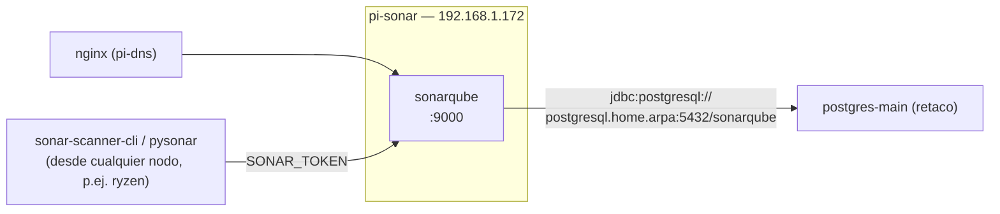

# 09 — Instalación y configuración: pi-sonar (192.168.1.172)

## Rol del nodo

`pi-sonar` aloja el análisis estático de calidad de código:

- **sonarqube** — Plataforma de análisis estático (Community Edition). Requiere recursos significativos de memoria — Raspberry Pi 5 con 8 GB recomendado.

La base de datos (antes `sonarqube-db`, local en este nodo) se migró a `postgres-main` en `retaco` — ver `docs/05-instalacion-retaco.md`. SonarQube se conecta entre nodos mediante `postgresql.home.arpa:5432`.

`node-exporter`, `cadvisor`, `portainer-agent` y `watchtower` también se ejecutan aquí — ver `docs/04-servicios-comunes.md`.

## Diagrama del nodo



---

## 1. Preparación del sistema base

Seguir `docs/03-instalacion-base-ubuntu-raspi.md`.

### 1.1 IP estática

```yaml
# /etc/netplan/01-netcfg.yaml
network:
  version: 2
  renderer: networkd
  ethernets:
    eth0:
      dhcp4: false
      addresses:
        - 192.168.1.172/24
      routes:
        - to: default
          via: 192.168.1.1
      nameservers:
        addresses:
          - 192.168.1.170   # pi-dns
          - 1.1.1.1
```

```bash
sudo netplan apply
```

## 2. Docker Engine

```bash
bash /srv/homelab/shared/scripts/install-docker-ubuntu.sh
```

## 3. Parámetros del kernel (obligatorios)

SonarQube (Elasticsearch interno) no arranca sin esto:

```bash
sudo tee /etc/sysctl.d/99-homelab-sonar.conf <<'EOF'
vm.max_map_count=524288
fs.file-max=131072
EOF
sudo sysctl --system
```

Verificar:

```bash
sysctl vm.max_map_count   # 524288
sysctl fs.file-max        # 131072
```

## 4. Límites de descriptores de archivo

```bash
sudo tee /etc/security/limits.d/99-sonarqube.conf <<'EOF'
sonarqube soft nofile 131072
sonarqube hard nofile 131072
sonarqube soft nproc 8192
sonarqube hard nproc 8192
EOF
```

## 5. Preparar directorios de datos

```bash
sudo bash /srv/homelab/shared/scripts/prepare-host.sh pi-sonar
```

Crea `sonarqube/{data,extensions,logs,temp}`, `chown -R 1000:1000` (UID con el que se ejecuta SonarQube).

## 6. Desplegar el stack

```bash
cd /srv/homelab/pi-sonar
cp .env.example .env
nano .env   # SONARQUBE_DB_PASSWORD — debe coincidir con la creada en retaco
docker compose up -d
```

> Requisito previo: la base de datos `sonarqube` debe existir ya en `retaco` — ver `docs/05-instalacion-retaco.md`, `shared/scripts/create-postgres-db.sh`.

Primer arranque: 3–5 minutos (inicializa base de datos + migraciones).

```bash
docker compose logs -f sonarqube
# Esperar: "SonarQube is operational"
```

## 7. Configuración post-arranque

### 7.1 Acceder

`https://sonarqube.home.arpa`, `admin`/`admin` — SonarQube obliga a cambiar la contraseña en el primer inicio de sesión.

### 7.2 Token de análisis

**My Account → Security → Generate Tokens**, tipo `Global Analysis Token`, guardar en un gestor de contraseñas.

### 7.3 Crear proyecto

**Projects → Create project → Manually**, con el token generado.

## 8. Análisis de código desde otro nodo

```bash
docker run --rm \
  -e SONAR_HOST_URL="https://sonarqube.home.arpa" \
  -e SONAR_TOKEN="<tu-token>" \
  -v "$(pwd):/usr/src" \
  sonarsource/sonar-scanner-cli
```

### 8.1 Análisis con `pysonar` (proyectos Python, sin Docker)

Alternativa a `sonar-scanner-cli` para los microservicios Python del clúster — un escáner nativo en Python instalable como dependencia `dev` con `uv`, sin necesidad de levantar un contenedor aparte. Integrado en los tres microservicios Python del clúster, todos bajo `services/` en la raíz del repo (no bajo cada nodo): `apikey-service`, `markitdown-service` y `whisper-service` (`services/apikey-service`, `services/markitdown-service`, `services/whisper-service`).

**`apikey-service` fue el primero integrado** — referencia completa para replicar en otro servicio:

- `pyproject.toml`: `pysonar` en `[dependency-groups] dev`.
- `sonar-project.properties` en la raíz del servicio: `projectKey`, `sources=src`, `tests=tests`, `python.coverage.reportPaths=coverage.xml`, y un `sonar.exclusions` para no analizar `__pycache__`/bytecode como si fuera código.
- `Makefile`: `make sonar` (análisis puntual) y `make sonar-check` (`test-cov` + `sonar` en un paso) — variables `SONAR_HOST_URL`/`SONAR_TOKEN`/`REQUESTS_CA_BUNDLE` siempre desde `.env` (copiar de `.env.example`), nunca escritas directamente en el código ni pasadas sueltas por la línea de comandos.

```bash
cd services/apikey-service   # o services/markitdown-service, o services/whisper-service
cp .env.example .env
nano .env   # SONAR_TOKEN — generado en My Account → Security → Generate Tokens
make sonar-check
```

El token de análisis (Global Analysis Token) es reutilizable entre proyectos — no hace falta generar uno nuevo por servicio, basta con copiarlo al `.env` de cada uno.

⚠️ **`SONAR_HOST_URL=https://sonarqube.home.arpa` requiere fijar también `REQUESTS_CA_BUNDLE`.** `pysonar` usa la librería `requests`, que valida TLS contra el bundle de `certifi`, no contra el almacén de certificados del sistema — la CA interna del clúster (`docs/15-ca-interna.md`) está instalada a nivel de sistema y por eso `curl`/navegadores la aceptan sin aviso, pero `requests` la rechaza con `CERTIFICATE_VERIFY_FAILED` si no se le indica explícitamente dónde está esa CA. Por eso el `Makefile` fija `REQUESTS_CA_BUNDLE ?= /etc/ssl/certs/ca-certificates.crt` como valor por defecto (Debian/Ubuntu, incluye la CA interna tras `generate-cert.sh`) y lo pasa al comando `pysonar` igual que `SONAR_HOST_URL`/`SONAR_TOKEN` — no hace falta tocar nada salvo que el bundle esté en otra ruta. Alternativa si se prefiere no depender de la CA interna: usar la IP directa `http://192.168.1.172:9000` (sin TLS, sin necesidad de `REQUESTS_CA_BUNDLE`).

⚠️ **Sin repo git, el sensor de texto y secretos de `pysonar` no respeta del todo `sonar.exclusions`** — sin la detección de "ficheros sucios" mediante git, cae a escanear más de la cuenta y puede quejarse de la codificación en bytecode compilado (`__pycache__/*.pyc`) o en artefactos de test (bases SQLite temporales). El target `sonar` del `Makefile` limpia esos ficheros justo antes de invocar `pysonar` como mitigación — deja de hacer falta en cuanto el repo esté bajo git (`docs/22-mejoras-futuras.md`, punto 2).

⚠️ **Si el servicio fija una versión de Python mediante `requires-python` en `pyproject.toml` pero no tiene `.python-version`, `uv run` puede coger el Python del sistema en vez de uno compatible.** Le pasó a `markitdown-service`: el sistema tenía Python 3.14 instalado, pero su dependencia `markitdown` arrastra `onnxruntime==1.20.1`, que **no publica wheel para cp314** (solo cp312/cp313/cp313t) — `uv run` fallaba en seco al resolver dependencias. Se resolvió con un fichero `.python-version` en la raíz del servicio (contenido: `3.12`, igual que el `FROM python:3.12-slim` del `Dockerfile`), que hace que `uv` use el intérprete 3.12 ya instalado en el sistema sin necesidad de descargar nada. Vale la pena crear este fichero en cualquier servicio Python nuevo del clúster desde el principio, no solo cuando falla.

Resultado del primer análisis de `apikey-service`: quality gate **OK**, cobertura 100%, 0 bugs, 0 duplicación, 1 vulnerabilidad MINOR y 3 code smells MINOR — los cuatro ya revisados y dejados a propósito (endpoint OTLP interno por HTTP con la IP escrita directamente en el código, y dos dependencias FastAPI sin `await` real dentro — cambiarlas obligaría a tocar en cascada los tests que las llaman directamente, por una ganancia mínima).

Resultado del primer análisis de `markitdown-service`: quality gate **OK**, cobertura 100%, 0 vulnerabilidades, 0 duplicación, 1 bug MAJOR y 7 code smells (2 MINOR, 5 MAJOR) — todos revisados y dejados a propósito como backlog de mejora (el "bug" es el uso de `tempfile.NamedTemporaryFile` síncrono dentro de un endpoint `async` — el servicio ya declara `aiofiles` como dependencia justo para esto, pendiente de migrar; los code smells son sugerencias de estilo moderno de FastAPI — `Annotated` en vez de valores por defecto, y documentar cada `HTTPException` en el parámetro `responses` de cada endpoint — ninguno afecta a la Quality Gate).

Resultado del primer análisis de `whisper-service`: quality gate **OK**, cobertura 100%, 0 bugs, 0 vulnerabilidades, 0 duplicación y 6 code smells MINOR/MAJOR — mismo tipo de sugerencias de estilo FastAPI que en los otros dos servicios (`Annotated`, documentar `HTTPException` en `responses`), dejadas igual como backlog sin bloquear la Quality Gate. Los tests no cargan un `WhisperModel` real ni requieren GPU — `/transcribe` se prueba monkeypatcheando el modelo cargado en `whisper_service.infrastructure.whisper_model` con uno falso, así se ejecutan igual en cualquier máquina de desarrollo.

⚠️ Los tres servicios se reestructuraron después en capas (`controllers`/`services`/`infrastructure` o `repositories`, ver `docs/06-instalacion-pi1-dns.md` y el `README.md` de cada uno) — los números de arriba son del análisis original, previo a esa reestructuración; no se ha vuelto a ejecutar `make sonar-check` desde entonces, así que los hallazgos concretos (aunque no la Quality Gate, que sigue pasando con `make test`) pueden haber cambiado.

## 9. Backup de la base de datos

La base vive en `retaco`, no aquí:

```bash
bash /srv/homelab/shared/scripts/backup-postgres.sh retaco postgres-main sonarqube
```

Contiene proyectos, issues, perfiles de calidad, usuarios, permisos — todo lo necesario para reconstruir la instancia. **No** incluye el índice de Elasticsearch (`pi-sonar/sonarqube/data`) — se regenera solo desde la base de datos al arrancar, no hace falta respaldarlo (práctica recomendada oficialmente por SonarQube).

Guardado en `/srv/homelab/backups/retaco/postgres-main_sonarqube_<fecha>.sql.gz`. Restaurar: `docs/12-backups-y-restore.md`.

## 10. Verificación de servicios

| Servicio | Puerto | Comprobación |
|---|---|---|
| sonarqube | 9000 | GET /api/system/status |
| postgres-main (retaco) | `postgresql.home.arpa:5432` | `check-health.sh retaco` |

```bash
curl -s http://192.168.1.172:9000/api/system/status | jq .
```

## 11. Healthcheck manual

```bash
bash /srv/homelab/shared/scripts/check-health.sh pi-sonar
```
