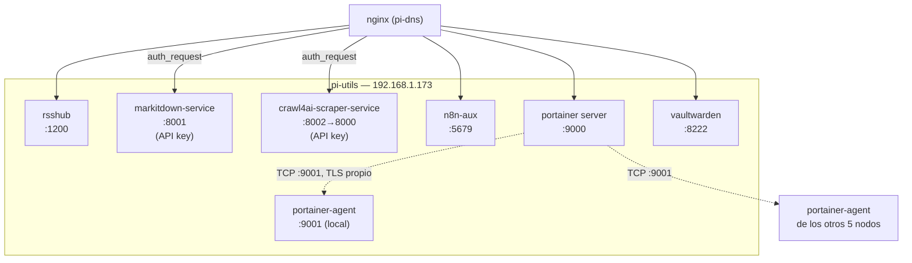
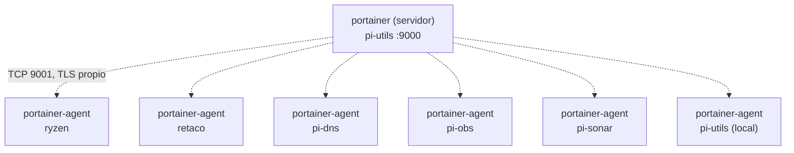

# 10 — Instalación y configuración: pi-utils (192.168.1.173)

## Rol del nodo

`pi-utils` agrupa servicios utilitarios, de productividad y de gestión del propio clúster:

- **rsshub** — Agregador RSS/Atom universal.
- **markitdown-service** — API REST de conversión de documentos a Markdown (FastAPI + `uv`). Imagen publicada en `registry.home.arpa` (código en `services/markitdown-service/`, raíz del repo — no se construye en este nodo). Protegido con `apikey-service`.
- **crawl4ai-scraper-service** — API REST de scraping y limpieza de contenido web a Markdown (FastAPI + Crawl4AI + Playwright/Chromium). Imagen publicada en `registry.home.arpa` (código en `services/crawl4ai-scraper-service/`, raíz del repo — no se construye en este nodo). Protegido con `apikey-service`, expuesto como `crawl4ai.scraper.home.arpa` (sub-subdominio a propósito).
- **n8n-aux** — Instancia secundaria de n8n para flujos de utilidades y notificaciones.
- **portainer** (servidor) — Panel web para gestionar Docker de **todo** el clúster sin terminal.
- **vaultwarden** — Gestor de contraseñas (compatible Bitwarden) del propio clúster.

`node-exporter`, `cadvisor`, `portainer-agent` y `watchtower` también se ejecutan aquí — ver `docs/04-servicios-comunes.md`.

## Diagrama del nodo



**Por qué aquí y no en otro nodo**: es el nodo con menos carga de los cuatro Pi (servicios ligeros), a diferencia de `pi-dns` (infraestructura crítica), `pi-obs` (8 servicios de observabilidad) o `pi-sonar` (SonarQube + Elasticsearch, el stack más pesado). No se instala en `ryzen` a propósito — es el nodo de cómputo GPU, y el objetivo del diseño es *liberarlo* de carga, no añadirle más.

---

## 1. Preparación del sistema base

Seguir `docs/03-instalacion-base-ubuntu-raspi.md`.

### 1.1 IP estática

```yaml
# /etc/netplan/01-netcfg.yaml
network:
  version: 2
  renderer: networkd
  ethernets:
    eth0:
      dhcp4: false
      addresses:
        - 192.168.1.173/24
      routes:
        - to: default
          via: 192.168.1.1
      nameservers:
        addresses:
          - 192.168.1.170   # pi-dns
          - 1.1.1.1
```

```bash
sudo netplan apply
```

## 2. Docker Engine

```bash
bash /srv/homelab/shared/scripts/install-docker-ubuntu.sh
```

## 3. Preparar directorios de datos

```bash
sudo bash /srv/homelab/shared/scripts/prepare-host.sh pi-utils
```

Crea `rsshub/data`, `n8n-aux/data`, `markitdown/cache`, `portainer/data`, `vaultwarden/data`. `crawl4ai-scraper-service` no necesita directorio propio — es un servicio sin estado persistente, no monta ningún volumen.

## 4. Inicio de sesión en el registry privado (markitdown-service, crawl4ai-scraper-service)

Ni `markitdown-service` ni `crawl4ai-scraper-service` se construyen en este nodo — el `docker-compose.yml` solo tiene `image: registry.home.arpa/<nombre>:latest` (`build:` no aparece en ninguno de los dos). El código y el build/push viven en `services/markitdown-service/` y `services/crawl4ai-scraper-service/` (raíz del repo, `make build` en cada uno) — ver `docs/05-instalacion-retaco.md` sección 5.3.

Para que `docker compose pull` funcione en este nodo, una sola vez:

```bash
# 1. CA interna a nivel de sistema (dockerd valida contra el almacén del SO, no el de nginx)
curl -s http://192.168.1.170/ca.crt -o /tmp/homelab-ca.crt
sudo cp /tmp/homelab-ca.crt /usr/local/share/ca-certificates/homelab-cluster-ca.crt
sudo update-ca-certificates
sudo systemctl restart docker   # dockerd solo lee el almacén de certs al arrancar

# 2. Inicio de sesión (credenciales en Vaultwarden: "Docker Registry (registry.home.arpa)")
docker login registry.home.arpa
```

Ambos se construyen multi-arch (`linux/amd64,linux/arm64`) porque esta Pi es arm64 — detalle del build en `docs/05-instalacion-retaco.md` sección 5.3.

## 5. Desplegar el stack

```bash
cd /srv/homelab/pi-utils
cp .env.example .env
nano .env
docker compose pull markitdown-service crawl4ai-scraper-service
docker compose up -d
```

### 5.1 Qué variables hay que ajustar de verdad

| Variable | ¿Cambiar? | Motivo |
|---|---|---|
| `N8N_AUX_ENCRYPTION_KEY` | **Sí, obligatorio** | Cifra credenciales de los workflows de n8n-aux. No cambiar tras el primer workflow guardado con credenciales — quedarían ilegibles. |
| `N8N_AUX_BASIC_AUTH_PASSWORD` | **Sí, obligatorio** | Contraseña del Basic Auth de la interfaz de n8n-aux. |
| `RSSHUB_ACCESS_KEY` | Decidir | En blanco = RSSHub abierto sin clave; con valor, hay que añadir `?key=` a cada petición. |
| `VAULTWARDEN_ADMIN_TOKEN` | **Sí, obligatorio** | Token del panel `/admin` de Vaultwarden — `openssl rand -base64 48`. |
| `VAULTWARDEN_SIGNUPS_ALLOWED` | `true` solo durante la instalación inicial | Ver sección Vaultwarden más abajo. |
| `CRAWL4AI_ENABLE_STEALTH_MODE`/`UNDETECTED_BROWSER`/`MAGIC_MODE` | Decidir | Anti-bot, cada uno independiente — más fiable contra bloqueos pero más lento. En este nodo están **activados** a propósito (ver sección de detalle más abajo). |
| Resto (`RSSHUB_CACHE_EXPIRE`, `MARKITDOWN_*`, `CRAWL4AI_*` restantes, `GENERIC_TIMEZONE`) | No | Valores por defecto razonables. |

⚠️ **`RSSHUB_ACCESS_KEY`**: si se deja el placeholder literal `CHANGE_ME_rsshub_access_key`, RSSHub queda "protegido" con una clave predecible y pública — peor que no tener clave. Generar una real, o dejarla explícitamente vacía.

```bash
openssl rand -hex 16     # N8N_AUX_ENCRYPTION_KEY
openssl rand -base64 18  # N8N_AUX_BASIC_AUTH_PASSWORD
openssl rand -base64 48  # VAULTWARDEN_ADMIN_TOKEN
```

---

## markitdown-service — detalle

Endpoints: `GET /health`, `POST /convert` (multipart, campo `file`) — PDF, DOCX, XLSX, PPTX, HTML, CSV, JSON, XML, imágenes, audio, ZIP.

```bash
curl -sk https://markitdown.home.arpa/health -H "X-Api-Key: <tu-key>"
curl -sk -X POST https://markitdown.home.arpa/convert -H "X-Api-Key: <tu-key>" \
  -F "file=@/tmp/test.pdf" -H "Accept: application/json"
```

Protegido con `apikey-service` (`docs/06-instalacion-pi1-dns.md`) — cualquier llamada externa, incluidas las de un workflow de n8n, necesita la cabecera `X-Api-Key`. Para llamarlo desde un workflow de n8n:

```
POST https://markitdown.home.arpa/convert
Headers: X-Api-Key: <key>
Content-Type: multipart/form-data
Body: file=<binario>
```

### Desarrollo local (tests, lint, SonarQube)

`markitdown-service` es un proyecto `uv` autocontenido (igual que `apikey-service`, `docs/06-instalacion-pi1-dns.md`) — no comparte tooling con el resto del monorepo. Vive en `services/markitdown-service/` (raíz del repo), no bajo `pi-utils/`.

```bash
cd services/markitdown-service
cp .env.example .env    # SONAR_TOKEN, REGISTRY_*, ajustes opcionales de MARKITDOWN_*/MAX_FILE_SIZE

make test        # pytest, cobertura mínima 80% (pyproject.toml)
make test-cov     # igual, además genera coverage.xml (lo consume SonarQube)
make lint         # ruff check
make format       # ruff format
make typecheck    # mypy src/
make sonar-check  # test-cov + análisis SonarQube (docs/09-instalacion-pi3-sonarqube.md, sección 8.1)
make build        # multi-arch (amd64+arm64) build + push a registry.home.arpa — docs/05-instalacion-retaco.md sección 5.3
make bump-version # sube la versión en pyproject.toml (patch por defecto — PART=minor|major)
```

⚠️ Si `uv run` falla al resolver dependencias porque el Python del sistema no es compatible con `onnxruntime` (dependencia de `markitdown`, sin wheel para Python 3.14), el fichero `.python-version` (contenido: `3.12`) ya fijado en la raíz del servicio soluciona esto — fuerza a `uv` a usar el mismo Python 3.12 que el `Dockerfile` (`FROM python:3.12-slim`).

---

## crawl4ai-scraper-service — detalle

Endpoints: `GET /health`, `POST /scrape` (JSON, campo `url`) — renderiza la página con Playwright/Chromium, limpia el boilerplate y devuelve markdown listo para RAG/LLM.

```bash
curl -sk https://crawl4ai.scraper.home.arpa/health -H "X-Api-Key: <tu-key>"
curl -sk -X POST https://crawl4ai.scraper.home.arpa/scrape -H "X-Api-Key: <tu-key>" \
  -H "Content-Type: application/json" -d '{"url": "https://example.com"}'
```

Protegido con `apikey-service` (`docs/06-instalacion-pi1-dns.md`) — mismo mecanismo que `markitdown-service`, cualquier llamada externa (incluidas las de un workflow de n8n) necesita `X-Api-Key`. Para llamarlo desde un workflow de n8n:

```
POST https://crawl4ai.scraper.home.arpa/scrape
Headers: X-Api-Key: <key>
Content-Type: application/json
Body: {"url": "https://..."}
```

### Overrides opcionales por petición (`params`)

Desde la versión `0.1.2`, `/scrape` acepta un campo opcional `params` para
sobreescribir la configuración del `.env` **solo para esa petición**
(`stealth_mode`, `undetected_browser`, `magic_mode`, `wait_until`,
`page_timeout_ms`, `word_count_threshold`, `max_retries`):

```bash
curl -sk -X POST https://crawl4ai.scraper.home.arpa/scrape -H "X-Api-Key: <tu-key>" \
  -H "Content-Type: application/json" \
  -d '{"url": "https://example.com", "params": {"stealth_mode": true, "wait_until": "networkidle"}}'
```

`stealth_mode`/`undetected_browser` lanzan un navegador Chromium dedicado
solo para esa petición si su valor difiere del `.env` (más lento, limitado
por `CRAWL4AI_MAX_CONCURRENT_DEDICATED_BROWSERS`, 2 por defecto en este
nodo — cada uno es un proceso Chromium completo, hay que limitar cuántos
se lanzan a la vez para no agotar la RAM de la Pi). El resto de campos no
tienen coste extra, siempre reutilizan el navegador compartido. Detalle
completo: `services/crawl4ai-scraper-service/README.md`.

### Sub-subdominio a propósito

`crawl4ai.scraper.home.arpa`, no `crawl4ai-scraper.home.arpa` — decisión explícita del propio diseño, no un error de naming. Pi-hole y nginx tratan `server_name`/registros DNS como cadenas de texto, un nivel adicional de subdominio no supone ninguna dificultad técnica.

### Anti-bot activado en este nodo

A diferencia del valor por defecto del propio servicio (`false`), este despliegue tiene `CRAWL4AI_ENABLE_STEALTH_MODE=true`, `CRAWL4AI_ENABLE_UNDETECTED_BROWSER=true` y `CRAWL4AI_ENABLE_MAGIC_MODE=true` en `/srv/homelab/pi-utils/.env` — decisión consciente para maximizar la tasa de éxito contra sitios con protección anti-scraping, asumiendo el coste de scrapes más lentos (Undetected Browser Adapter en particular). Ver `services/crawl4ai-scraper-service/README.md` para el detalle de cada mecanismo.

### `/scrape` puede tardar — timeout de nginx ajustado

`SCRAPE_TIMEOUT_SECONDS` (60s por defecto) puede acercarse al timeout por defecto de nginx (`proxy_read_timeout`, también 60s) — el `server{}` de `crawl4ai.scraper.home.arpa` en `nginx.conf` sube este valor a 90s explícitamente, solo para este host.

### ⚠️ El `Dockerfile` necesita instalar Chromium dos veces (Playwright *y* patchright)

Con `ENABLE_UNDETECTED_BROWSER=true` (activo en este nodo), Crawl4AI usa el
Undetected Browser Adapter, que se ejecuta sobre **`patchright`** (fork de
Playwright con parches de evasión), no sobre el paquete `playwright`
normal. `patchright` gestiona su propio build de Chromium — mismo
`PLAYWRIGHT_BROWSERS_PATH`, revisión de navegador distinta. El `Dockerfile`
original solo tenía `playwright install --with-deps chromium`; con
undetected activado, el arranque fallaba con `BrowserType.launch:
Executable doesn't exist at .../chromium_headless_shell-.../headless_shell`.
Los tests no lo detectan (mockean el repositorio entero, nunca lanzan un
navegador real) — solo apareció en este primer despliegue real. Fix:
también `patchright install --with-deps chromium` en el `Dockerfile`
(`services/crawl4ai-scraper-service/Dockerfile`, imagen `0.1.1+`).

### ⚠️ Calidad del markdown — limitación conocida en sitios complejos

Probado con 5 URLs reales tras el despliegue. 3/5 dieron markdown limpio y
completo (AWS Big Data Blog, dev.to, HackerNoon — con algo de ruido de
sitio en HackerNoon). 2/5 fallaron de forma real:

- **arstechnica.com**: la respuesta solo traía el `<title>` (86 caracteres), nada del cuerpo del artículo.
- **blog.bytebytego.com** (Substack): la respuesta traía la sección de comentarios/posts recomendados, no el artículo real.

**Diagnóstico confirmado** (no es bloqueo anti-bot ni fallo de carga): en
ambos casos el navegador capturó la página completa (610 KB / 198 KB de
HTML crudo, verificado con una llamada directa a `crawler.arun()` dentro
del contenedor, sin pasar por el pipeline de la app) — el problema está en
`PruningContentFilter` (el filtro de contenido usado para generar el
markdown final, `core/crawler_config.py`), que en estos dos sitios
concretos puntúa como "irrelevante" el cuerpo real del artículo y conserva
solo bloques de navegación/comentarios. Cambiar el `wait_until` a
`networkidle` **no** lo soluciona (probado) — confirma que no es un
problema de timing de carga.

**Sin resolver todavía** — posibles vías, ninguna aplicada aún:
1. Ajustar los parámetros de `PruningContentFilter` (umbral, longitud mínima de bloque) — riesgo: es una configuración global, podría empeorar otros sitios que hoy funcionan bien.
2. Cambiar de filtro (p. ej. `BM25ContentFilter`, que puntúa por relevancia de palabras clave en vez de heurística estructural) — no probado.
3. Aceptarlo como limitación conocida de la extracción automática en sitios con maquetación compleja (páginas ricas en JS/ads tipo Condé Nast, o Substack) — ningún scraper automático es 100% fiable en todos los sitios.

### Desarrollo local (tests, lint, SonarQube)

`crawl4ai-scraper-service` es un proyecto `uv` autocontenido (igual que `apikey-service`/`markitdown-service`) — no comparte tooling con el resto del monorepo. Vive en `services/crawl4ai-scraper-service/` (raíz del repo), no bajo `pi-utils/`.

```bash
cd services/crawl4ai-scraper-service
cp .env.example .env    # SONAR_TOKEN, REGISTRY_*, ajustes de anti-bot/concurrencia

make test        # pytest, cobertura mínima 80% (pyproject.toml)
make test-cov     # igual, además genera coverage.xml (lo consume SonarQube)
make lint         # ruff check
make format       # ruff format
make typecheck    # mypy src/
make sonar-check  # test-cov + análisis SonarQube (docs/09-instalacion-pi3-sonarqube.md, sección 8.1)
make build        # multi-arch (amd64+arm64) build + push a registry.home.arpa — docs/05-instalacion-retaco.md sección 5.3
make bump-version # sube la versión en pyproject.toml (patch por defecto — PART=minor|major)
```

---

## Portainer — gestión visual de Docker para todo el clúster

### Rol y arquitectura

Panel web para ver y operar contenedores sin terminal: logs, arrancar/parar/reiniciar, consola dentro del contenedor, CPU/RAM en vivo, gestión de imágenes/volúmenes. El **servidor** vive solo aquí; el **agente** (`portainer-agent`, ver `docs/04-servicios-comunes.md`) vive en los seis nodos — es lo que le da a Portainer visión de todo el clúster, no solo de este nodo.



El **servidor** solo necesita el volumen `/data` (su base de datos interna) — no monta `docker.sock`, no gestiona Docker directamente en el nodo donde vive. Todo el acceso pasa por el protocolo agente, con TLS gestionado por el propio Portainer (certificados propios, canal aparte del de nginx).

```yaml
portainer:
  image: portainer/portainer-ce:2.42.0
  container_name: portainer
  restart: unless-stopped
  command: ["--http-enabled"]
  volumes:
    - /srv/homelab/pi-utils/portainer/data:/data
  ports:
    - "9000:9000"
```

`--http-enabled`: sirve la interfaz en HTTP plano — TLS lo pone nginx por delante, un único certificado que gestionar en vez de uno por servicio.

### Primer arranque

```bash
cd /srv/homelab/pi-utils
docker compose up -d portainer
```

La interfaz pide fijar la contraseña de admin **dentro de los primeros 5 minutos**, o hay que `docker compose restart portainer` para reabrir esa ventana.

### Conectar cada agente como "Environment"

**Environments → Add environment → Agent**:

| Campo | Valor |
|---|---|
| Name | `pi-dns`, `pi-obs`, `pi-sonar`, `ryzen`, `retaco`, etc. |
| Environment address | `<ip-del-nodo>:9001` |

O por API:

```bash
JWT=$(curl -sk -X POST https://portainer.home.arpa/api/auth \
  -H "Content-Type: application/json" \
  -d '{"Username":"admin","Password":"<contraseña admin>"}' | jq -r .jwt)

curl -sk -X POST https://portainer.home.arpa/api/endpoints \
  -H "Authorization: Bearer ${JWT}" \
  -F "Name=ryzen" -F "EndpointCreationType=2" \
  -F "URL=tcp://192.168.1.150:9001" \
  -F "TLS=true" -F "TLSSkipVerify=true" -F "TLSSkipClientVerify=true"
```

`EndpointCreationType=2` = tipo "Agent" (no "Edge Agent" — todos los nodos están en la misma LAN, directamente alcanzables). Los seis nodos están conectados y verificados (`Status: up`).

### Operar con Portainer

- **Environments**: selector de nodo — cada uno se gestiona independiente; **Home** lista todos con su recuento de contenedores.
- **Containers**: logs en vivo, stats, consola (`exec`), start/stop/restart/recreate, sin SSH.
- **Volumes/Networks/Images**: inspección y limpieza por nodo.
- **Stacks**: Portainer puede desplegar un `docker-compose.yml` como "stack" — **no se usa así en este proyecto** (se gestiona por SSH + `docker compose`, que es lo que sabe hacer `update-stack.sh`); útil solo para pruebas puntuales sin tocar el repo.

### Notas de seguridad

- Contraseña de admin generada aleatoriamente en el primer arranque — cambiarla desde **Settings → Users** si se va a compartir el acceso.
- El agente monta `/var/run/docker.sock` — control total sobre Docker en ese host, equivalente a root. Coherente con el resto del clúster (acceso ya requiere estar en la LAN), pero relevante si `portainer.home.arpa` se expusiera fuera de casa algún día.

---

## Vaultwarden — gestor de contraseñas del clúster

### Rol y ubicación

Servidor compatible con el protocolo Bitwarden (implementación no oficial en Rust) — apps oficiales de Bitwarden (extensión, móvil, escritorio, CLI) apuntando a este servidor en vez de a la nube de Bitwarden. SQLite local, autocontenido, deliberadamente sin depender de `postgres-main`: es el servicio más sensible del clúster (aquí viven todas las demás contraseñas) — cuantas menos piezas móviles, mejor.

```yaml
vaultwarden:
  image: vaultwarden/server:1.37.0
  container_name: vaultwarden
  restart: unless-stopped
  environment:
    DOMAIN: https://vaultwarden.home.arpa
    SIGNUPS_ALLOWED: ${VAULTWARDEN_SIGNUPS_ALLOWED:-false}
    ADMIN_TOKEN: ${VAULTWARDEN_ADMIN_TOKEN}
    WEBSOCKET_ENABLED: "true"
    LOG_LEVEL: warn
  volumes:
    - /srv/homelab/pi-utils/vaultwarden/data:/data
  ports:
    - "8222:80"
```

`WEBSOCKET_ENABLED`: sincronización instantánea entre dispositivos, mismo puerto HTTP — `proxy-common.conf` ya trae las cabeceras de upgrade necesarias (igual que n8n).

### Primer acceso: crear tu cuenta

`SIGNUPS_ALLOWED=true` solo para este paso:

1. `https://vaultwarden.home.arpa` → **Create Account** → email + contraseña maestra. **No se puede recuperar si se pierde** (ni desde `/admin` — Vaultwarden nunca la conoce, solo un hash derivado).
2. Activar **2FA** (TOTP) — `Settings → Security → Two-step Login`.

Desactivar registros justo después:

```bash
ssh u-utils@192.168.1.173
nano /srv/homelab/pi-utils/.env    # VAULTWARDEN_SIGNUPS_ALLOWED=false
cd /srv/homelab/pi-utils && docker compose up -d vaultwarden
```

A partir de aquí, cuentas nuevas solo por invitación desde una Organización, o desde `/admin`.

### Panel de administración

`https://vaultwarden.home.arpa/admin`, autenticado con `VAULTWARDEN_ADMIN_TOKEN` (no la contraseña maestra) — gestión de usuarios, diagnóstico del servidor, configuración en caliente.

**(Opcional) Hash Argon2 del token de admin** — más seguro que texto plano, requiere terminal interactiva:

```bash
ssh u-utils@192.168.1.173
docker exec -it vaultwarden /vaultwarden hash --preset owasp
# → $argon2id$... — pegar como VAULTWARDEN_ADMIN_TOKEN en .env, Vaultwarden detecta el formato solo
```

### Conectar dispositivos

**Settings → Self-hosted environment** en cualquier app oficial de Bitwarden → Server URL `https://vaultwarden.home.arpa` → inicio de sesión normal. CLI: `bw config server https://vaultwarden.home.arpa`.

### Copia de seguridad y restauración

La copia de seguridad más importante de todo el clúster — sin él se pierde el acceso a todas las demás credenciales. SQLite en modo WAL no se copia en caliente de forma segura sin parar el contenedor unos segundos (no hay `sqlite3` en la imagen para un `.backup` en caliente).

```bash
bash /srv/homelab/shared/scripts/backup-vaultwarden.sh
# → /srv/homelab/backups/pi-utils/vaultwarden_<fecha>.tar.gz

bash /srv/homelab/shared/scripts/restore-vaultwarden.sh /srv/homelab/backups/pi-utils/vaultwarden_<fecha>.tar.gz
# Pide escribir "RESTAURAR" — sobreescribe todo
```

Cron diario recomendado (ver `docs/12-backups-y-restore.md`) y, dado lo crítico del dato, copiar periódicamente el `.tar.gz` fuera del propio nodo.

---

## Verificación de servicios

```bash
curl -s http://192.168.1.173:8001/health          # markitdown-service (directo, sin key)
curl -s http://192.168.1.173:8002/health          # crawl4ai-scraper-service (directo, sin key)
curl -s http://192.168.1.173:1200/                 # rsshub
curl -s http://192.168.1.173:5679/healthz          # n8n-aux
curl -sk https://vaultwarden.home.arpa/alive       # timestamp ISO 8601
```

| Servicio | Puerto host | URL externa |
|---|---|---|
| rsshub | 1200 | https://rsshub.home.arpa |
| markitdown-service | 8001 | https://markitdown.home.arpa (+ API key) |
| crawl4ai-scraper-service | 8002→8000 | https://crawl4ai.scraper.home.arpa (+ API key) |
| n8n-aux | 5679 | https://n8n-aux.home.arpa |
| portainer | 9000 | https://portainer.home.arpa |
| vaultwarden | 8222 | https://vaultwarden.home.arpa |

## Integración con n8n-main (retaco)

`n8n-aux`, `markitdown-service` y `crawl4ai-scraper-service` pueden llamarse desde `n8n-main` (en `retaco`, entre nodos) como nodo HTTP Request, siempre por el nombre de host público (`https://n8n-aux.home.arpa`, `https://markitdown.home.arpa`, `https://crawl4ai.scraper.home.arpa`) — nunca por nombre de contenedor Docker, ya que no comparten red.

## Actualización del stack

```bash
bash /srv/homelab/shared/scripts/update-stack.sh pi-utils
```

Solo markitdown-service/crawl4ai-scraper-service tras cambios de código — el build/push va aparte, desde `services/markitdown-service/` y `services/crawl4ai-scraper-service/` (`make build` en cada uno, ver `docs/05-instalacion-retaco.md` sección 5.3); en este nodo solo se hace `pull` + recrear:

```bash
cd /srv/homelab/pi-utils
docker compose pull markitdown-service crawl4ai-scraper-service
docker compose up -d markitdown-service crawl4ai-scraper-service
```

## Healthcheck manual

```bash
bash /srv/homelab/shared/scripts/check-health.sh pi-utils
```
