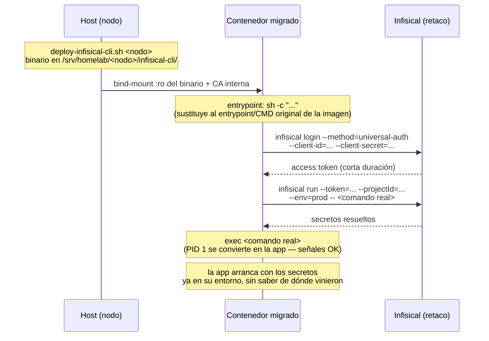

# 26 — Infisical: gestor de secretos para consumo entre máquinas

## Qué es y por qué

Mejora 16 del backlog (`docs/22-mejoras-futuras.md`), que documenta con detalle la decisión Infisical vs HashiCorp Vault — no se repite aquí. Resumen mínimo: Vaultwarden protege credenciales para que una persona las use desde un navegador; Infisical cubre el caso complementario, credenciales para que un contenedor las pida solo al arrancar, con identidades de máquina propias por servicio en vez de valores fijos copiados a mano en cada `.env`.

Dos decisiones de arquitectura tienen su propia ADR, con las alternativas consideradas y por qué se descartaron:

- **`docs/adr/0001-infisical-inyeccion-bind-mount-vs-imagen-derivada.md`** — cómo llega el CLI de Infisical a cada contenedor migrado (binario estático por nodo + bind-mount + `entrypoint:` en Compose, nunca horneado en ninguna imagen).
- **`docs/adr/0002-infisical-postgres-dedicado.md`** — por qué Infisical tiene su propio Postgres (`postgres-infisical`) en vez de compartir `postgres-main`.

## Despliegue en `retaco`

### Backend: Postgres dedicado + Valkey reutilizado

`postgres-infisical` (imagen `postgres:16-alpine`, no multi-tenant, un único rol/base "infisical" creados por la propia imagen al arrancar — sin `create-postgres-db.sh`, no hace falta) — ver ADR 0002 para el motivo de por qué NO comparte `postgres-main`.

Redis: Infisical lo exige (no hay modo sin Redis en autoalojado), pero **no se despliega uno dedicado** — reutiliza el `valkey` ya desplegado (mejora 24, `docs/25-valkey-cache.md`, que ya anticipaba a Infisical como primer consumidor real), con un usuario ACL propio en `retaco/config/valkey/users.acl`:

```
user infisical on >CONTRASEÑA ~* &* +@all -@admin -@dangerous +info
```

**Distinto del ejemplo de `docs/25`** (`~infisical:* &infisical:* +@read +@write -@dangerous`) — confirmado en vivo, no asumido: BullMQ (la cola interna de Infisical) usa nombres de clave propios con hash-tags (`{cron}:slot:0`, etc.), no un prefijo `infisical:`, así que restringir por prefijo de clave rompe el arranque (`NOPERM No permissions to access a key`). También necesita el comando `INFO` (categorizado como `@dangerous` en Valkey, no `@read`/`@write`), imprescindible para BullMQ. Sin un segundo consumidor real todavía en `valkey`, no hay ningún otro inquilino al que aislar de estas claves — si en el futuro aparece uno, revisar si conviene volver a restringir por prefijo en ambos usuarios a la vez.

`REDIS_URL` usa `rediss://` (TLS obligatorio, Valkey no acepta puerto en claro) contra el hostname `valkey.home.arpa`, **no** el nombre de contenedor `valkey` — el certificado TLS de Valkey solo lleva `CN=valkey.home.arpa` en el SAN (confirmado que ese hostname resuelve igual desde dentro de un contenedor en `retaco-net`, vía el DNS embebido de Docker reenviando a Pi-hole). Necesita además `NODE_EXTRA_CA_CERTS` (Infisical es Node/NestJS) apuntando a una copia de la CA interna montada en el contenedor — mismo patrón ya usado para `n8n-main` en `retaco/docker-compose.yml`.

### Servicio Infisical

Imagen standalone oficial `infisical/infisical:v0.162.18` (versión fijada, no `latest`). Variables clave (`retaco/.env`, plantilla en `.env.example`): `DB_CONNECTION_URI`, `REDIS_URL`, `ENCRYPTION_KEY` (`openssl rand -hex 16` — cifra todos los secretos, **nunca rotar sin plan de migración**), `AUTH_SECRET` (`openssl rand -base64 32`), `TRUSTED_PROXY_CIDRS` (el CIDR de nginx en `pi-dns`, evita que un cliente falsifique `X-Forwarded-For`), `TELEMETRY_ENABLED=false`, `DISABLE_UPDATE_CHECK=true` (mismo criterio que `n8n-main`: sin avisos de versión ni telemetría saliendo del clúster).

Publicado en el puerto `8006` de `retaco` (siguiente libre tras `epub2pdf`/`pdf2chunks`/`open-terminal-mcp`) — **necesario, no opcional**: sin `ports:` publicado, nginx en `pi-dns` no puede alcanzarlo (nodos distintos, no comparten red Docker) — error real cometido en el primer despliegue, corregido antes de la migración de ningún servicio.

### Acceso: DNS, nginx, CA

`infisical.home.arpa` → `pi-dns` (nginx le hace proxy hacia `192.168.1.174:8006`) → `shared/dns/dns-records.md` y `shared/scripts/load-dns-records.sh`. Añadido al array `DOMAINS` de `pi-dns/config/nginx/generate-cert.sh` (certificado regenerado, firmado por la CA interna). Bloque `server{}` **sin** `apikey-auth.conf` — Infisical gestiona su propio login, mismo criterio que `bifrost.home.arpa`/`registry.home.arpa`.

### SMTP no configurado

`/api/status` reporta `"emailConfigured":false` — esperado, no hay servidor SMTP en el clúster. Verás en los logs de Infisical `connect ECONNREFUSED 127.0.0.1:587` de forma periódica — inofensivo (intentos de envío de correo para invitaciones/notificaciones, sin ningún consumidor real de esa función hoy). Configurar SMTP solo si en algún momento hace falta invitar usuarios nuevos a la organización por email.

## Cómo funciona la inyección



El binario nunca vive en ninguna imagen (ver ADR 0001) — se despliega una vez por nodo con `shared/scripts/deploy-infisical-cli.sh <nodo>` y se monta por bind-mount en cada servicio migrado de ese nodo.

## Migrar un servicio nuevo — procedimiento

Generalizado a partir de la migración real de `apikey-service` (primer servicio, ver más abajo el detalle específico):

1. **Binario en el nodo** (si no está ya): `bash shared/scripts/deploy-infisical-cli.sh <nodo>`.
2. **Migrar los secretos a Infisical** — ver "Importación masiva de secretos" más abajo. Para los 10 servicios listados en "Estado actual" esto **ya está hecho**: sus secretos reales viven en su propia carpeta dentro del proyecto "Homelab Cluster", entorno `prod` — falta solo conectar el `docker-compose.yml` de cada uno (pasos 5-7 de aquí).
3. **Machine Identity con Universal Auth**: Organization Access Control → Machine Identities → Create Identity, nombre del servicio, método Universal Auth (sin restricción de IP — **IP allowlisting es una funcionalidad de pago, Infisical Pro/Enterprise, no disponible en la edición community autoalojada que usa este clúster** — no perder tiempo buscándola). Guardar `client_id`/`client_secret` en Vaultwarden.
4. **Dar acceso al proyecto**: dentro del proyecto → Access Control → Add Identity → seleccionar la identidad → rol de solo lectura (Viewer), restringido a la carpeta `/<servicio>/` de ese servicio (no a la raíz — cada identidad solo debe poder leer sus propios secretos).
5. **Averiguar el `ENTRYPOINT`/`CMD` real de la imagen** (solo si es de terceros — las propias ya se conocen por su `Dockerfile`): `docker inspect --format='{{.Config.Entrypoint}} {{.Config.Cmd}}' <imagen>`.
6. **Editar el `docker-compose.yml` del nodo** — bind-mount del binario y de la CA interna, `entrypoint: ["/bin/sh", "-c"]` + `command:` con el script de dos pasos (login + run), variables `INFISICAL_UNIVERSAL_AUTH_CLIENT_ID`/`_CLIENT_SECRET`/`INFISICAL_PROJECT_ID`/`INFISICAL_DOMAIN` y `SSL_CERT_FILE`. Plantilla completa: bloque `apikey-service` en `pi-dns/docker-compose.yml`.
7. **Desplegar y verificar antes de dar por bueno**:
   - Logs del contenedor: `Injecting N Infisical secrets into your application process` sin errores.
   - `docker inspect <servicio> --format='{{.State.Health.Status}}'` → `healthy`.
   - El servicio responde igual que antes de migrar (mismo endpoint de salud, mismo flujo funcional real).
   - Reiniciar el contenedor y confirmar que vuelve a arrancar solo.
   - Confirmar que el secreto en claro ya no queda en ningún `.env` del nodo.

## Importación masiva de secretos

Crear secretos uno a uno desde la UI no escala a "todos los servicios del clúster". Nada de CSV — Infisical no lo soporta — pero el CLI sí acepta un `.env` (o YAML) completo de golpe:

```bash
infisical secrets set --file=<ruta-al-.env> --path=/<servicio>/ \
  --env=prod --token=$TOKEN --projectId=$PROJECT_ID
```

Cada línea `CLAVE=valor` del fichero se convierte en un secreto — como ya tenemos un `.env` real por nodo, no hace falta convertir nada a mano.

**Credencial para el volcado**: las API keys personales de Infisical están **deprecadas** (`API keys are deprecated — use machine identities`, mensaje real visto en la UI de esta instancia) — no sirven como atajo. Se usó una Machine Identity (`bulk-import`, rol **Editor** a nivel de proyecto, no Viewer) creada para esto. **Decisión consciente: se mantiene viva** (no revocada tras el primer volcado) porque va a reutilizarse en la mejora 28 (`docs/22-mejoras-futuras.md`) para importar el resto de servicios — evita recrearla en cada ronda. Sigue siendo la única identidad del clúster con permiso de escritura de secretos; revisar si conviene revocarla o bajarla a un rol sin escritura cuando se dé por terminada la mejora 28.

Comandos usados en la importación real (2026-08-10), para repetir el patrón con el resto de servicios:

```bash
# Autenticar una vez, reutilizar el token para varios comandos
TOKEN=$(infisical login --method=universal-auth \
  --client-id=<bulk-import-client-id> --client-secret=<bulk-import-secret> \
  --domain=https://infisical.home.arpa/api --plain --silent)

# Por cada servicio: crear su carpeta, volcar su .env dentro
infisical secrets folders create --name <servicio> --path=/ \
  --domain=https://infisical.home.arpa/api --token="$TOKEN" \
  --projectId=<project-id> --env=prod

infisical secrets set --file=<servicio>.env --path=/<servicio>/ \
  --domain=https://infisical.home.arpa/api --token="$TOKEN" \
  --projectId=<project-id> --env=prod
```

`secrets delete` tiene la misma trampa a tener en cuenta: por defecto borra secretos **personales** (`--type=personal`), no los compartidos del proyecto — hace falta `--type=shared` explícito para borrar lo que realmente se ve en la UI del equipo (usado al limpiar los dos secretos duplicados que quedaron en la raíz tras mover `apikey-service` a su propia carpeta).

**Importante — importar el VALOR no es lo mismo que MIGRAR el servicio**: esto deja el secreto listo en Infisical, pero el contenedor real sigue leyendo su `.env` de siempre hasta que se completan los pasos 5-7 del procedimiento de arriba (bind-mount del CLI, wrapper en el `docker-compose.yml`, verificación). Ver la tabla de "Estado actual" para saber qué servicios tienen ya el secreto en Infisical pero **todavía leen de `.env` en producción** — son casos distintos, no confundirlos.

## Estado actual — mejora 28 completada: 11 servicios migrados

`apikey-service`/`authentik` (mejora 16, piloto) más los 9 de la mejora 28
(docs/22-mejoras-futuras.md), migrados y verificados en producción el
2026-08-19: `n8n-main`, `qdrant`, `open-webui`, `open-terminal-mcp` (retaco),
`n8n-aux`, `rsshub`, `vaultwarden` (pi-utils), `sonarqube`, `bifrost`
(pi-sonar). Verificación aplicada a los 9: logs con `Injecting N Infisical
secrets`, `healthy`, prueba funcional real (no solo el healthcheck) y
`--force-recreate` repetido dos veces para confirmar que arrancan solos.

### Hallazgo nuevo — el nombre del secreto en Infisical debe coincidir con el nombre real que consume la app, no con el de la variable `.env` original

El volcado masivo del 2026-08-10 importó cada `.env` tal cual, con los
nombres de variable **de ese fichero** — que no siempre coinciden con el
nombre que la aplicación real espera (el `.env` de este repo suele añadir un
prefijo por servicio o nodo para evitar colisiones entre `docker-compose.yml`
distintos, cosa que Infisical no necesita porque cada servicio ya vive en su
propia carpeta). Antes de conectar el wrapper de cada servicio (mejora 28) se
revisó carpeta por carpeta y se renombraron las claves que no coincidían:

| Servicio | Clave `.env` original (2026-08-10) | Clave real que consume la app (renombrada en Infisical) |
|---|---|---|
| `n8n-main` | `N8N_DB_PASSWORD` | `DB_POSTGRESDB_PASSWORD` |
| `qdrant` | `QDRANT_API_KEY` / `QDRANT_READONLY_KEY` | `QDRANT__SERVICE__API_KEY` / `QDRANT__SERVICE__READ_ONLY_API_KEY` |
| `open-webui` | `OPENWEBUI_SECRET_KEY` / `BIFROST_VIRTUAL_KEY` / `OPENWEBUI_DB_PASSWORD` | `WEBUI_SECRET_KEY` / `OPENAI_API_KEYS` / **`DATABASE_URL`** (ver nota abajo) |
| `n8n-aux` | `N8N_AUX_ENCRYPTION_KEY` / `N8N_AUX_BASIC_AUTH_USER` / `N8N_AUX_BASIC_AUTH_PASSWORD` | `N8N_ENCRYPTION_KEY` / `N8N_BASIC_AUTH_USER` / `N8N_BASIC_AUTH_PASSWORD` |
| `rsshub` | `RSSHUB_ACCESS_KEY` | `ACCESS_KEY` |
| `vaultwarden` | `VAULTWARDEN_ADMIN_TOKEN` | `ADMIN_TOKEN` |
| `sonarqube` | `SONARQUBE_DB_USER` / `SONARQUBE_DB_PASSWORD` | `SONAR_JDBC_USERNAME` / `SONAR_JDBC_PASSWORD` |
| `open-terminal-mcp`, `bifrost` | (ya coincidían) | sin cambios |

`open-webui` es el caso especial: `DATABASE_URL` no es una contraseña suelta,
es la cadena de conexión completa (`postgresql://openwebui:<password>@postgres-main:5432/openwebui`)
— Open WebUI solo sabe leer `DATABASE_URL` entera, no una variable de
contraseña por separado. Se sustituyó el secreto `OPENWEBUI_DB_PASSWORD` por
uno nuevo `DATABASE_URL` con la cadena completa ya construida, en vez de
intentar componerla en el `docker-compose.yml` a partir de un secreto
inyectado (no se puede: `infisical run` inyecta variables de entorno
completas, no permite interpolar un secreto dentro de otro string en YAML).

**Antes de migrar un servicio nuevo, comprobar siempre si el nombre de la
clave en Infisical coincide con lo que la aplicación real espera** — no
asumir que el volcado masivo ya lo dejó bien, aunque el servicio esté en la
lista de "candidatos limpios" del inventario.

### Hallazgo nuevo — el healthcheck no ve los secretos inyectados en caliente

`docker exec` (que es como Docker ejecuta el `healthcheck:` de Compose) hereda
el entorno **estático** con el que se creó el contenedor, no el entorno
dinámico del proceso PID 1 después de que `infisical run` lo sustituyera por
`exec`. Cualquier healthcheck que antes referenciara una variable de secreto
directamente (`$$ACCESS_KEY`, etc.) deja de funcionar tal cual tras migrar
ese servicio — se descubrió con `rsshub` (`/healthz?key=$$ACCESS_KEY` pasaba
a mandar `key=` vacío, 403 constante). Solución aplicada: aceptar como "sano"
tanto la respuesta autenticada (200) como el 403 esperado sin credencial
—mismo criterio que ya usaba `registry` para 401/200. Revisar este mismo
punto antes de migrar cualquier otro servicio cuyo healthcheck dependa de un
secreto.

### Hallazgo nuevo — un secreto migrado puede seguir haciendo falta en claro en el `.env` si otro servicio SIN migrar lo consume

`postgres-main` (retaco) usa `N8N_DB_PASSWORD` en su propio `environment:`
—no para autenticarse él mismo, sino como valor de semilla para su script de
init (`01-init-n8n.sh`), que solo se ejecuta si el volumen de datos está
vacío. Al migrar `n8n-main` se retiró `N8N_DB_PASSWORD` del `.env` de
`retaco` por rutina (ya no lo necesita `n8n-main`, que ahora lo recibe vía
Infisical con el nombre `DB_POSTGRESDB_PASSWORD`) — pero `postgres-main`
**seguía referenciándolo por su nombre original**, así que se quedó apuntando
a una variable vacía. No rompe nada mientras el volumen de `postgres-main` no
se reinicialice desde cero, pero si algún día ocurre, crearía el rol `n8n`
con una contraseña vacía que ya no coincidiría con la que `n8n-main` lee de
Infisical. Corregido restaurando `N8N_DB_PASSWORD` en el `.env` de `retaco`
(mismo valor, sin rotar) — `postgres-main` está en la lista de "bloqueados,
solo primer arranque" precisamente por este tipo de acoplamiento, así que
**antes de borrar una variable en claro tras migrar un servicio, comprobar
que ningún OTRO servicio (típicamente `postgres-main`, por sus scripts de
init) todavía la referencia por su nombre original**.

### Hallazgo nuevo — recrear un servicio puede arrastrar a `postgres-main`

`docker compose up -d --force-recreate <servicio>` recreó también
`postgres-main` la primera vez que se probó (sin pedirlo), por depender de él
vía `depends_on`. No perdió datos (bind-mount), pero sí cortó brevemente las
conexiones activas de otros consumidores (reconectaron solos). A partir de
ahí se usó `--force-recreate --no-deps <servicio>` en el resto de
recreaciones para evitar tocar dependencias sanas sin necesidad.

### Duda sin resolver — `BIFROST_ADMIN_USERNAME`/`_PASSWORD`

Sigue sin confirmarse si Bifrost los relee en cada arranque o solo la primera
vez (como Grafana) — la comprobación en vivo (cambiar el valor en Infisical y
recrear el contenedor) quedó bloqueada por una restricción de seguridad de
esta sesión (no está permitido teclear directamente en un campo de
contraseña). El resto de secretos de `bifrost` (`AWS_*`, `BIFROST_VIRTUAL_KEY`,
`BIFROST_DB_PASSWORD`) sí están confirmados de cada arranque y funcionando.
Pendiente para quien retome esta duda: cambiar `BIFROST_ADMIN_PASSWORD` en
Infisical, recrear `bifrost` y probar el login del panel admin con el valor
nuevo.

## Histórico — piloto `apikey-service`

Migrado y verificado en producción el 2026-08-09. Detalle específico de esta migración:

- Secretos migrados: `APIKEY_DATABASE_URL`, `APIKEY_ADMIN_TOKEN` — carpeta `/apikey-service/`, entorno `prod`, proyecto "Homelab Cluster" (quedaron primero en la raíz por un despiste al crearlos a mano; reorganizados el 2026-08-10 junto con la importación masiva del resto de servicios — `secrets set --file` a la carpeta nueva, `secrets delete --type=shared` de los duplicados en la raíz, y `--path=/apikey-service/` añadido al wrapper en `pi-dns/docker-compose.yml`. Verificado de nuevo tras el cambio: `docker logs` confirma "Injecting 2 Infisical secrets", `healthy`, `/health` responde 200).
- `pi-dns/docker-compose.yml`, bloque `apikey-service` — imagen y `Dockerfile` **sin tocar**, solo `entrypoint:`/`command:`/`volumes:`/`environment:` a nivel de Compose.
- Wrapper de dos pasos (no el `entrypoint:` de una sola línea que preveía originalmente el ADR 0001) — la versión del CLI desplegada (0.43.121) no soporta Universal Auth vía variables de entorno directamente en `infisical run`; hace falta `infisical login --method=universal-auth` primero. Detalle completo en el ADR 0001 (sección actualizada tras esta migración).
- `SSL_CERT_FILE` + bind-mount de la CA interna — sin esto, `x509: certificate signed by unknown authority` al llamar a `infisical.home.arpa` desde el CLI (Go no hereda el almacén de certificados de la imagen `python:3.11-slim`, que no la tiene instalada).
- Verificación end-to-end realizada: `curl` sin credencial → 401 en `ollama.home.arpa`; creación de una API key con `APIKEY_ADMIN_TOKEN` (ya inyectado, no visible en `.env`) → éxito; validación de esa key contra `ollama.home.arpa` → 200; revocación → 204. Reinicio de `apikey-service` con Infisical arriba → recupera solo. Infisical apagado con `apikey-service` ya en marcha → sigue sirviendo sin problema (no reinyecta en caliente). `apikey-service` forzado a reiniciar con Infisical caído → bucle de reintentos (`restart: unless-stopped`) hasta que Infisical vuelve, sin intervención manual — el trade-off exacto que ya anticipaba `docs/22` mejora 16 punto 5, confirmado en vivo.
- `pi-dns/.env`: `APIKEY_DATABASE_URL`/`APIKEY_ADMIN_TOKEN` eliminados tras confirmar el funcionamiento — quedan solo `APIKEY_SERVICE_INFISICAL_CLIENT_ID`/`_CLIENT_SECRET`/`_PROJECT_ID`.

### Servicios conectados en la mejora 28 (2026-08-19)

De los 10 servicios que quedaron con el secreto ya importado pero sin
conectar, 9 se conectaron y verificaron en la mejora 28 (claves finales tras
los renombrados de la sección anterior). `registry` queda fuera a propósito
(bajo valor, ver inventario).

| Nodo | Servicio | Carpeta | Secretos (nombre final, ya conectado) |
|---|---|---|---|
| retaco | `n8n-main` | `/n8n-main/` | `DB_POSTGRESDB_PASSWORD`, `N8N_ENCRYPTION_KEY`, `N8N_BASIC_AUTH_USER`, `N8N_BASIC_AUTH_PASSWORD` |
| retaco | `qdrant` | `/qdrant/` | `QDRANT__SERVICE__API_KEY`, `QDRANT__SERVICE__READ_ONLY_API_KEY` |
| retaco | `registry` | `/registry/` | **sin conectar** — `REGISTRY_HTTP_SECRET` (el credential real de `docker login` sigue en `htpasswd`, fuera de alcance — ver inventario) |
| retaco | `open-webui` | `/open-webui/` | `WEBUI_SECRET_KEY`, `OPENAI_API_KEYS`, `DATABASE_URL` (cadena de conexión completa), `QDRANT_API_KEY` (copia propia) |
| retaco | `open-terminal-mcp` | `/open-terminal-mcp/` | `OPEN_TERMINAL_API_KEY` |
| pi-utils | `n8n-aux` | `/n8n-aux/` | `N8N_ENCRYPTION_KEY`, `N8N_BASIC_AUTH_USER`, `N8N_BASIC_AUTH_PASSWORD` |
| pi-utils | `rsshub` | `/rsshub/` | `ACCESS_KEY` |
| pi-utils | `vaultwarden` | `/vaultwarden/` | `ADMIN_TOKEN` |
| pi-sonar | `sonarqube` | `/sonarqube/` | `SONAR_JDBC_USERNAME`, `SONAR_JDBC_PASSWORD` |
| pi-sonar | `bifrost` | `/bifrost/` | `AWS_ACCESS_KEY_ID`, `AWS_SECRET_ACCESS_KEY`, `AWS_ROLE_ARN`, `BIFROST_VIRTUAL_KEY`, `BIFROST_DB_PASSWORD`, `BIFROST_ADMIN_USERNAME`, `BIFROST_ADMIN_PASSWORD` — estos dos últimos con la duda de "solo primer arranque" (tipo Grafana) todavía sin confirmar, ver más arriba |

`markitdown-service`, `epub2pdf-service`, `pdf2chunks-service` y `crawl4ai-scraper-service` **no tienen secretos reales configurados hoy** (`CRAWL4AI_PROXY_*` existe como variable pero sin proxy activado/valor puesto) — nada que importar todavía.

### Inventario completo — auditoría de TODOS los servicios del clúster

La primera versión de este roadmap solo mencionaba "microservicios propios, luego n8n/Open WebUI/Bifrost" — incompleto: Infisical se planteó desde el principio (`docs/22` mejora 16) para proteger las credenciales de **todos** los servicios del clúster con secretos en `.env`, no solo los propios. Auditoría real (2026-08-09), contenedor por contenedor, en vivo (`docker exec <contenedor> sh -c "echo ok"` contra cada uno, no solo lectura de los `docker-compose.yml`) — el mecanismo del ADR 0001 tiene dos requisitos duros que no todos cumplen:

1. La app debe releer sus secretos en **cada arranque** del proceso, no solo usarlos para sembrar un estado interno persistente la primera vez (caso Postgres/Grafana — ver abajo).
2. La imagen debe tener un shell (`/bin/sh` como mínimo) para ejecutar el script de dos pasos.

**Bloqueados por falta de shell — el mecanismo NO puede aplicarse tal cual:**

| Nodo | Servicio | Motivo |
|---|---|---|
| `pi-utils` | `portainer` | Confirmado en vivo: `exec: "sh": executable file not found`. Además su propia contraseña de admin no es vía env var (primer acceso web, igual que el propio Infisical) — doblemente fuera de alcance. |
| `pi-obs` | `otel-collector` | Confirmado en vivo, sin shell — pero tampoco tiene secretos reales en su `environment:` (solo un fichero de config montado), así que no es candidato de todas formas. |

**Bloqueados por comportamiento "solo al primer arranque" — envolver el entrypoint con Infisical no logra nada útil una vez que el servicio ya está inicializado con datos reales (cambiar la variable de entorno no cambia la credencial real, que vive en el propio estado interno del servicio):**

| Nodo | Servicio | Variable | Motivo |
|---|---|---|---|
| `retaco` | `postgres-main` | `POSTGRES_ADMIN_PASSWORD` | Solo la usa `docker-entrypoint.sh` al inicializar un `PGDATA` vacío — ya inicializado, la contraseña real vive en `pg_authid`. Gestionarla de verdad requeriría `ALTER ROLE ... PASSWORD ...` vía SQL tras leerla de Infisical, no el wrapper genérico. |
| `retaco` | `postgres-infisical` | `POSTGRES_PASSWORD` | Mismo motivo — e irónico: es el propio backend de Infisical (ver ADR 0002, ya es un secreto de arranque irreducible). |
| `pi-obs` | `grafana` | `GF_SECURITY_ADMIN_PASSWORD` | Documentado y confirmado: solo siembra el usuario admin la primera vez contra su base interna vacía; arranques posteriores la ignoran. Rotar de verdad exige `grafana-cli admin reset-admin-password` o la API, no el env var. |
| `pi-dns` | `tailscale` (dentro de `pi-dns`) | `TS_AUTHKEY` | Solo se consulta para **registrar** un nodo nuevo — con el estado ya persistido en `/var/lib/tailscale` (bind-mount), los reinicios lo ignoran. |

**A verificar antes de migrar — comportamiento no confirmado, podría ser "cada arranque" o "solo una vez" (no dar por hecho ninguna de las dos sin comprobarlo primero, mismo criterio que el resto de este documento):**

| Nodo | Servicio | Variable | Duda concreta |
|---|---|---|---|
| `pi-dns` | `pihole` | `PIHOLE_PASSWORD` (→ `FTLCONF_webserver_api_password`) | Pi-hole v6 escribe ese valor en `pihole.toml` — sin confirmar si lo reaplica en cada arranque o solo si la clave todavía no existe en el fichero. |
| `pi-sonar` | `bifrost` | `BIFROST_ADMIN_USERNAME`/`_PASSWORD` | Bifrost persiste su `config_store` en Postgres — podría seguir el mismo patrón que Grafana (siembra una vez, ignora después). `AWS_ACCESS_KEY_ID`/`_SECRET_ACCESS_KEY`/`BIFROST_VIRTUAL_KEY`/`BIFROST_DB_PASSWORD` sí parecen de cada arranque (se usan por request/conexión, no para sembrar una cuenta). |

**Secreto real en fichero, no en variable de entorno — necesita un mecanismo distinto (renderizar el fichero a partir de un secreto de Infisical al arrancar, no el wrapper `infisical run` genérico):**

| Nodo | Servicio | Detalle |
|---|---|---|
| `retaco` | `registry` | El credential real de `docker login` vive en `htpasswd` (bcrypt, fichero montado) — `REGISTRY_HTTP_SECRET` sí es env-var y migrable sin problema, pero no es el secreto que de verdad importa. |

**Candidatos limpios ya migrados en la mejora 28** (2026-08-19): `n8n-main`, `qdrant`, `open-webui`, `open-terminal-mcp`, `n8n-aux`, `rsshub`, `vaultwarden`, `sonarqube`, `bifrost` — ver tabla más arriba. `BIFROST_ADMIN_USERNAME`/`_PASSWORD` migrados también (mismo mecanismo, valor sin cambiar) aunque la duda de "solo primer arranque" siga sin confirmar — no bloqueaba conectar el resto de secretos de `bifrost`, que sí están confirmados de cada arranque.

**Pendientes, sin tocar todavía:**

1. `markitdown-service`, `epub2pdf-service`, `pdf2chunks-service`, `crawl4ai-scraper-service` (`PROXY_PASSWORD`) — sin secretos reales configurados hoy, nada que migrar hasta que aparezca uno.
2. `registry` (`REGISTRY_HTTP_SECRET`) — bajo valor, descartado a propósito de esta ronda (el credential real de `docker login` sigue en `htpasswd`, fuera de alcance de Infisical de todas formas).
3. `postgres-exporter` (`pi-obs`) — su `DATA_SOURCE_NAME` embebe la contraseña de `postgres-main`; migrarlo depende de que esa contraseña siga siendo gestionable (ver el bloqueo de `postgres-main` abajo — no tiene sentido migrar el exporter mientras la fuente real del secreto siga fija).
4. `whisper-service` (`ryzen`) — sin secretos reales hoy; revisar si alguno aparece en el futuro. Sin nodo siempre encendido, la Machine Identity necesita seguir funcionando igual tras cada arranque/apagado de `mole` (`docs/19-wake-on-lan.md`).
5. `vllm` (`ryzen`) — `HUGGING_FACE_HUB_TOKEN`, opcional (vacío por defecto hoy) — baja prioridad.

**Sin secretos reales, no son candidatos** (revisado, solo variables de configuración: nivel de log, timezone, flags): `unbound`, `nginx`, `node-exporter`, `cadvisor`, `portainer-agent`, `watchtower`, `promtail`, `loki`, `tempo`, `prometheus`, `ollama`, `comfyui`, `valkey` (usa fichero ACL, no env vars — ya resuelto, `docs/25-valkey-cache.md`).

**Otras tareas pendientes:**

- Reorganizar los secretos de `apikey-service` en una carpeta `/apikey-service/` dentro del proyecto — quedaron en la raíz por un despiste al crearlos (no se entró en la carpeta antes de "Add Secret"); no bloqueante, sí conviene antes de que haya más servicios compartiendo la raíz del entorno `prod`.
- Decidir, para los cuatro bloqueados por "solo al primer arranque" (`postgres-main`, `postgres-infisical`, `grafana`, `tailscale`), si compensa un mecanismo distinto (script de arranque que lea el secreto de Infisical y lo aplique explícitamente vía la API propia de cada servicio) o si se aceptan como excepción permanente — no es una decisión urgente mientras ninguno de ellos rote hoy.
- Con la mejora 28 ya cerrada, decidir si conviene revocar o bajar de rol la Machine Identity `bulk-import` (rol Editor, la única con permiso de escritura de secretos) — se mantuvo viva a propósito para esta ronda, ver nota más arriba.

## Actualizar el CLI en un nodo

```bash
bash shared/scripts/deploy-infisical-cli.sh <nodo> [version]
# Recrear (no solo reiniciar) los contenedores que lo montan:
ssh <usuario>@<nodo> "cd /srv/homelab/<nodo> && docker compose up -d --force-recreate <servicio>"
```

Trade-off aceptado explícitamente (ADR 0001): esto es manual, no se beneficia de Watchtower/`update-stack.sh` como el resto de imágenes del clúster — a cambio, ninguna imagen depende de la versión del CLI.

## Backup

`postgres-infisical` entra en el mecanismo ya existente:

```bash
bash shared/scripts/backup-postgres.sh retaco postgres-infisical infisical
```

`ENCRYPTION_KEY`/`AUTH_SECRET` (`retaco/.env`) van también a Vaultwarden — perder `ENCRYPTION_KEY` sin backup deja ilegibles todos los secretos ya guardados, sin forma de recuperarlos.
