# 32 — Manual de operaciones de Docker Swarm (para dummies)

Guía de referencia rápida para las operaciones del día a día sobre el clúster Swarm: desplegar, arrancar, parar, reiniciar, escalar, ver logs, eliminar, y cómo se gestionan los secrets. Cada operación se explica primero por CLI (la vía que usa este repo por convención) y después el equivalente paso a paso en Portainer, con capturas reales de este mismo clúster. Pensado para alguien que nunca ha tocado Docker Swarm — si ya conoces Swarm, la "Chuleta rápida" del final te basta.

No repite el diseño ya explicado en `docs/31-docker-swarm.md` (por qué Swarm, por qué estos nodos sí y estos no, el historial de la migración) — este documento es solo el manual de uso.

---

## 1. Conceptos mínimos para entender el resto del manual

- **Nodo**: una máquina física (Raspberry Pi, PC) que forma parte del clúster.
- **Nodo manager**: un nodo que participa en el consenso Raft del Swarm y puede recibir comandos (`docker service`, `docker stack`, `docker secret`...). Este clúster no tiene nodos *worker* — los 5 nodos del Swarm son todos manager (ver sección 2).
- **Stack**: un grupo de servicios desplegados juntos desde un mismo `docker-compose.yml`, con `docker stack deploy`. Cada carpeta de `docker-swarm/stacks/<nombre>/` de este repo es un stack.
- **Servicio**: la unidad que gestiona Swarm dentro de un stack (equivalente a un `service:` del compose). Un servicio no es un contenedor — es una *declaración* ("quiero 1 réplica de esta imagen, con estos puertos/secrets/red"); Swarm crea y mantiene los contenedores reales por ti.
- **Tarea (task)**: el contenedor real que Swarm arranca para cumplir un servicio. Si un nodo se cae, Swarm crea una tarea nueva en otro nodo válido — por eso nunca deberías depender del nombre de un contenedor concreto, solo del nombre del servicio.
- **`mode: replicated` vs `mode: global`**: `replicated` (el caso normal) fija un número exacto de réplicas, en cualquier nodo válido. `global` (Traefik, `node-exporter`, `cadvisor`...) pone siempre una réplica en cada nodo manager, sin más.
- **Secret / Config**: contenido (sensible o no) que Swarm distribuye de forma nativa a los nodos que lo necesitan, sin que tengas que copiar ficheros a mano. Detalle completo en la sección 5.

---

## 2. ¿Desde dónde se pueden lanzar comandos de Swarm? ¿Vale ryzen?

**Corto: no directamente.** El estado del Swarm (qué servicios existen, en qué nodo corre cada tarea, los secrets...) solo vive en los nodos manager. Cualquier comando `docker service/stack/secret/config/node` tiene que ejecutarse con el cliente Docker apuntando a uno de esos 5 nodos — nunca a `ryzen` ni a `pi-dns`, que están fuera del Swarm a propósito (`docs/31-docker-swarm.md`).

| Nodo | IP | ¿Es manager del Swarm? |
|---|---|---|
| `retaco` | 192.168.1.174 | Sí |
| `pi-obs` | 192.168.1.171 | Sí |
| `pi-sonar` | 192.168.1.172 | Sí (Leader del consenso Raft ahora mismo — cualquier manager sirve igual para operar, esto solo importa para el propio Swarm internamente) |
| `pi-utils` | 192.168.1.173 | Sí |
| `pinchi` | 192.168.1.175 | Sí |
| `ryzen` | 192.168.1.150 | **No** — Compose clásico, nunca se unió al Swarm |
| `pi-dns` | 192.168.1.170 | **No** — solo DNS + Tailscale, deliberadamente fuera |

Si ejecutas `docker service ls` (o cualquier comando de Swarm) en `ryzen` o `pi-dns`, Docker responde `Error response from daemon: This node is not a swarm manager.` — no porque falte software (Docker Engine ya está instalado ahí), sino porque ese nodo nunca se unió al clúster.

### Cómo operar el Swarm si estás sentado en `ryzen` (o en `pi-dns`, o en tu propio portátil)

Dos formas, ninguna exige instalar nada nuevo en la máquina que no es manager — basta con tener el propio cliente Docker (`ryzen`/`pi-dns` ya lo tienen; en tu portátil, cualquier instalación normal de Docker Desktop/Engine trae el cliente) y acceso SSH ya autorizado a un nodo manager:

**Opción A — SSH directo cada vez (la que usa este repo hoy):**
```bash
ssh u-data@192.168.1.174 "docker service ls"
```
Simple, sin preparación previa. Es el patrón usado en todo este repo y en el resto de este manual.

**Opción B — Un `docker context` con transporte SSH (más cómodo si vas a lanzar muchos comandos).** Un *context* es simplemente un perfil guardado de "a qué Docker le hablo" — con transporte `ssh://` no necesita el daemon remoto escuchando en ningún puerto TCP, reutiliza el mismo acceso SSH que ya tienes. Válido para configurarlo en `ryzen`, en `pi-dns`, o en cualquier máquina con SSH ya autorizado a un nodo manager (tu portátil de gestión, por ejemplo) — el procedimiento es idéntico, cambia solo el usuario/IP del manager al que apuntas.

**Paso 1 — Crear el context (una sola vez por máquina):**
```bash
docker context create swarm-manager --docker "host=ssh://u-data@192.168.1.174"
```
Salida real (probado en vivo desde `ryzen` para este manual):
```
swarm-manager
Successfully created context "swarm-manager"
```
El nombre `swarm-manager` es arbitrario — elige el que quieras, pero sé consistente si vas a documentar esto para más gente. La IP puede ser la de cualquiera de los 5 managers (sección 2) — no hace falta que sea siempre `retaco`, cualquiera vale igual para operar.

**Paso 2 — Confirmar que aparece en la lista:**
```bash
docker context ls
```
```
NAME            DESCRIPTION                               DOCKER ENDPOINT               ERROR
default *       Current DOCKER_HOST based configuration   unix:///var/run/docker.sock
swarm-manager                                             ssh://u-data@192.168.1.174
```
El asterisco (`*`) marca el context activo — al crear uno nuevo, `default` sigue siendo el activo hasta que cambies explícitamente (paso 4).

**Paso 3 — Probarlo sin cambiar el context activo, con `--context`:**
```bash
docker --context swarm-manager service ls --format 'table {{.Name}}\t{{.Replicas}}'
docker --context swarm-manager node ls
docker --context swarm-manager stack ps traefik
```
Cada comando con `--context swarm-manager` opera sobre el Swarm sin tocar tu context activo — útil si solo necesitas un comando suelto y quieres evitar el riesgo del aviso del paso 4.

**Paso 4 — (opcional) Cambiar el context activo, para no escribir `--context` en cada comando:**
```bash
docker context use swarm-manager
docker service ls          # ya sin prefijo, hasta que cambies de contexto otra vez
docker node ls              # ídem

# Para volver a operar sobre el Docker LOCAL de esta máquina (el stack de IA de ryzen, por ejemplo):
docker context use default
```

**Paso 5 — (opcional) Eliminar el context si ya no lo necesitas:**
```bash
docker context rm swarm-manager
```
No afecta al Swarm en absoluto — solo borra el perfil guardado localmente en esta máquina.

⚠️ **Cuidado con `docker context use`** si sueles trabajar tanto con el Docker local de la máquina (en `ryzen`, el stack de IA, `docs/07-instalacion-ryzen.md`) como con el Swarm — es fácil olvidar en qué context estás y ejecutar `docker compose up -d` sobre el clúster equivocado, o viceversa. Si te pasa a menudo, usa siempre `--context swarm-manager` explícito (paso 3) en vez de cambiar el activo, o quédate directamente con la Opción A (SSH explícito, imposible confundirte de destino).

---

## 3. El patrón de despliegue de este repo: sin checkout permanente en los nodos

A diferencia de los nodos con Compose clásico (que sí tienen su `docker-compose.yml` real en `/srv/homelab/<nodo>/`), **ningún nodo del Swarm guarda una copia permanente de `docker-swarm/stacks/`**. El flujo siempre es: editar el fichero en este repo (tu checkout local), copiarlo a `/tmp` de un nodo manager, y desplegar desde ahí.

```bash
# 1. Copiar el/los ficheros del stack a un nodo manager
rsync -av docker-swarm/stacks/<nombre>/docker-compose.yml u-data@192.168.1.174:/tmp/<nombre>-compose.yml
# (Traefik es la excepción: también necesita dynamic/routes.yml, ver docker-swarm/stacks/traefik/)

# 2. Desplegar desde ese nodo
ssh u-data@192.168.1.174 "docker stack deploy -c /tmp/<nombre>-compose.yml <nombre> --with-registry-auth && rm /tmp/<nombre>-compose.yml"
```

`--with-registry-auth` reenvía tus credenciales de `registry.404labo.net` a los nodos que necesiten tirar de una imagen nueva — sin esto, un nodo que todavía no tenga la imagen en caché puede fallar el pull si el registry exige login.

---

## 4. Operaciones comunes (CLI)

Todos los comandos de esta sección se ejecutan **en un nodo manager** (vía SSH, o `--context`, ver sección 2). Usamos `capataz_capataz-api` como ejemplo real a lo largo de todo el manual — el prefijo `<stack>_` delante del nombre del servicio es automático, siempre lo pone Swarm.

### 4.1. Ver qué hay desplegado

```bash
docker stack ls                          # lista de stacks, con nº de servicios de cada uno
docker service ls                        # TODOS los servicios del clúster, con réplicas N/M
docker stack services capataz            # solo los servicios del stack "capataz"
docker stack ps capataz                  # tareas (contenedores reales) del stack, con su nodo y estado
docker service ps capataz_capataz-api    # tareas de un único servicio — útil para ver el historial
                                          # (tareas "Shutdown" anteriores) al diagnosticar un problema
```

### 4.2. Desplegar / actualizar un stack

Ya visto en la sección 3 — `docker stack deploy` es **idempotente**: si el stack ya existe, actualiza solo lo que haya cambiado en el fichero (imagen, variables, puertos...) sin tocar lo demás. Es el mismo comando para "desplegar por primera vez" y para "aplicar un cambio" — no hay un comando "actualizar" distinto.

### 4.3. Ver logs

```bash
docker service logs capataz_capataz-api             # todo el histórico disponible
docker service logs capataz_capataz-api --tail 100  # últimas 100 líneas
docker service logs capataz_capataz-api -f           # en directo (follow)
```

Funciona igual aunque el servicio use el driver de logging `loki` (la mayoría de este clúster, `docker-swarm/stacks/*/docker-compose.yml`) — confirmado en vivo contra `traefik_traefik` y `capataz_capataz-api`, ambos con `logging: driver: loki`. El propio driver de Loki para Docker soporta lectura además de envío, así que `docker service logs` no depende de consultar Loki aparte (aunque también puedes hacerlo, vía `curl` contra `http://192.168.1.171:3100/loki/api/v1/query_range` si quieres buscar por rango de fechas o filtrar por label — más potente para depuración seria, pero `docker service logs` basta para el día a día).

### 4.4. Arrancar / parar un servicio

Swarm no tiene un "parar sin eliminar" tan directo como `docker stop` en Compose clásico — el equivalente es **escalar a 0 réplicas**, y volver a subirlo escalando de nuevo:

```bash
docker service scale capataz_capataz-api=0   # "parar" -- 0 tareas corriendo, el servicio sigue existiendo
docker service scale capataz_capataz-api=1   # "arrancar" -- vuelve a crear la tarea
```

Para servicios `mode: global` (Traefik, `common_node-exporter`...) no se puede escalar — siempre llevan una réplica por nodo manager por diseño. Si necesitas parar uno de esos temporalmente, la vía real es quitarlo del stack (editar el compose, comentar el servicio, `docker stack deploy` de nuevo) o eliminar el stack entero — no hay un botón de pausa para `global`.

### 4.5. Reiniciar un servicio (forzar una tarea nueva)

Esto es lo que usamos para que `capataz-api` recargara el catálogo tras un cambio de fichero (sección "Cómo actualizar Capataz" de `docs/28-capataz-consola-automatizacion.md`) — fuerza a Swarm a recrear la tarea aunque nada haya cambiado en la imagen ni en la config:

```bash
docker service update --force capataz_capataz-api
```

Útil cuando: (a) el servicio solo relee algo al arrancar (un fichero de catálogo, una config montada), o (b) simplemente quieres un reinicio limpio sin cambiar nada. Swarm programa una tarea nueva, espera a que esté sana, y solo entonces retira la vieja — sin caída total si `replicas` es ≥2 (en este clúster casi todo es `replicas: 1`, así que sí hay una ventana corta sin servicio, del orden de segundos).

### 4.6. Actualizar la imagen de un servicio

```bash
docker service update --image registry.404labo.net/capataz-api:latest capataz_capataz-api
```

Si la imagen ya es `:latest` y el registry no cambió el tag pero sí el contenido, añade `--force` para forzar el re-pull aunque el nombre:tag sea idéntico:
```bash
docker service update --force --image registry.404labo.net/capataz-api:latest capataz_capataz-api
```

Para un cambio persistente (que sobreviva al próximo `docker stack deploy` de ese stack), recuerda también actualizar el `docker-compose.yml` del repo — `docker service update` cambia el servicio en vivo, no el fichero. Si no lo reflejas en el repo, el siguiente `docker stack deploy` que haga alguien (con el fichero viejo) revertiría tu cambio sin querer.

### 4.7. Escalar (número de réplicas)

```bash
docker service scale capataz_capataz-api=3   # ejemplo -- este clúster no suele necesitar más de 1
docker service ls                            # confirma N/M
```

En un clúster de un solo operador como este, escalar por encima de 1 réplica rara vez compensa (más contenedores compitiendo por los mismos recursos de nodos pequeños) — se documenta aquí por completitud, no porque sea una operación habitual en este repo.

### 4.8. Eliminar

```bash
docker service rm capataz_capataz-api   # elimina SOLO ese servicio -- el resto del stack sigue vivo
docker stack rm capataz                 # elimina el stack ENTERO -- los 3 servicios (api/runner/frontend)
```

⚠️ **`docker stack rm` no toca bind-mounts ni datos en disco** — borra los servicios/tareas/redes del stack, no `/srv/homelab/<nodo>/...`. Para un servicio con estado real (Postgres, Valkey...) los datos sobreviven a un `stack rm` seguido de un `stack deploy` — pero aun así, sigue el mismo criterio de precaución que el resto de este repo: nunca borres un stack con estado sin haber confirmado que hay una copia de seguridad reciente.

⚠️ **`docker service rm` de un solo servicio dentro de un stack gestionado por `docker stack deploy`** es una operación que se puede deshacer sin más que volver a desplegar el stack (el `docker-compose.yml` sigue en el repo, así que un `docker stack deploy` normal lo recrea) — pero mientras tanto, cualquier otro servicio del mismo stack que dependiera de él (misma red overlay, por ejemplo) puede fallar hasta que vuelva.

### 4.9. Inspeccionar / depurar

```bash
docker node ls                                  # los 5 nodos manager, su estado y quién es Leader
docker node ps <nombre-nodo>                     # qué tareas corren en ese nodo concreto
docker service inspect capataz_capataz-api --pretty          # config completa, legible
docker service inspect capataz_capataz-api --format '{{.Spec.TaskTemplate.ContainerSpec.Image}}'
                                                  # un campo concreto -- muy útil para confirmar qué
                                                  # imagen/versión de secret está usando de VERDAD un
                                                  # servicio, sin fiarte de lo que dice el repo
```

Este último patrón (`--format` sobre un campo concreto) es el que se usó varias veces durante el cierre de la mejora 41 para confirmar que un servicio en vivo coincidía con lo que decía el repo antes de darlo por bueno — el repo puede quedarse desincronizado de lo desplegado de verdad si alguien edita un fichero y se olvida de aplicar el `docker stack deploy` (pasó de verdad con `crawl4ai-scraper-service`, detectado y corregido durante la redacción de este mismo manual).

---

## 5. Secrets: qué son y cómo se gestionan

Un **Docker secret** es contenido sensible (contraseñas, tokens, claves privadas...) que Swarm distribuye de forma nativa y cifrada solo a los nodos que ejecutan una tarea que lo necesita, montado dentro del contenedor en `/run/secrets/<nombre-target>` como si fuera un fichero normal — la aplicación ni se entera de que viene de Swarm, simplemente lee un fichero.

### Cómo se crean

```bash
# Desde un valor en variable de entorno (nunca lo escribas en el propio comando -- quedaría en el
# historial de bash y en los logs de auditoría del propio Swarm)
echo -n "$MI_VALOR_SECRETO" | docker secret create nombre-del-secret-v1 -

# Desde un fichero (p. ej. una clave privada ya en disco)
docker secret create nombre-del-secret-v1 /ruta/al/fichero
```

El patrón `-v1`/`-v2`/`-vN` del nombre **no es una convención de Swarm** — es una convención de este repo (ver `CLAUDE.md`), necesaria porque los secrets son **inmutables**: una vez creado, no se puede editar ni sobreescribir su contenido. Si necesitas cambiar el valor, creas uno nuevo con sufijo de versión incrementado, apuntas el servicio a él, y (opcionalmente) borras el viejo.

### Cómo se referencian en un `docker-compose.yml`

```yaml
services:
  capataz-api:
    secrets:
      - source: capataz-database-url-v2   # nombre real del secret en Swarm
        target: database_url               # nombre del fichero dentro de /run/secrets/ en el contenedor

secrets:
  capataz-database-url-v2:
    external: true   # "ya existe, creado fuera de este compose" -- nunca se define el valor aquí
```

`external: true` es la pieza clave: el valor real **nunca** vive en el `docker-compose.yml` ni en git — el fichero solo declara "este servicio necesita un secret que se llama así", y el contenido real se creó por separado con `docker secret create`.

### Cómo rotar un secret (cambiar su valor)

No hay un comando `docker secret update` — el flujo es siempre "crear versión nueva → apuntar el servicio a ella → borrar la vieja (opcional)":

```bash
# 1. Crear la versión nueva
echo -n "$VALOR_NUEVO" | docker secret create capataz-database-url-v3 -

# 2. Apuntar el servicio a ella (quita la referencia vieja, añade la nueva, en el mismo comando)
docker service update \
  --secret-rm capataz-database-url-v2 \
  --secret-add source=capataz-database-url-v3,target=database_url \
  capataz_capataz-api

# 3. (opcional, una vez confirmado que todo funciona) limpiar la versión vieja
docker secret rm capataz-database-url-v2
```

Ejemplo real de este mismo patrón, automatizado por completo: `shared/scripts/deploy-traefik-cert.sh` rota el certificado TLS de Traefik cada vez que `renew-letsencrypt.sh` renueva de verdad el certificado (cada ~60 días) — sube la versión, actualiza el servicio, y limpia la anterior, sin intervención manual. Es el mismo patrón de arriba, solo que disparado por cron en vez de a mano.

⚠️ **Actualiza también el `docker-compose.yml` del repo** tras rotar un secret a mano (el número de versión que aparece ahí) — igual que con las imágenes (sección 4.6), si no lo haces el repo queda desincronizado y un futuro `docker stack deploy` con el fichero viejo podría revertir la rotación.

### Cómo ver qué secrets existen

```bash
docker secret ls                                                    # lista completa
docker secret inspect capataz-database-url-v2                       # metadatos -- NUNCA el valor
```

**El valor de un secret nunca es legible después de crearlo** — ni por CLI, ni por la API, ni por Portainer. Es una propiedad de diseño de Swarm (mismo motivo por el que Vaultwarden/Infisical tampoco muestran contraseñas ya guardadas sin más), no una limitación de este repo.

---

## 6. Configs: el equivalente para contenido NO sensible

Un **Docker config** es el mismo mecanismo que un secret (inmutable, versionado, distribuido de forma nativa), pero para contenido que no hace falta cifrar ni ocultar — el caso real de este clúster es `docker-swarm/stacks/traefik/dynamic/routes.yml`, montado como config en vez de secret porque no es sensible (son solo reglas de enrutado) y así se puede leer/depurar sin más que `docker config inspect`.

```bash
docker config ls
docker config inspect traefik_traefik-dynamic-routes-v5 --pretty   # el contenido SÍ es legible aquí
```

El ciclo de vida es idéntico al de un secret (inmutable, versión nueva + `--config-rm`/ `--config-add` en `docker service update` para rotar) — la única diferencia real es que el contenido no está oculto.

---

## 7. Las mismas operaciones, paso a paso en Portainer

Portainer está desplegado como servidor propio (`docker-swarm/stacks/portainer-server/`, en `pi-utils`) con un agente en cada nodo (`docker-swarm/stacks/portainer-agent/` y equivalentes en `ryzen`/`pi-dns`, que Portainer también gestiona como entornos aparte). Entra en **`https://portainer.404labo.net`**.

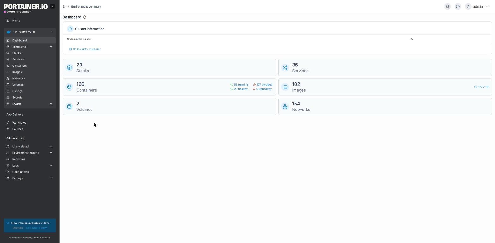

Nada más entrar, Portainer muestra **3 entornos separados** — esto es importante para no confundirte de sitio:

- **`pi-dns`** (Standalone) — el Docker de ese nodo, fuera del Swarm.
- **`ryzen`** (Standalone) — el Docker de ese nodo, fuera del Swarm.
- **`homelab-swarm`** (Swarm) — el clúster real de 5 nodos. **Este es el que te interesa para todo lo de este manual.**

Haz clic en `homelab-swarm` para entrar. El menú lateral izquierdo pasa a mostrar **Stacks**, **Services**, **Containers**, **Configs**, **Secrets** y **Swarm** — son las secciones que usarás.

### 7.1. Ver qué hay desplegado

**Stacks** (menú lateral) lista todos los stacks, con su tipo (`Swarm` o `Compose`) y estado:

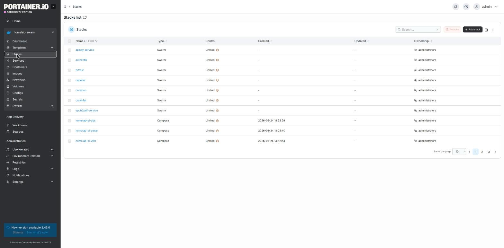

Haz clic en un stack (p. ej. `capataz`) para ver sus servicios:

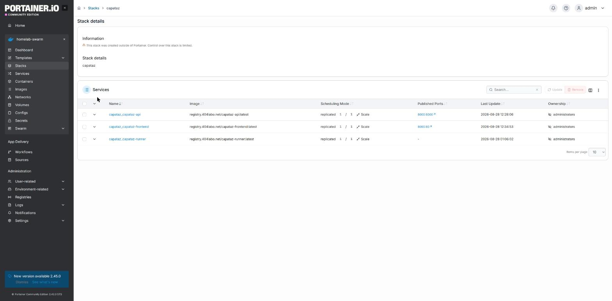

⚠️ **Fíjate en el aviso naranja**: *"This stack was created outside of Portainer. Control over this stack is limited."* — como este repo despliega siempre por CLI (`docker stack deploy`, sección 3), Portainer no puede editar el `docker-compose.yml` de estos stacks desde su editor web, ni ofrece un botón "Update" con contenido nuevo. **Sí puedes**: ver servicios, escalarlos, ver logs, forzar actualización, y eliminar el stack entero. **No puedes**: cambiar el YAML del stack desde aquí — eso sigue siendo siempre "editar en el repo → `rsync` + `docker stack deploy`" (sección 3).

**Services** (menú lateral) lista TODOS los servicios del clúster de una vez, con su stack, imagen, réplicas y un botón rápido de **Scale**:

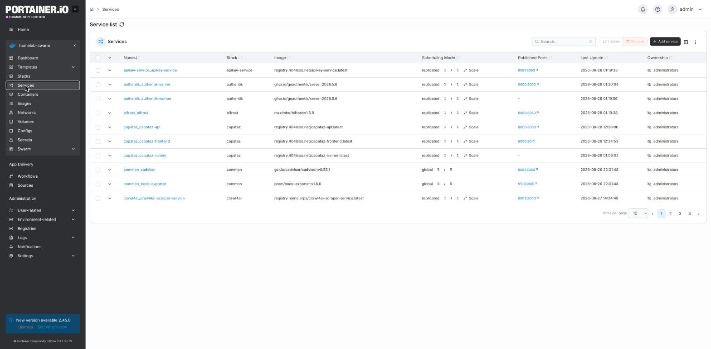

### 7.2. Ver el detalle de un servicio

Haz clic en el nombre de cualquier servicio (p. ej. `capataz_capataz-api`):

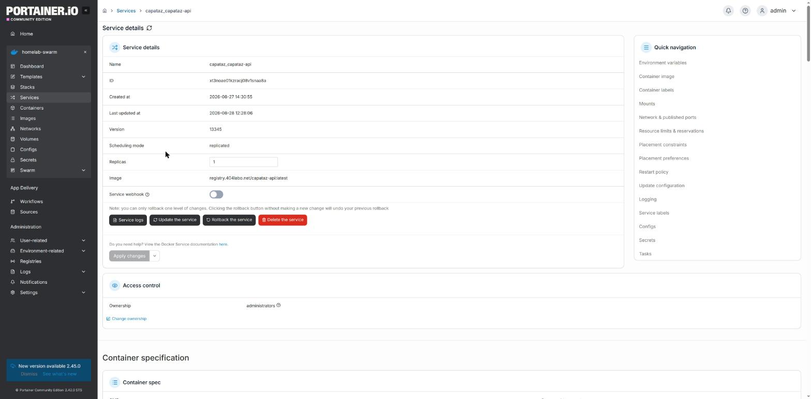

Aquí ves Nombre, ID, imagen, réplicas (editable directamente en el campo — cambiar el número y guardar equivale a `docker service scale`), y cuatro botones:

- **Service logs** — logs en vivo (equivalente a `docker service logs`, sección 7.3).
- **Update the service** — fuerza una tarea nueva (equivalente a `docker service update --force`, sección 7.4).
- **Rollback the service** — deshace el último cambio aplicado (un nivel, no un histórico completo — mismo aviso que da la propia UI: *"you can only rollback one level of changes"*).
- **Delete the service** — elimina el servicio (equivalente a `docker service rm`).

### 7.3. Ver logs

Botón **Service logs** en la página de detalle del servicio:

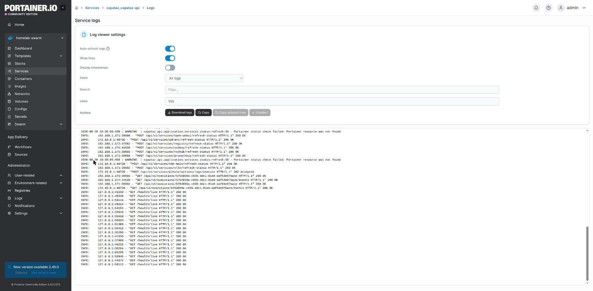

Auto-refresco activable, ajuste de nº de líneas, buscador de texto, botón de descarga — más cómodo que la terminal para revisar algo con calma, mismo contenido que `docker service logs`.

### 7.4. Reiniciar / forzar una actualización

Botón **Update the service** en la página de detalle:

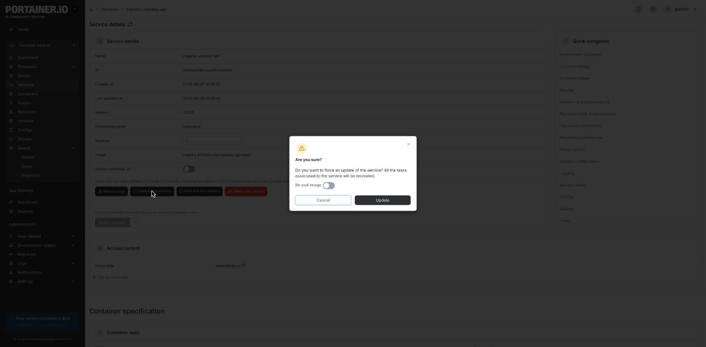

*"Do you want to force an update of the service? All the tasks associated to the service will be recreated."* — exactamente `docker service update --force`. El interruptor **Re-pull image** (si lo activas) añade el equivalente a volver a descargar la imagen aunque el tag no haya cambiado — útil cuando actualizaste `:latest` en el registry y quieres que el nodo la recoja de verdad.

### 7.5. Arrancar / parar (escalar)

En la lista de **Services**, cada fila tiene un enlace **Scale** — te deja poner el número de réplicas directamente (0 para "parar", 1 o más para "arrancar"), sin entrar al detalle del servicio. Mismo resultado que `docker service scale <servicio>=N` (sección 4.4).

### 7.6. Eliminar un stack o un servicio

Desde la lista de **Stacks**: marca la casilla del stack y pulsa **Remove** (arriba a la derecha) — equivale a `docker stack rm`. Desde **Services**, el mismo patrón (casilla + Remove) para un servicio suelto, o el botón **Delete the service** dentro del detalle.

### 7.7. Desplegar un stack nuevo desde Portainer (alternativa a la CLI)

Portainer también permite crear un stack íntegramente desde la web — botón **+ Add stack** en la lista de Stacks:

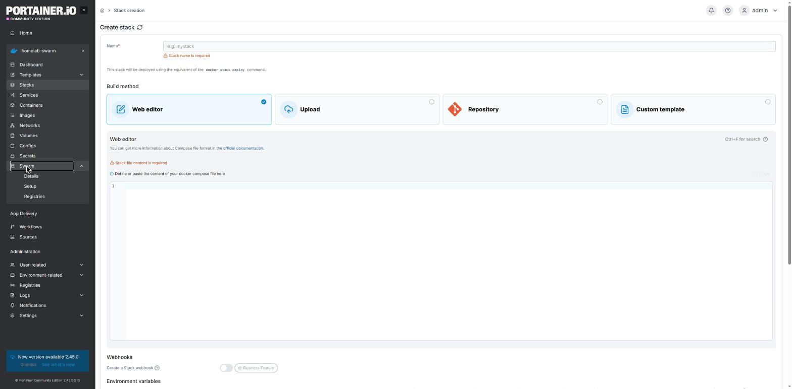

Fíjate en el aviso propio de la página: *"This stack will be deployed using the equivalent of the `docker stack deploy` command."* — internamente hace exactamente lo mismo que la sección 3 de este manual, solo que pegando el YAML en el editor web en vez de hacer `rsync` + SSH. Un stack creado así **sí** queda bajo control completo de Portainer (sin el aviso naranja de la sección 7.1) — puedes editarlo y redesplegarlo desde la propia UI la próxima vez.

Este repo no usa esta vía como práctica habitual (el `docker-compose.yml` versionado en git es la fuente de verdad, no lo que haya pegado alguien en un editor web una vez) — se documenta aquí como alternativa válida, útil sobre todo para probar algo rápido sin tocar el repo todavía.

### 7.8. Secrets y Configs en Portainer

**Secrets** (menú lateral) — lista, igual que por CLI, sin mostrar nunca el valor:

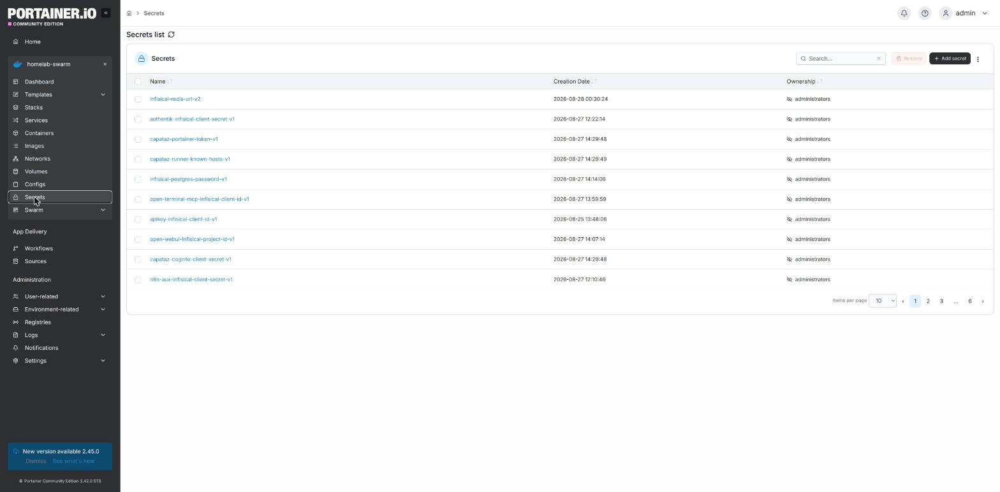

Al entrar en el detalle de uno, confirmas lo mismo que por CLI — nombre, fecha, y un botón **Delete this secret**, nada de "ver valor" ni "editar":

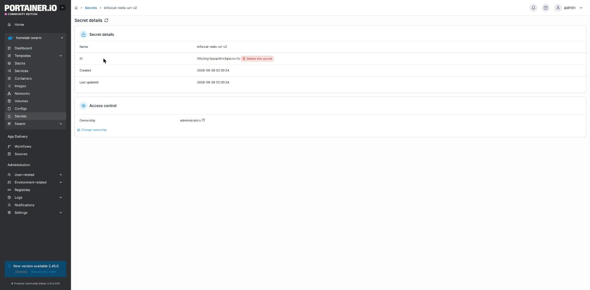

Botón **+ Add secret** para crear uno nuevo (equivalente a `docker secret create`):

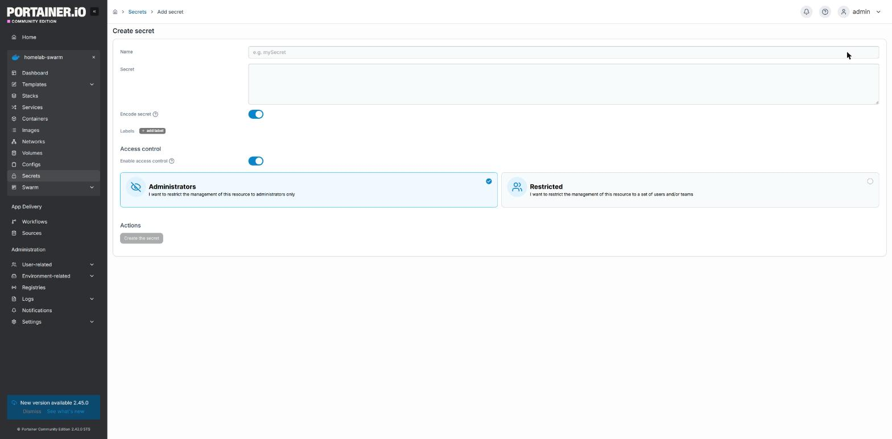

**Configs** (menú lateral) — misma lista, pero aquí el contenido **sí** es legible al entrar en el detalle (coherente con que no son sensibles):

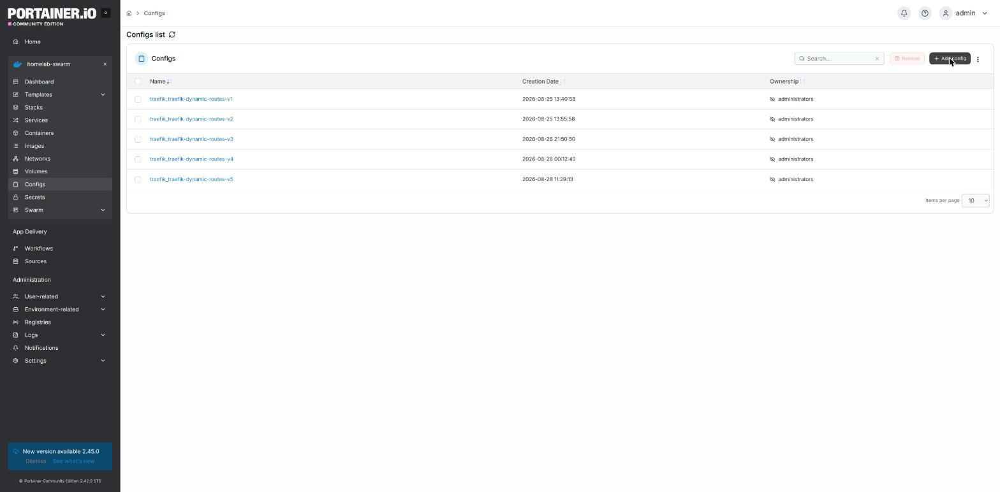

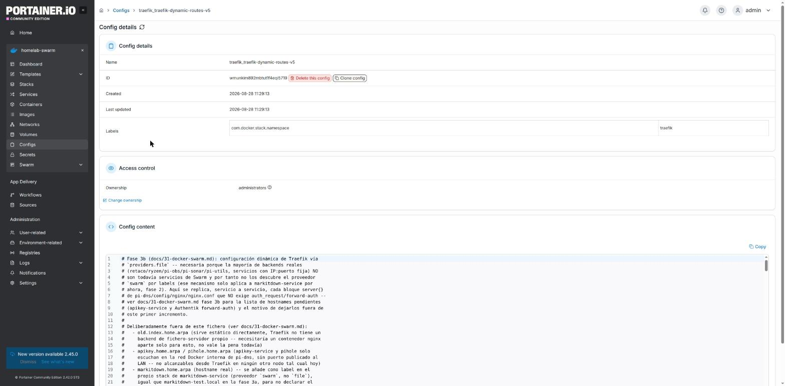

El botón **Clone config** de esta pantalla es un atajo útil para el patrón de versionado (`-vN` → `-vN+1` de la sección 5/6): clona el contenido actual como punto de partida para la siguiente versión, en vez de tener que volver a pegar el YAML entero a mano.

### 7.9. Ver los nodos del clúster

**Swarm → Details** (menú lateral) — resumen del clúster y tabla de nodos:

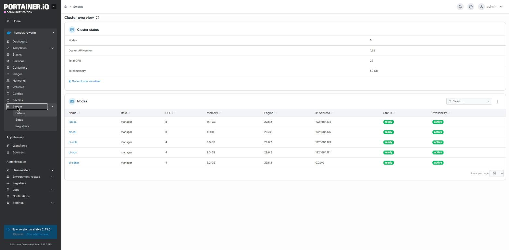

Confirma lo mismo que `docker node ls` por CLI: 5 nodos, todos `manager`, todos `ready`/`active`.

---

## 8. Chuleta rápida — CLI vs Portainer

| Operación | CLI (en un nodo manager) | Portainer |
|---|---|---|
| Ver stacks | `docker stack ls` | Stacks (lista) |
| Ver servicios de un stack | `docker stack ps <stack>` | Stacks → clic en el stack |
| Ver todos los servicios | `docker service ls` | Services (lista) |
| Desplegar/actualizar un stack | `docker stack deploy -c <file> <stack> --with-registry-auth` | Add stack (solo para stacks creados así desde el principio, ver 7.1/7.7) |
| Ver logs | `docker service logs <servicio> [-f]` | Detalle del servicio → Service logs |
| Parar (a 0 réplicas) | `docker service scale <servicio>=0` | Services → Scale, poner `0` |
| Arrancar de nuevo | `docker service scale <servicio>=1` | Services → Scale, poner `1` |
| Reiniciar (forzar tarea nueva) | `docker service update --force <servicio>` | Detalle del servicio → Update the service |
| Actualizar imagen | `docker service update --image  <servicio>` | Detalle del servicio → Update the service (con Re-pull image) |
| Eliminar un servicio | `docker service rm <servicio>` | Detalle del servicio → Delete the service |
| Eliminar un stack entero | `docker stack rm <stack>` | Stacks → casilla + Remove |
| Crear un secret | `docker secret create <nombre> -` | Secrets → Add secret |
| Rotar un secret | crear `-vN+1` + `docker service update --secret-rm/--secret-add` | Secrets → Add secret, luego editar el servicio a mano (Portainer no tiene un botón directo de rotación) |
| Ver nodos del clúster | `docker node ls` | Swarm → Details |

**Regla general**: para cualquier cosa que implique cambiar el contenido de un `docker-compose.yml` (nueva variable, nuevo puerto, nuevo volumen...), la vía correcta en este repo sigue siendo editar el fichero en git y `docker stack deploy` (sección 3) — Portainer es excelente para *consultar* estado y para operaciones puntuales (logs, escalar, forzar reinicio), pero no sustituye al repo como fuente de verdad.
