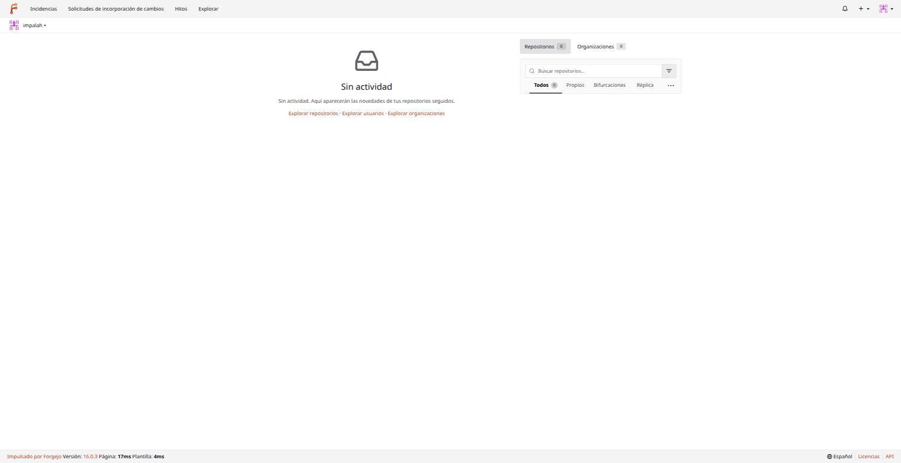

# Forgejo — manual de usuario del homelab

Manual paso a paso de Forgejo, escrito para alguien que no lo ha usado nunca — ni Forgejo, ni Gitea, ni siquiera GitHub/GitLab en profundidad. No es un tutorial genérico: está orientado específicamente a esta instancia (`forgejo.404labo.net`) y, en la parte de Git, funciona también como un pequeño curso de "cómo no cagarla" para quien todavía no tiene soltura con Git en el día a día.

## Qué es Forgejo y por qué está aquí

Forgejo es una "forja" de código autoalojada — repositorios Git, incidencias, pull requests, wiki, CI (Forgejo Actions) y un registro de paquetes, todo en un único binario, sin depender de GitHub. Es un *fork* de Gitea nacido cuando parte de su comunidad decidió pasar a una gobernanza sin una empresa única detrás — mismo protocolo Git, misma base de UI, pero desarrollo 100 % comunitario (Forgejo Software Freedom Conservancy).

Mejora 7 del backlog de este clúster (`docs/22-mejoras-futuras.md`): hoy todo el código de este homelab vive en GitHub; la intención es migrar a Forgejo como sistema principal, con GitHub como espejo de solo lectura mientras haga falta (todavía no iniciado — ver `docs/36-forgejo-repositorios-git.md` para el estado real de esa migración). Mismo criterio "FOSS de verdad, sin depender de un tercero" ya aplicado en este clúster a Vaultwarden/Infisical/ntfy.

## Cómo llegar a Forgejo

```
https://forgejo.404labo.net          # web, HTTPS
git@forgejo.404labo.net:2222         # Git por SSH (puerto no estándar, ver docs/36)
```

Solo accesible desde la LAN o vía Tailscale, como el resto de paneles internos del clúster (`docs/18-tailscale.md`). El login es una cuenta propia de Forgejo (creada por `forgejo admin user create`, `docs/36-forgejo-repositorios-git.md`) — no está integrado con Authentik SSO todavía, aunque el clúster ya usa Authentik para otros servicios (`docs/27-authentik-sso.md`); si en el futuro se integra, este documento quedaría desactualizado en ese punto concreto.



## Detalles de esta instancia que conviene saber antes de seguir

- **Versión**: Forgejo 16.0.3, imagen rootless, desplegada como stack de Docker Swarm sin nodo fijo (`docker-swarm/stacks/forgejo/`) — ver `docs/36-forgejo-repositorios-git.md` para la arquitectura completa.
- **Puerto SSH: `2222`, no el `22` por defecto** — cualquier `git clone`/`git push` por SSH necesita especificarlo explícitamente (`ssh://git@forgejo.404labo.net:2222/...`, o una entrada en `~/.ssh/config`, ver el documento 01).
- **Sin Forgejo Actions activado todavía** — el CI de este clúster (mejora 7.3) no está implementado; este manual no cubre Actions más allá de mencionar dónde estaría si se activa en el futuro.
- **Un pequeño bug cosmético conocido de esta versión**: en algunas páginas de repositorio verás un texto roto tipo `%!c(template.HTML= 1)onfirmación de cambios` en vez de "1 confirmación de cambios" — es un fallo de formato de plantilla de Forgejo 16.0.3 con la pluralización en español, no algo que hayas roto tú ni un problema de esta instancia en particular.

## Cómo está organizado este manual

| Documento | Contenido |
|---|---|
| [01-primeros-pasos.md](01-primeros-pasos.md) | Primer contacto: login, tour de la interfaz, perfil, apariencia, y **claves SSH** (imprescindible antes de clonar nada) |
| [02-administracion.md](02-administracion.md) | El panel de administración: gestión de usuarios, configuración del servidor, mantenimiento — para cuando tú eres quien administra la instancia |
| [03-repositorios.md](03-repositorios.md) | Crear y gestionar repositorios: desde cero, plantillas, colaboradores, ramas protegidas, webhooks, etiquetas |
| [04-issues-pull-requests.md](04-issues-pull-requests.md) | El flujo de trabajo diario: incidencias, pull requests, revisión de código, fusión, forks |
| [05-cli-tea.md](05-cli-tea.md) | `tea`, la CLI oficial de Forgejo/Gitea (el equivalente al `gh` de GitHub) — instalación y uso |
| [06-git-guia-practica.md](06-git-guia-practica.md) | Curso práctico de Git contra esta instancia: operaciones del día a día **e incidentes reales** (cómo deshacer un lío sin perder trabajo) |

No hace falta leerlos en orden estricto salvo el 01 primero (sin una clave SSH configurada, buena parte del resto no funciona tal cual está escrito) — pero si es tu primera vez con una forja de código, sí conviene seguir la secuencia tal como está.

Todas las capturas de este manual son de esta instancia real, usando un repositorio de pruebas creado para la ocasión (`impalah/proyecto-demo`) — no son mockups ni capturas genéricas de la documentación oficial de Forgejo.
