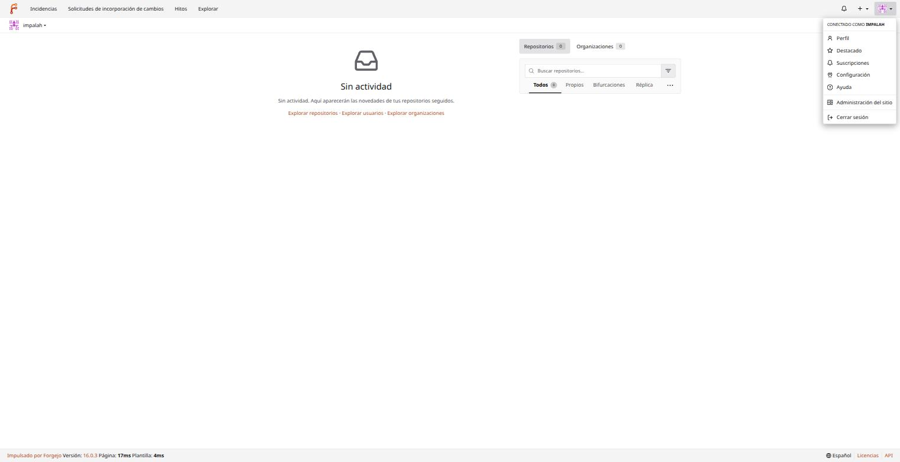
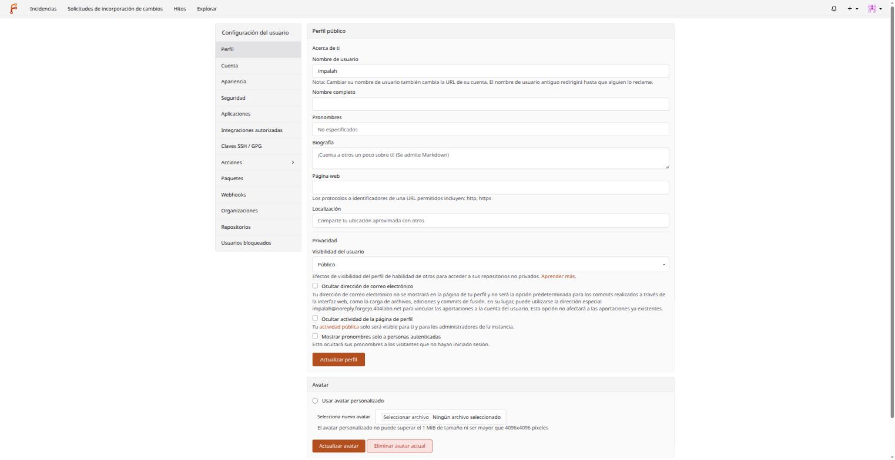
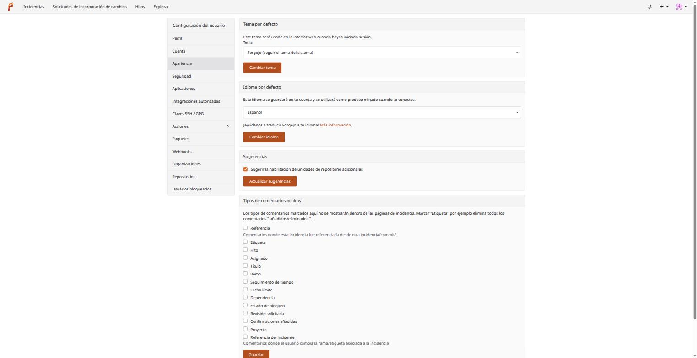
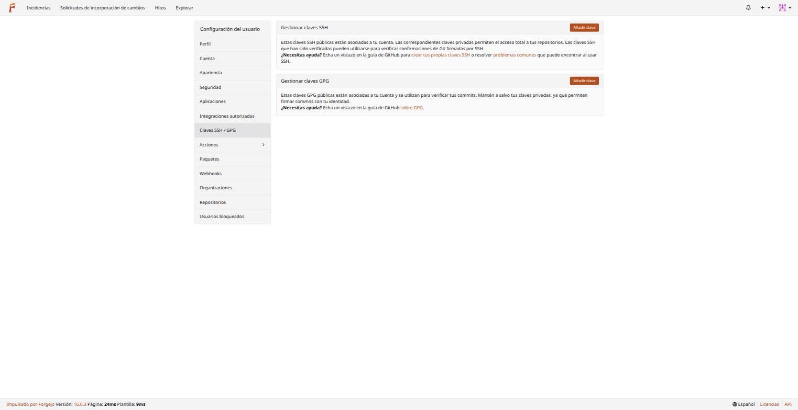
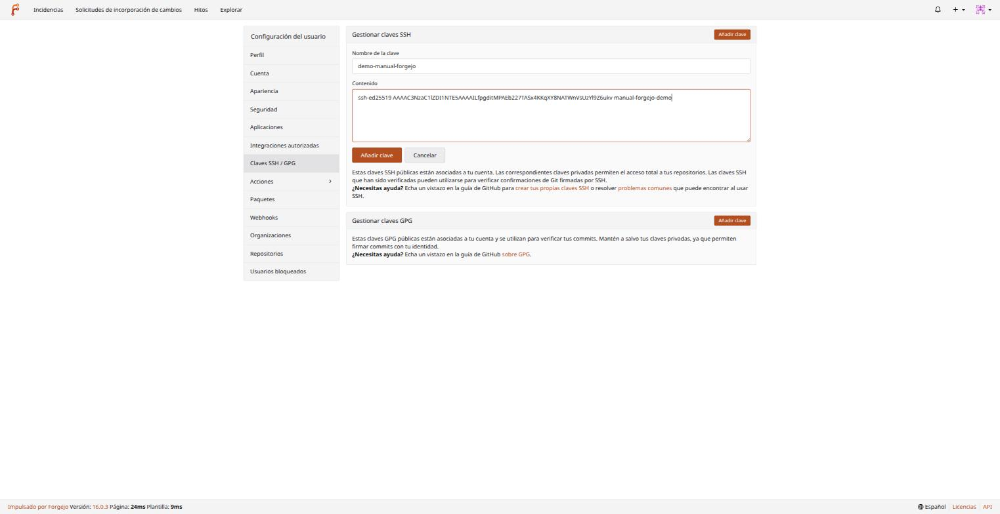
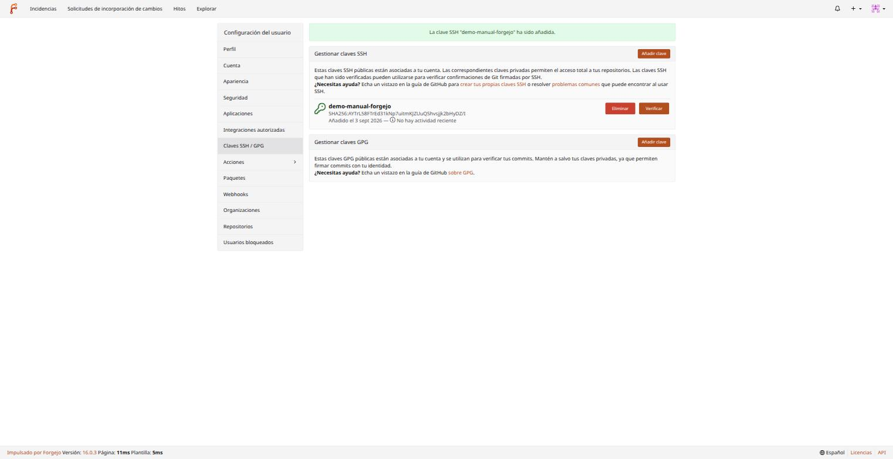
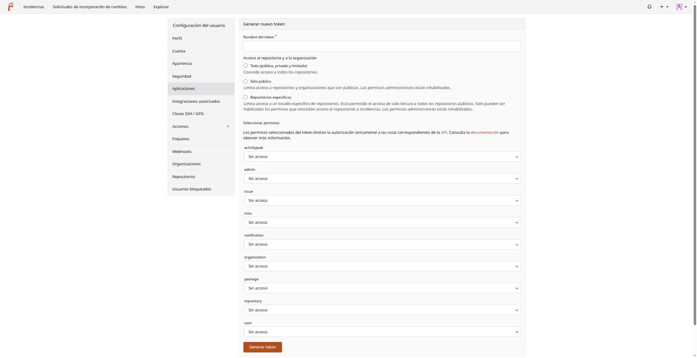
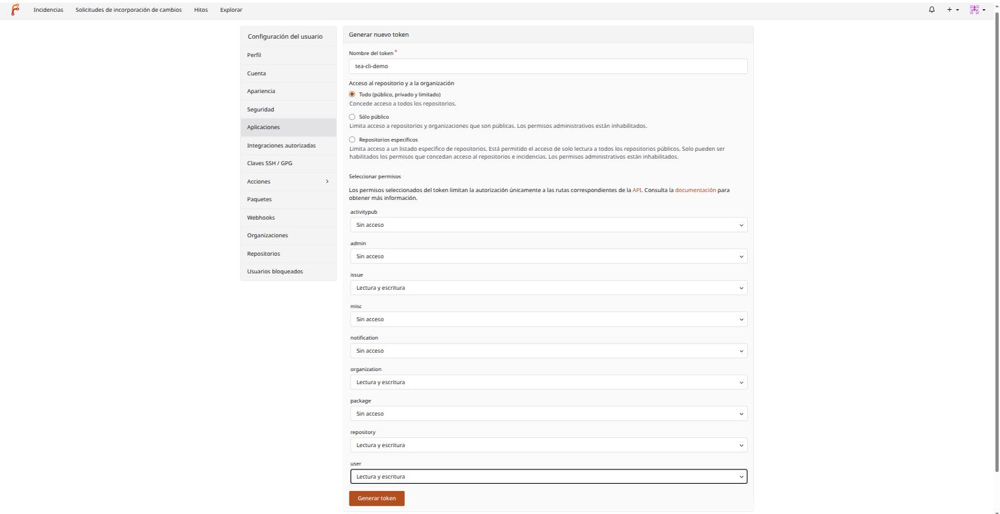
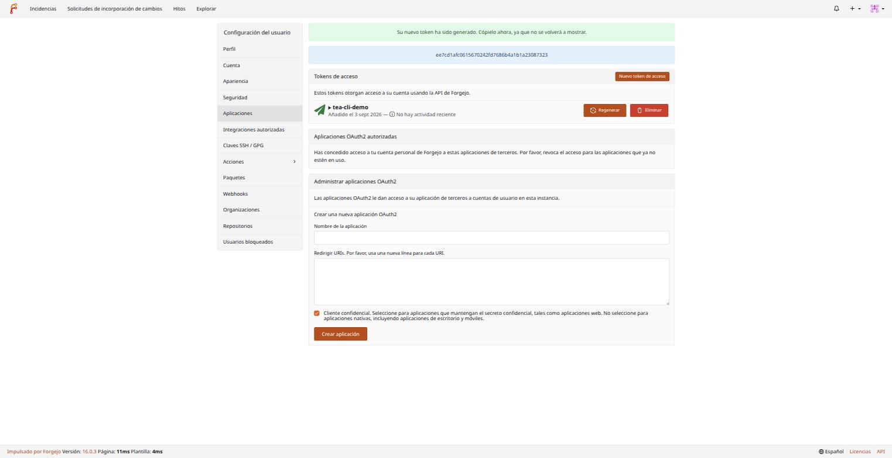

# 01 — Primeros pasos

## Iniciar sesión

Entra en `https://forgejo.404labo.net` con el usuario y contraseña que te haya dado el administrador de la instancia (creado con `forgejo admin user create`, no hay auto-registro público en este clúster). Tras iniciar sesión verás el panel de control (arriba), con tus repositorios y organizaciones a la derecha y la actividad reciente al centro — vacío la primera vez.

## Tour rápido de la interfaz

La barra superior es la misma en todas las páginas:

- **Incidencias** / **Solicitudes de incorporación de cambios** / **Hitos** — vistas globales de *todos* los repositorios en los que participas, no solo uno.
- **Explorar** — buscador de repositorios/usuarios/organizaciones de toda la instancia.
- El icono de campana — notificaciones (menciones, respuestas a tus comentarios, PRs asignados...).
- El **+** — atajos para crear: nuevo repositorio, nueva migración (importar uno externo), nueva organización.
- Tu avatar (arriba a la derecha) — el menú de usuario:



- **Perfil** — tu página pública (repos, actividad, contribuciones).
- **Configuración** — todo lo relacionado contigo: cuenta, apariencia, seguridad, claves SSH/GPG, tokens de API, organizaciones... (el resto de este documento).
- **Administración del sitio** — solo visible si tu cuenta es administradora (ver [02-administracion.md](02-administracion.md)).

## Configuración de perfil

`Configuración` abre una página con un menú lateral que reaparece en casi todo este manual — merece la pena conocerlo de un vistazo:



Lo más relevante de cada sección:

- **Perfil** — nombre visible, biografía, visibilidad del perfil, avatar.
- **Cuenta** — email, contraseña, vinculación de cuentas externas.
- **Apariencia** — tema (claro/oscuro/seguir el sistema) e **idioma** (esta instancia y este manual usan español, pero Forgejo está traducido a decenas de idiomas).
- **Seguridad** — 2FA, claves de seguridad (WebAuthn).
- **Aplicaciones** — tokens de acceso a la API (para `tea`, scripts, CI) y aplicaciones OAuth2.
- **Claves SSH / GPG** — imprescindible, ver la sección siguiente.
- **Webhooks** (a nivel de usuario, distinto de los webhooks por repositorio del documento 03).
- **Organizaciones**, **Repositorios**, **Usuarios bloqueados**.

### Apariencia e idioma



El tema por defecto sigue el del sistema operativo/navegador; puede fijarse a claro u oscuro sin depender de eso. El idioma se guarda por cuenta — todas las capturas de este manual están en español porque así se configuró esta cuenta de ejemplo.

## Claves SSH — necesarias antes de clonar nada

Forgejo admite dos formas de autenticarte para operaciones Git: HTTPS (usuario/contraseña o un token) y SSH (clave pública/privada). **SSH es la forma recomendada para el día a día** — no reintroduces credenciales en cada `git push`, y es lo que usa el resto de este manual.

Ve a `Configuración → Claves SSH / GPG`:



Si no tienes ya un par de claves SSH en tu máquina, genera uno nuevo (en tu terminal, **no** en Forgejo — Forgejo nunca debe ver tu clave privada):

```bash
ssh-keygen -t ed25519 -C "tu-email@ejemplo.com" -f ~/.ssh/id_ed25519_forgejo
```

`ed25519` es el tipo de clave recomendado hoy (más corta y más rápida que RSA, igual de segura). El parámetro `-f` le da un nombre específico para no chocar con otras claves que ya tengas (por ejemplo, las que usas para los nodos del clúster, `docs/01-topologia.md`).

Copia el contenido de la clave **pública** (`~/.ssh/id_ed25519_forgejo.pub`, termina en `.pub`, es la que se puede compartir) y pégalo en "Añadir clave":



Tras guardar, la clave aparece en la lista con su huella (fingerprint) y fecha de alta:



### Usarla — el puerto 2222 es la parte que se te va a olvidar

A diferencia de GitHub (SSH en el puerto 22 estándar), esta instancia publica Git-por-SSH en el **2222** (ver `docs/36-forgejo-repositorios-git.md` para el porqué). Dos formas de manejarlo:

**Opción A — en cada URL explícitamente:**

```bash
git clone ssh://git@forgejo.404labo.net:2222/impalah/mi-repo.git
```

**Opción B — una entrada en `~/.ssh/config` (recomendado, evita escribirlo cada vez):**

```
Host forgejo.404labo.net
    Port 2222
    IdentityFile ~/.ssh/id_ed25519_forgejo
```

Con esto, la URL "corta" de siempre ya funciona sola:

```bash
git clone git@forgejo.404labo.net:impalah/mi-repo.git
```

Verifica que la clave funciona antes de intentar clonar nada — si ves un saludo con tu nombre de usuario, está todo correcto:

```bash
$ ssh -p 2222 git@forgejo.404labo.net
PTY allocation request failed on channel 0
Hi there, impalah! You've successfully authenticated with the key named demo-manual-forgejo, but Forgejo does not provide shell access.
If this is unexpected, please log in with password and setup Forgejo under another user.
Connection to forgejo.404labo.net closed.
```

Ese mensaje ("no provide shell access") es el esperado y correcto — SSH aquí solo sirve para el protocolo Git, no para abrir una sesión de shell en el servidor.

## Tokens de acceso — para la CLI y scripts

Además de las claves SSH (que autentican operaciones **Git**), Forgejo tiene tokens de API independientes que autentican llamadas a su **API REST** — los necesita `tea` (documento 05) y cualquier script/integración que hable con Forgejo sin ser un simple `git push`.

`Configuración → Aplicaciones → Nuevo token de acceso`:



Forgejo permite acotar el token a permisos concretos por área (`issue`, `repository`, `organization`, `user`...) en vez de dar acceso total — buena práctica aplicarlo, sobre todo si el token va a vivir en un script o CI: dale solo lectura/escritura donde de verdad lo necesite.



Al generarlo, el valor se muestra **una sola vez** — cópialo de inmediato, no se puede volver a ver después (mismo criterio que cualquier gestor de secretos, ver `docs/26-infisical-secretos.md` para cómo se gestionan los tokens de servicio de este clúster):



Guárdalo como harías con cualquier contraseña — nunca en un repositorio, nunca en texto plano compartido. Si se filtra, revócalo desde esta misma pantalla (botón "Eliminar" junto al token) y genera uno nuevo.

## Siguiente paso

Con la clave SSH y (si vas a usar `tea` o scripts) un token, ya puedes crear tu primer repositorio — [03-repositorios.md](03-repositorios.md) — o, si tu cuenta es administradora de la instancia, primero puede interesarte [02-administracion.md](02-administracion.md).
