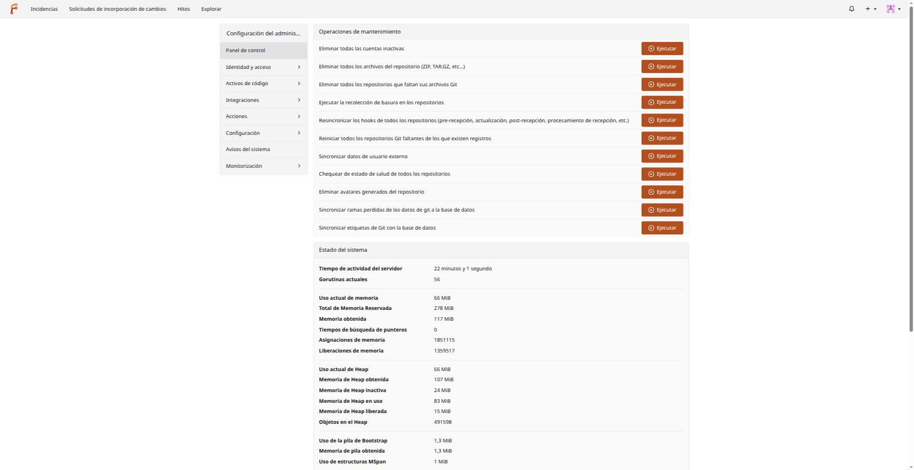
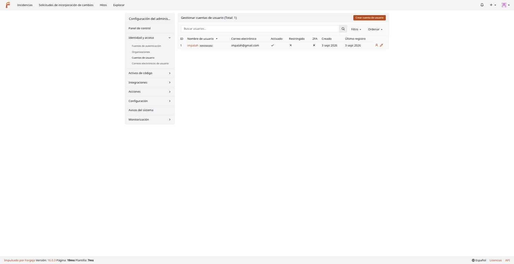
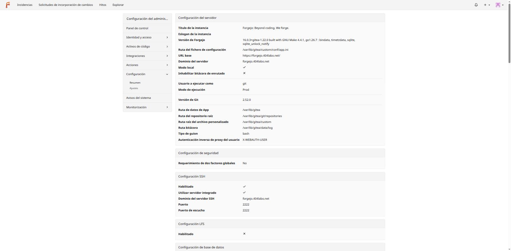
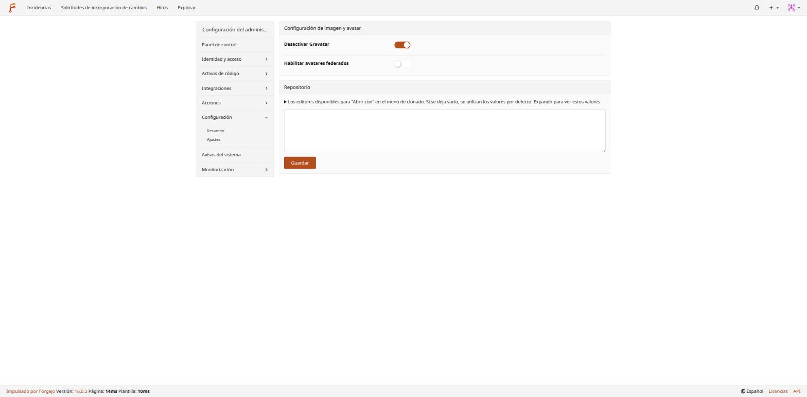

# 02 — Administración de la instancia

Esta sección es para cuando tu cuenta tiene el rol de **administrador de la instancia** (no solo administrador de un repositorio concreto — eso es distinto y se cubre en el documento 03). Solo las cuentas admin ven la entrada "Administración del sitio" en el menú de usuario, o pueden entrar directamente en `https://forgejo.404labo.net/admin`.

En esta instancia, el primer usuario creado (`impalah`, vía `forgejo admin user create --admin`, ver `docs/36-forgejo-repositorios-git.md`) es admin. No hay auto-registro público ni forma de que un usuario se auto-promueva — cualquier admin adicional lo da de alta otro admin explícitamente.

## El panel de control

`Administración del sitio → Panel de control`:



Dos bloques principales:

- **Operaciones de mantenimiento** — tareas que normalmente NO hace falta tocar a mano (Forgejo las gestiona solo), pero están aquí para cuando algo se ha desincronizado: recolección de basura en repositorios, resincronizar hooks, comprobar salud de repos, sincronizar ramas/etiquetas de Git con la base de datos interna... Útil, por ejemplo, si alguna vez se restaura un repositorio desde una copia de seguridad y su estado en base de datos queda desfasado.
- **Estado del sistema** — memoria, goroutines, tiempo de actividad del proceso Go — telemetría de bajo nivel del propio proceso Forgejo, no del contenedor/nodo (para eso, Grafana/Prometheus del clúster, `docs/grafana/`).

## Menú lateral de administración

El menú lateral agrupa el resto de secciones administrativas:

| Sección | Para qué sirve |
|---|---|
| **Identidad y acceso** | Fuentes de autenticación externas (LDAP, OAuth2/OIDC — aquí es donde se conectaría Authentik si algún día se integra SSO, `docs/27-authentik-sso.md`), organizaciones, **cuentas de usuario**, correos electrónicos de usuario |
| **Activos de código** | Configuración a nivel de instancia sobre repositorios, paquetes, etc. |
| **Integraciones** | Webhooks/apps a nivel de instancia (distinto de los webhooks por repositorio) |
| **Acciones** | Forgejo Actions (CI) — runners, secretos, variables a nivel de instancia. No activado todavía en este clúster (mejora 7.3, pendiente) |
| **Configuración** | Resumen (solo lectura) y Ajustes (editables en caliente) del servidor — ver más abajo |
| **Avisos del sistema** | Log de eventos administrativos/errores relevantes |
| **Monitorización** | Procesos en curso, cola de tareas, cron jobs internos |

## Gestión de usuarios

`Identidad y acceso → Cuentas de usuario`:



Desde aquí un admin puede: crear cuentas nuevas (botón "Crear cuenta de usuario" — alternativa a hacerlo por CLI con `forgejo admin user create`, ver `docs/36-forgejo-repositorios-git.md`), promover/degradar a admin, activar/desactivar 2FA, restringir una cuenta (acceso de solo lectura, sin poder crear repos), o eliminarla. La columna "Activado" indica si el email está verificado; "Restringido" si tiene el acceso limitado ya mencionado.

**Crear un usuario por CLI** (alternativa a la UI, útil para scripts o cuando no hay un admin con sesión web a mano — es como se creó tanto la cuenta admin de esta instancia como una cuenta de prueba usada en este mismo manual):

```bash
docker exec -it <contenedor-forgejo> forgejo admin user create \
  --username nuevo-usuario \
  --password 'una-contraseña-fuerte' \
  --email nuevo-usuario@ejemplo.com \
  --must-change-password=false   # o deja que la cambie en el primer login
```

Añade `--admin` al final si la cuenta debe ser administradora de la instancia.

## Configuración del servidor

`Configuración → Resumen` — vista de solo lectura de cómo está configurada la instancia ahora mismo (equivalente a leer `app.ini` desde la UI, sin exponer secretos):



Aquí se confirma en vivo lo que documenta `docs/36-forgejo-repositorios-git.md`: puerto SSH `2222`, dominio `forgejo.404labo.net`, base de datos, rutas internas del contenedor (`/var/lib/gitea`, coherente con la imagen **rootless** usada en este despliegue)... Útil para diagnosticar sin tener que entrar al contenedor.

`Configuración → Ajustes` — a diferencia del Resumen, estos sí son editables **en caliente**, sin redeploy:



Cosas como desactivar Gravatar (por privacidad — un servicio externo no debería enterarse de qué emails tiene esta instancia, coherente con el criterio "sin depender de terceros" de este clúster), habilitar avatares federados, o configurar qué editores externos aparecen en el menú "Abrir con" al clonar. **Importante**: esto son ajustes de runtime, en memoria — si la tarea de Swarm se recrea (redeploy, node drain, restart), estos ajustes puntuales hechos desde aquí no persisten a menos que también estén en las variables `FORGEJO__*`/`app.ini` del despliegue (`docker-swarm/stacks/forgejo/docker-compose.yml`). Para un cambio que deba sobrevivir a un redeploy, la vía correcta en este clúster es añadir la variable de entorno correspondiente al compose, no solo tocarlo aquí.

## ¿Y la "personalización" de marca (logo, nombre, colores)?

Forgejo permite sustituir plantillas/estilos vía un directorio de "custom" (`CustomPath`, visible en el Resumen de arriba: `/var/lib/gitea/custom`) — subiendo un `logo.png`/`favicon.png` ahí, o CSS propio en `custom/public/css/`. **No configurado en esta instancia** (se usa el branding por defecto de Forgejo) — si se quisiera en el futuro, habría que montar esos ficheros en el volumen NFS ya usado por este stack (`docs/36-forgejo-repositorios-git.md`, sección de almacenamiento) y documentar el cambio ahí, no solo en la UI (no hay ajuste de marca vía UI, es enteramente por fichero).

## Monitorización y avisos

`Monitorización` muestra procesos activos del propio Forgejo (una petición HTTP lenta, un cron interno en marcha) y la cola de notificaciones/webhooks pendientes de entregar. `Avisos del sistema` es un log corto de eventos administrativos (creación/eliminación de usuarios, cambios de configuración relevantes) — para diagnóstico más profundo, los logs completos del contenedor van a Loki como el resto del clúster (`{swarm_stack="forgejo"}`, ver `docs/36-forgejo-repositorios-git.md`, sección "Operación").

## Siguiente paso

Con la instancia dada de alta y usuarios creados, toca trabajar de verdad con repositorios — [03-repositorios.md](03-repositorios.md).
