# 03 — Crear y gestionar repositorios

## Crear un repositorio desde cero

Botón **+** (barra superior) → **Nuevo repositorio**, o directamente `https://forgejo.404labo.net/repo/create`:

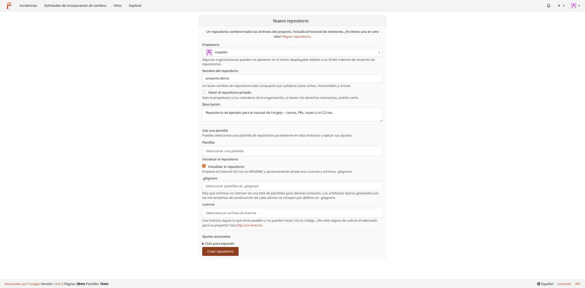

Campos importantes:

- **Propietario** — tu usuario o una organización de la que seas miembro con permiso para crear repos ahí.
- **Nombre** y **Descripción**.
- **Hacer el repositorio privado** — solo tú (o los miembros de la organización con permiso) lo verán. En este clúster, dado que Forgejo entero solo es accesible desde la LAN/Tailscale (`docs/36-forgejo-repositorios-git.md`), la privacidad de un repo es una capa adicional, no la única barrera de acceso.
- **Usa una plantilla** — si ya existe un repositorio marcado como plantilla en esta instancia, aplica su estructura de partida (ver más abajo).
- **Inicializar el repositorio** — marca esta casilla si quieres empezar con un `README.md` (y opcionalmente `.gitignore`/licencia) ya creado y un primer commit; si la dejas sin marcar, el repo se crea completamente vacío y tendrás que hacer tú el primer `git push` (ver el documento 06 para cómo).

Con "Inicializar" marcado aparecen dos selectores útiles:

- **`.gitignore`** — plantillas por lenguaje (Python, Node, Go...) con los patrones típicos de artefactos a ignorar ya rellenados.
- **Licencia** — MIT, Apache-2.0, GPL... si no tienes claro cuál, el enlace "Elija una licencia" de la propia página enlaza a una guía neutral.

Al crear, el repo queda listo con su primer commit:

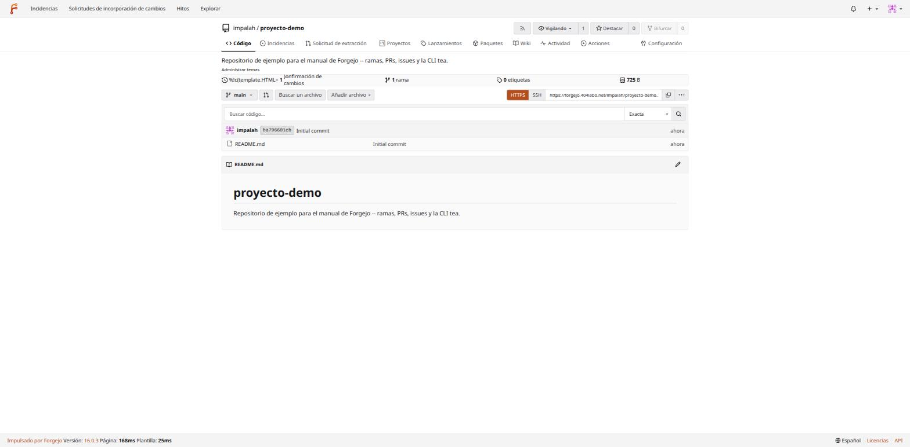

## Clonarlo

Con la clave SSH ya configurada (documento 01):

```bash
git clone git@forgejo.404labo.net:impalah/proyecto-demo.git
cd proyecto-demo
```

(Si no configuraste la entrada `Host` en `~/.ssh/config`, la URL completa es `ssh://git@forgejo.404labo.net:2222/impalah/proyecto-demo.git` — ver documento 01.)

## Plantillas de repositorio

Si tu equipo/homelab repite siempre la misma estructura inicial (por ejemplo, el esqueleto de un microservicio Python como los de `services/` en `homelab-cluster`, `docs/desarrollo-microservicios-python.md`), puedes marcar un repositorio existente como plantilla: `Configuración del repositorio → Repositorio → "Plantilla de repositorio"`. A partir de ahí, aparecerá en el selector "Usa una plantilla" al crear uno nuevo, copiando su estructura de archivos (no su historial de commits).

## Migrar/importar un repositorio existente

Botón **+** → **Nueva migración**, o desde el propio formulario de creación, enlace "Migrar repositorio". Forgejo puede clonar un repositorio completo desde GitHub, GitLab, Gitea/otra Forgejo, o una URL Git genérica — trayéndose también, opcionalmente, issues, pull requests, releases y wiki (según el origen lo soporte). Es la vía a usar cuando llegue la mejora 7.2 de este clúster (migración de repos desde GitHub, `docs/22-mejoras-futuras.md`) — todavía no ejecutada en este homelab.

## Configuración de un repositorio

`Configuración` (pestaña del repositorio, no confundir con la Configuración de usuario del documento 01) abre un menú lateral:

| Sección | Contenido |
|---|---|
| Repositorio | Nombre, descripción, visibilidad, marcarlo como plantilla, archivarlo o eliminarlo |
| Unidades | Qué funcionalidades están activas en este repo concreto (Incidencias, Wiki, Proyectos, Paquetes...) — se pueden desactivar las que no se usen |
| **Colaboradores** | Ver más abajo |
| **Webhooks** | Ver más abajo |
| **Ramas** | Rama por defecto y **reglas de protección de rama** — ver más abajo |
| Etiquetas | Aquí, dentro de Configuración, son **etiquetas protegidas de Git** (tags de versión, ej. `v*`) — no confundir con las etiquetas de incidencias/PRs, que viven en la pestaña "Incidencias" del repo (ver documento 04) |
| Claves de implementación | Claves SSH de solo-lectura ligadas a este repo concreto, típicas para que un servidor de despliegue clone sin necesitar la cuenta de una persona |
| Acciones | Configuración de Forgejo Actions específica de este repo (no activo en este clúster todavía) |

### Colaboradores

`Configuración → Colaboradores` — añade a otro usuario de la instancia (por nombre de usuario) con nivel de permiso Lectura/Escritura/Administración:

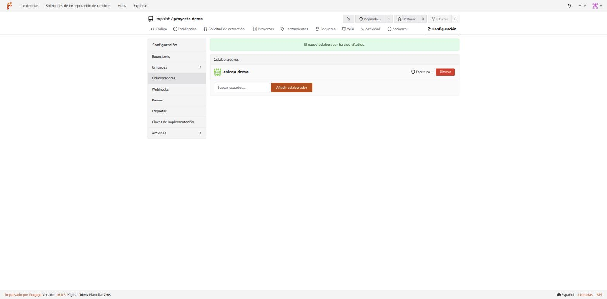

Para trabajo en equipo con más de un puñado de personas o varios repos compartidos, mejor usar una **organización** (`+ → Nueva organización`) y sus **equipos**, en vez de ir añadiendo colaboradores repo a repo — los permisos de un equipo se heredan automáticamente en todos los repos que se le asignen.

### Ramas y protección de ramas

`Configuración → Ramas`:

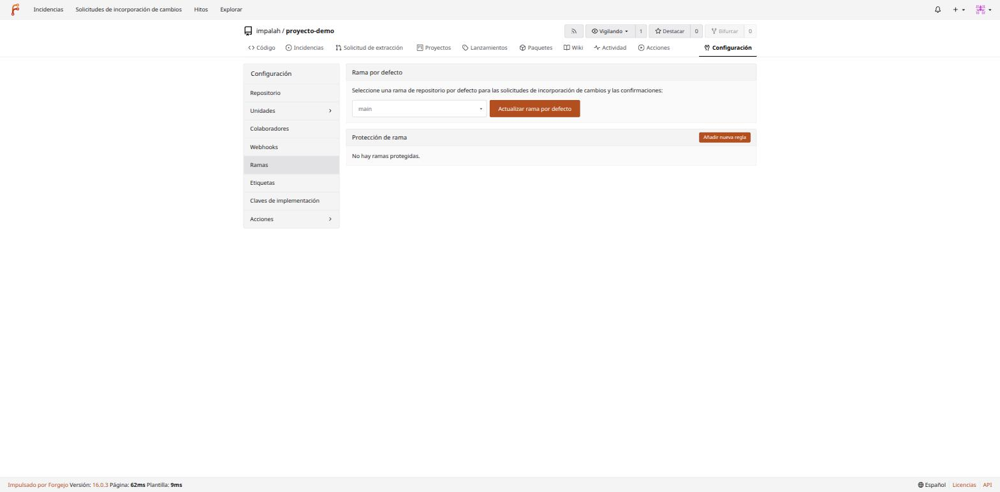

"Rama por defecto" es la que se usa como base de las pull requests nuevas y la que ve quien entra al repo por primera vez (normalmente `main`). "Protección de rama" es donde se define **qué reglas debe cumplir un push/merge** contra una rama concreta — esto es lo que separa un repo con disciplina real de uno donde cualquiera puede reescribir el historial de `main` sin que nadie se entere.

"Añadir nueva regla" abre un formulario con bastantes opciones — las más relevantes para un homelab/equipo pequeño:

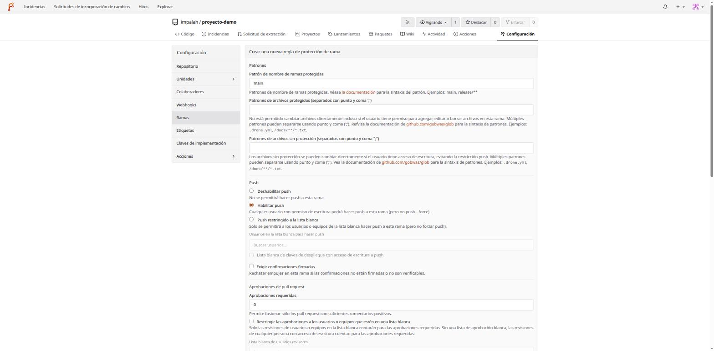

- **Patrón de nombre de ramas protegidas** — `main`, o un patrón (`release/**`) para proteger varias a la vez.
- **Push**: "Deshabilitar push" (todo cambio debe pasar por PR, ni el propio dueño puede empujar directo), "Habilitar push" (cualquiera con permiso de escritura puede hacer push directo, **pero nunca `--force`**), o restringirlo a una lista blanca concreta de usuarios.
- **Aprobaciones de pull request** — cuántas revisiones positivas hacen falta antes de poder fusionar (0 = ninguna, válido para un repo de una sola persona; súbelo en cuanto haya más de un colaborador real).
- **Exigir confirmaciones firmadas** — rechaza commits sin firma GPG/SSH verificable.
- **Aplicar esta regla para los administradores del repositorio** — si no se marca, el dueño del repo puede saltarse su propia regla; para que la protección sea real (incluso contra un despiste propio), conviene marcarla.

En esta instancia se creó una regla real para `main` con "Habilitar push" (para poder seguir trabajando en el día a día sin abrir PR para cada cambio menor) pero **sin permitir force-push** — que es precisamente el escenario que rompe menos flujos de trabajo y evita el incidente más típico y más destructivo (ver el documento 06, sección de incidentes, para ver esta protección rechazando un `git push --force` real).

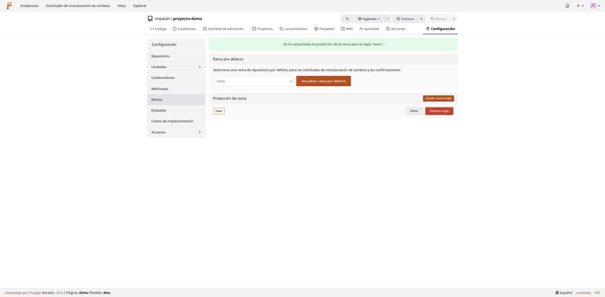

### Etiquetas protegidas de Git (tags)

Distinto de las etiquetas de incidencias. Aquí se define, por ejemplo, que solo ciertos usuarios puedan crear/mover tags que empiecen por `v` (versiones de release) — evita que un tag de versión ya publicado se reescriba por error:

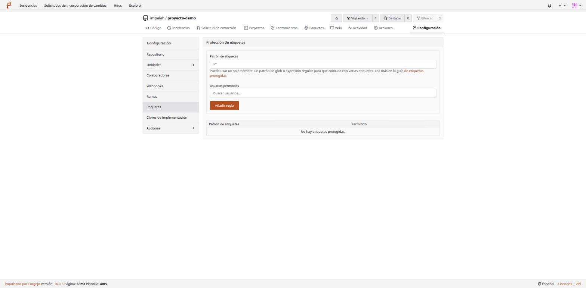

### Webhooks

`Configuración → Webhooks` — notificaciones HTTP automáticas cuando pasan cosas en el repo (push, nueva issue, PR fusionada...). Útil para conectar Forgejo con CI externo, un bot de chat, o (en este clúster) potencialmente con `ntfy` (`docs/34-ntfy-notificaciones.md`) para avisos de repositorio, aunque no configurado todavía.

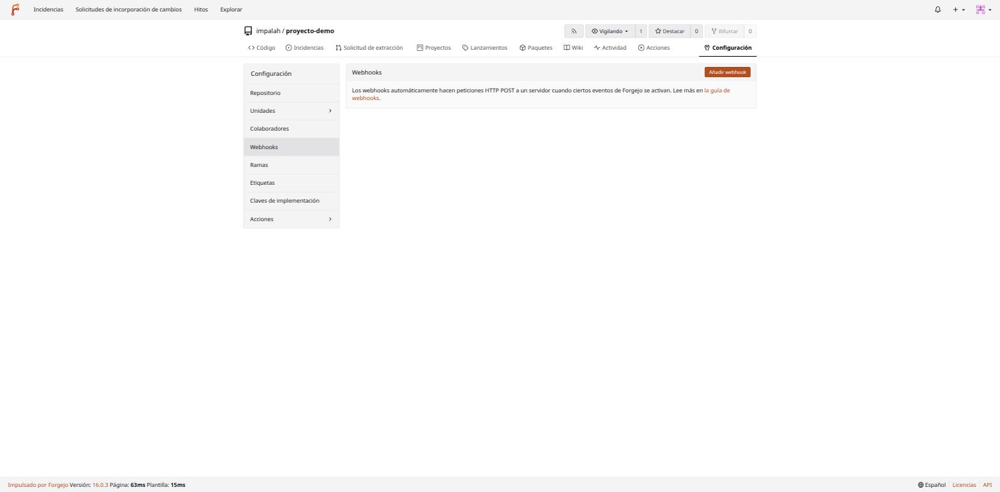

"Añadir webhook" ofrece integraciones predefinidas (Slack, Discord, Telegram, Matrix...) además del formato "Forgejo"/genérico, que envía un JSON con toda la información del evento a cualquier URL propia:

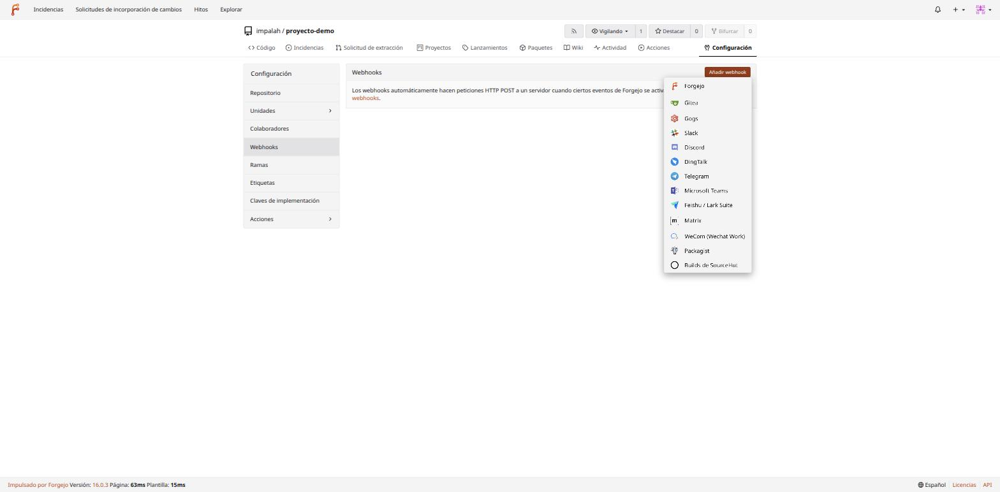

## Etiquetas de incidencias (labels)

Estas sí son las etiquetas que se usan para clasificar issues y PRs — viven en la pestaña **Incidencias → Etiquetas** del repo (no en Configuración):

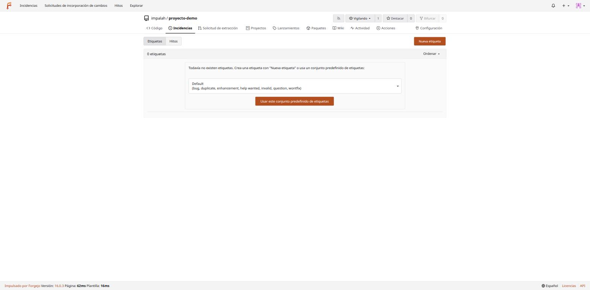

Un repo nuevo no trae ninguna etiqueta — Forgejo ofrece un conjunto predefinido razonable (`bug`, `duplicate`, `enhancement`, `help wanted`, `invalid`, `question`, `wontfix`) como punto de partida, con un clic:

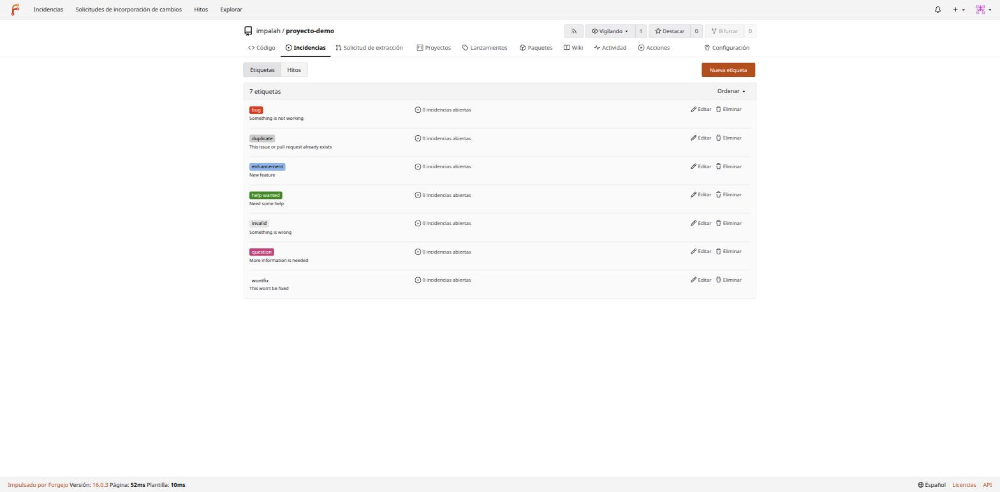

También se pueden crear etiquetas propias ("Nueva etiqueta"), con nombre, descripción y color a elegir.

## Siguiente paso

Con el repositorio creado y configurado, toca el día a día real: incidencias y pull requests — [04-issues-pull-requests.md](04-issues-pull-requests.md).
