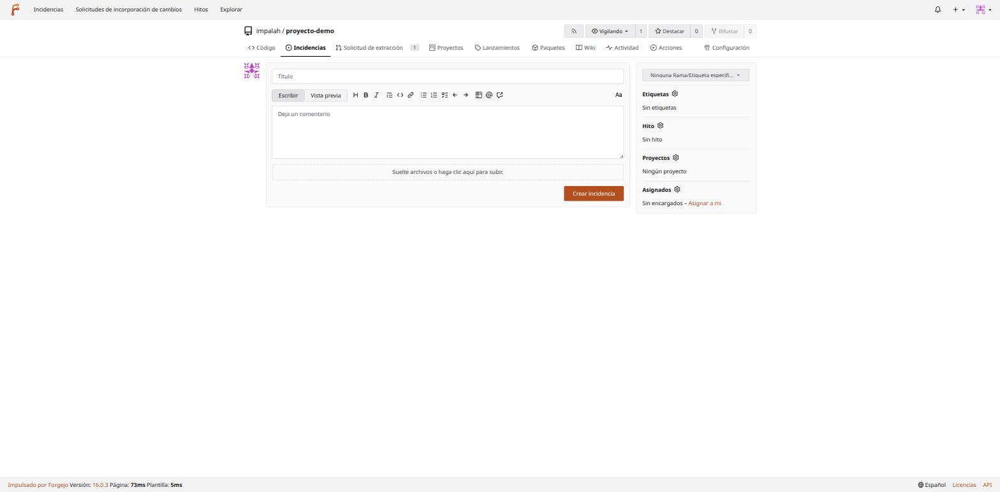
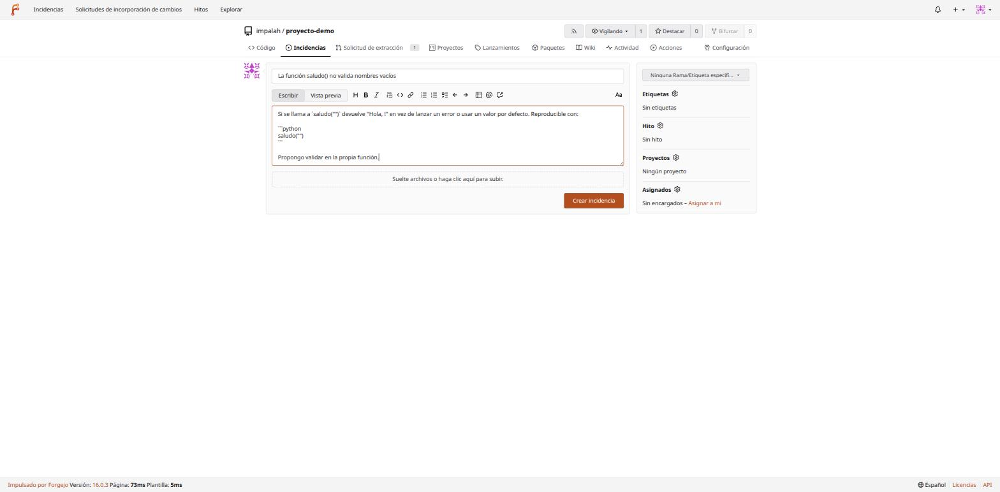
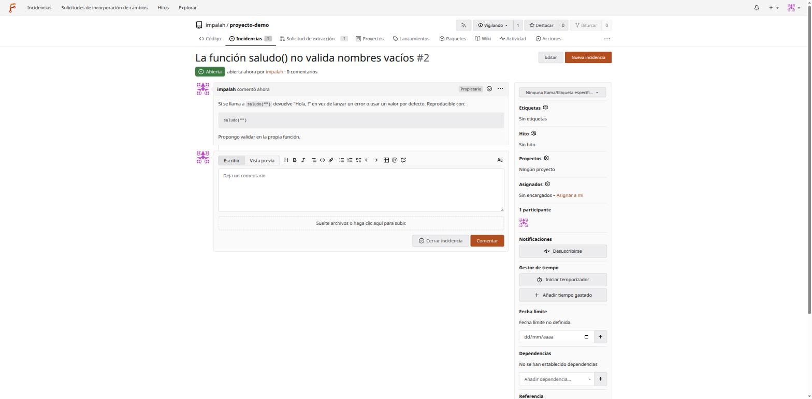
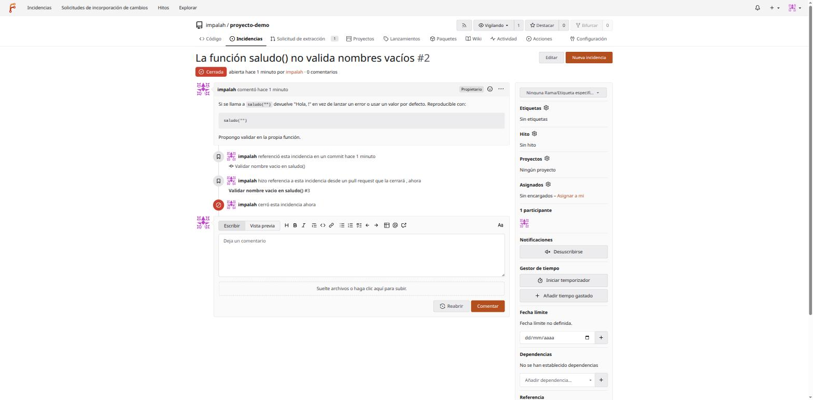
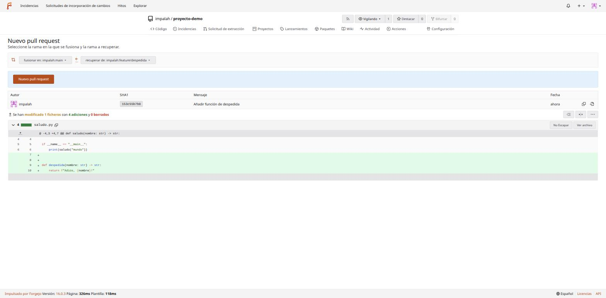
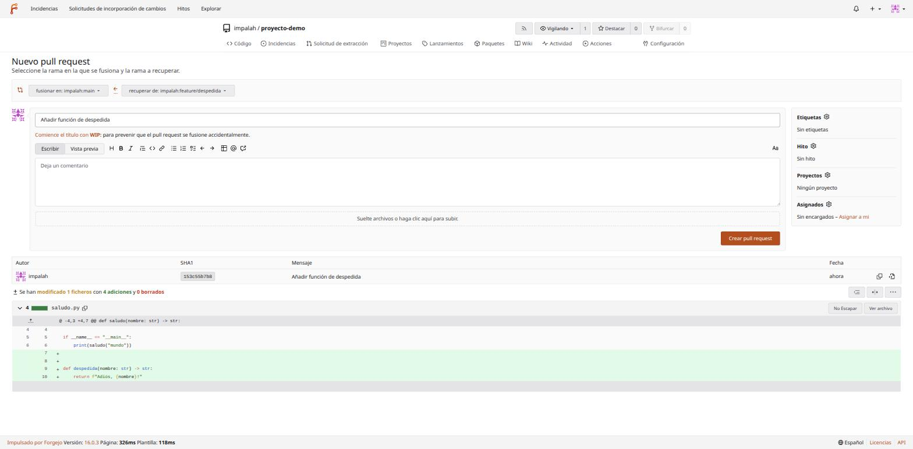
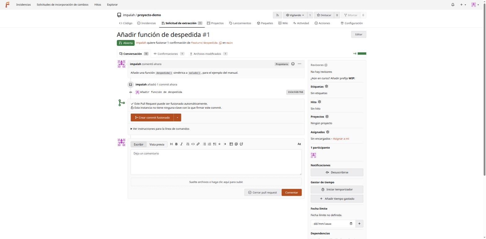
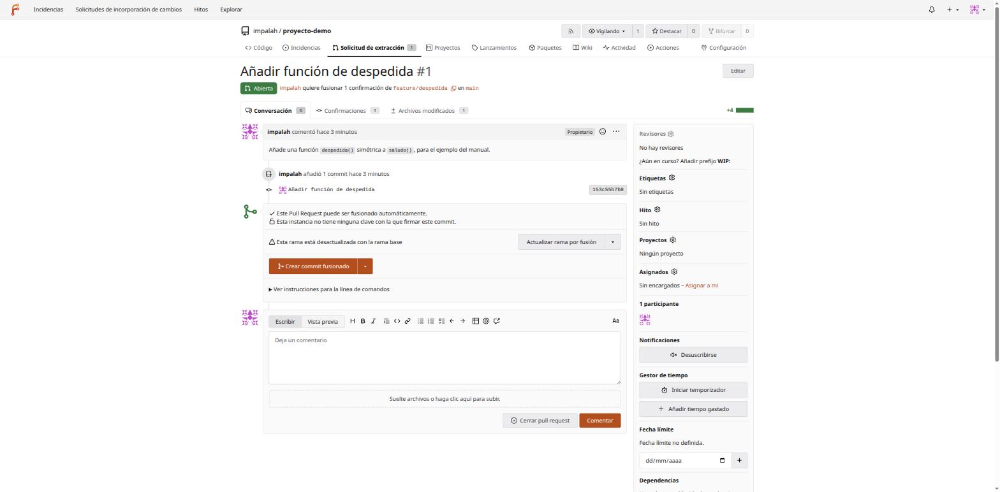
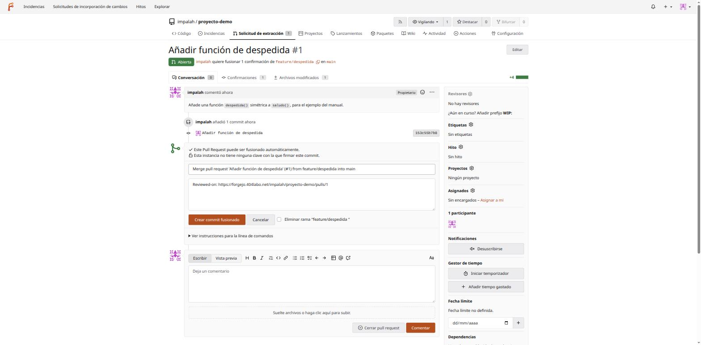
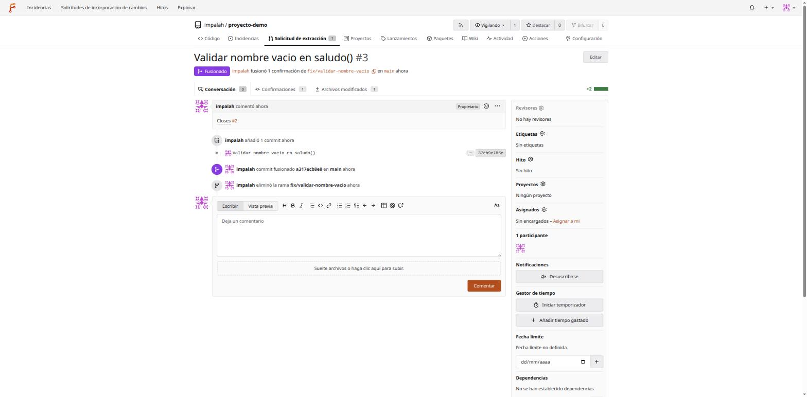

# 04 — Incidencias y Pull Requests

Este documento cubre el flujo de trabajo diario: reportar/seguir trabajo con incidencias, y proponer/revisar/fusionar cambios con pull requests. Todos los ejemplos son operaciones reales hechas sobre el repositorio de pruebas `impalah/proyecto-demo` de esta instancia.

## Incidencias (Issues)

Pestaña **Incidencias** del repositorio → **Nueva incidencia**:



El editor admite Markdown completo, con barra de formato y bloques de código con resaltado de sintaxis — muy útil para pegar un traceback o un fragmento reproducible:



Al crear, la incidencia queda numerada (`#2`, `#3`... — la numeración es compartida entre incidencias y pull requests del mismo repo, no dos secuencias separadas) con panel lateral para asignar etiquetas, hito, proyecto y responsables:



### Cerrar una incidencia automáticamente desde un commit o PR

Si el mensaje de un commit (o la descripción de una PR) incluye `Closes #N`, `Fixes #N` o `Resolves #N` (en inglés, son las palabras clave que Forgejo reconoce — funciona igual aunque el resto del mensaje esté en español), la incidencia número `N` se cierra automáticamente en cuanto ese commit llega a la rama por defecto:

```bash
git commit -m "Validar nombre vacio en saludo()

Closes #2"
```

El resultado, verificado en vivo — la incidencia queda cerrada con el enlace exacto al commit y a la PR que la cerraron, sin ninguna acción manual:



Esto es más que una comodidad — es documentación viva: cualquiera que entre a la incidencia en el futuro ve exactamente qué cambio la resolvió, sin tener que preguntarlo en ningún sitio.

## Pull Requests

El flujo estándar: crear una rama, hacer commits en ella, subirla, y abrir una PR contra la rama base (normalmente `main`).

```bash
git checkout -b feature/despedida
# ... editar, git add, git commit ...
git push -u origin feature/despedida
```

Al hacer push de una rama nueva, el propio Git (vía el servidor) sugiere la URL para abrir la PR directamente:

```
remote: Create a new pull request for 'feature/despedida':
remote:   https://forgejo.404labo.net/impalah/proyecto-demo/compare/main...feature/despedida
```

Esa URL de "comparar" muestra el diff completo antes de abrir nada:



Botón "Nuevo pull request" → título, descripción (Markdown igual que las incidencias — y si escribes `Closes #N` aquí, funciona exactamente igual que en un commit), etiquetas, hito, revisores:



La PR creada muestra el estado de fusión, los commits incluidos, y —si el repo tiene Forgejo Actions activo (no es el caso en este clúster todavía)— el resultado de los checks de CI:



### Revisar el diff archivo por archivo

Pestaña "Archivos modificados" dentro de la PR — vista de revisión de código dedicada, con posibilidad de marcar archivos como "vistos" y dejar comentarios sobre líneas concretas (clic en el número de línea):

Útil en revisiones con varios archivos: puedes ir marcando "Visto" en cada uno según avanzas, y Forgejo recuerda el progreso si vuelves más tarde a la misma PR.

### Ramas desactualizadas

Si `main` avanza mientras una PR sigue abierta, Forgejo lo avisa antes de dejar fusionar directamente:



"Actualizar rama por fusión" trae los cambios nuevos de la base a la rama de la PR (un merge, no un rebase) automáticamente, sin que tengas que hacerlo a mano en local. Si en cambio los cambios de ambas ramas tocan literalmente las mismas líneas, esto **no** se resuelve solo — ver el documento 06 para el flujo real de resolver un conflicto de fusión a mano.

### Fusionar

Botón de fusión (varía de texto según la estrategia — "Crear commit fusionado" es la más simple: un merge commit normal). Antes de confirmar, Forgejo deja editar el mensaje del commit de fusión y ofrece eliminar la rama origen automáticamente tras fusionar (recomendado, mantiene la lista de ramas limpia):



Tras confirmar, la PR queda marcada como fusionada, con el historial completo de eventos (commits añadidos, fusión, eliminación de rama) en la propia conversación:



**Otras estrategias de fusión** (desplegable junto al botón principal, si están habilitadas en `Configuración → Repositorio`): *squash* (todos los commits de la rama se comprimen en uno solo al fusionar — útil cuando el historial de la rama de trabajo es "ruido" tipo `wip`, `arreglo typo`, `arreglo de verdad`...) y *rebase* (los commits de la rama se reaplican uno a uno sobre la punta de `main`, sin generar un commit de fusión — deja un historial lineal, pero reescribe los commits de la rama, con las mismas precauciones que cualquier reescritura de historia, ver documento 06).

## Forks — colaborar sin ser colaborador directo

Un **fork** es una copia completa de un repositorio bajo otro propietario (tu usuario, o una organización) — el mecanismo habitual cuando quieres proponer cambios a un repositorio en el que no tienes permiso de escritura directo (equivalente a como funciona en GitHub/GitLab). Botón "Bifurcar" (arriba a la derecha de cualquier repositorio):

1. Elige el propietario del fork (tu usuario u otra organización de la que seas miembro — **no puedes bifurcar un repositorio bajo el mismo propietario que ya lo tiene**, Forgejo simplemente te avisa "Ya has bifurcado" si lo intentas sobre uno tuyo).
2. Se crea una copia completa (historial incluido) bajo tu cuenta.
3. Clonas **tu fork**, no el original: `git clone git@forgejo.404labo.net:tu-usuario/repo.git`.
4. Trabajas en una rama, la subes a tu fork.
5. Abres una PR desde tu fork hacia el repositorio original — la pantalla de "Nuevo pull request" del repo original deja elegir como origen ("recuperar de") cualquier fork visible, no solo sus propias ramas.

Para mantener tu fork al día con el original, Forgejo ofrece un botón "Sincronizar bifurcación" en la página del fork — trae los commits nuevos del original sin que tengas que añadir un remoto manualmente. Si prefieres hacerlo por Git directamente: añade el original como un segundo remoto (`git remote add upstream git@forgejo.404labo.net:propietario-original/repo.git`) y haz `git fetch upstream && git merge upstream/main`.

En un homelab de una sola persona (como el uso principal previsto para esta instancia hoy) los forks no son el flujo habitual — el patrón normal es tener permiso de colaborador directo (documento 03) y trabajar con ramas dentro del mismo repositorio, como en todos los ejemplos anteriores de este documento. Los forks entran en juego en cuanto haya colaboradores externos sin acceso de escritura directo, o al recibir contribuciones de fuera del clúster.

## Siguiente paso

Todo lo anterior también se puede hacer sin salir de la terminal — [05-cli-tea.md](05-cli-tea.md) cubre la CLI oficial de Forgejo. Y si Git en sí (no Forgejo) todavía no te resulta cómodo del todo, [06-git-guia-practica.md](06-git-guia-practica.md) es el curso práctico pensado justo para eso.
