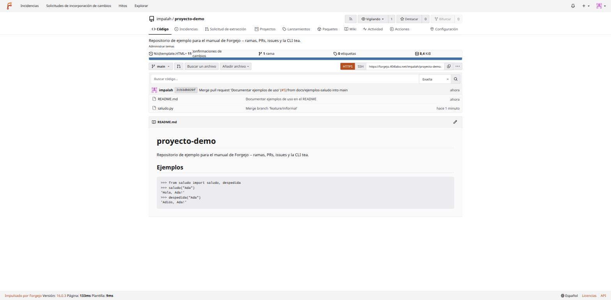

# 06 — Git en la práctica: el día a día y cómo deshacer un lío

Este documento no es un manual exhaustivo de Git — es justo lo contrario: el subconjunto de comandos que cubre el 95 % del trabajo real, más una sección larga dedicada a **incidentes** (los sustos típicos de cualquiera que empieza) explicados con salidas de terminal **reales**, generadas a propósito contra el repositorio de pruebas de esta instancia (`impalah/proyecto-demo`) para que veas exactamente qué dice Git en cada caso, no una versión idealizada.

Si nunca has usado Git más allá de lo imprescindible, la idea de este documento es que puedas trastear con confianza — casi todo lo que sale mal en Git tiene arreglo, casi siempre sin perder trabajo, si sabes qué comando mirar.

## Conceptos mínimos para que el resto tenga sentido

- **Repositorio (repo)** — el proyecto completo con su historial, vive en la carpeta oculta `.git/`.
- **Commit** — una fotografía guardada de los archivos en un momento dado, con un mensaje y un identificador único (hash, ej. `d54c6b9`).
- **Rama (branch)** — un puntero con nombre a un commit concreto; avanza sola cada vez que confirmas (`commit`) estando en ella. `main` es la rama principal por convención, no por magia.
- **`HEAD`** — a qué commit/rama apunta tu copia de trabajo *ahora mismo*.
- **Remoto (remote)** — una copia del repositorio en otro sitio (aquí, Forgejo); `origin` es el nombre por defecto del remoto del que clonaste.
- **Working directory / staging area (índice) / repositorio** — las tres "zonas" por las que pasa un cambio: editas ficheros (working directory) → `git add` los mueve al índice (lo que *va a* entrar en el próximo commit) → `git commit` los graba de verdad en el historial.

## El ciclo diario

```bash
git status              # qué ha cambiado, qué está en el índice, en qué rama estás
git add archivo.py      # mover un cambio concreto al índice ("lo voy a confirmar")
git add .                # mover TODOS los cambios del directorio actual (usar con cuidado, ver más abajo)
git commit -m "mensaje"  # grabar lo que hay en el índice como un commit nuevo
git push origin main     # subir tus commits locales al remoto
git pull origin main     # traer y fusionar los commits nuevos del remoto
```

Ejemplo real, de principio a fin, contra esta instancia:

```bash
$ git status
En la rama main
Tu rama está actualizada con 'origin/main'.
Archivos sin seguimiento:
	saludo.py
no hay nada agregado al commit pero hay archivos sin seguimiento presentes (usa "git add" para hacerles seguimiento)

$ git add saludo.py
$ git status
Cambios a ser confirmados:
	nuevos archivos: saludo.py

$ git commit -m "Añadir función de saludo de ejemplo"
[main d54c6b9] Añadir función de saludo de ejemplo
 1 file changed, 6 insertions(+)
 create mode 100644 saludo.py

$ git push origin main
To ssh://forgejo.404labo.net:2222/impalah/proyecto-demo.git
   ba79660..d54c6b9  main -> main
```

**`git add .` vs `git add archivo.py`**: `.` añade todo lo que haya cambiado en el directorio actual y subdirectorios — cómodo, pero fácil de usar sin mirar y colar algo que no querías (un fichero de configuración local, unas credenciales de prueba, un `print()` de depuración). El hábito más seguro: `git status` antes de cualquier `add`, y `git add -p` (modo interactivo, pregunta trozo a trozo) cuando el cambio mezcla cosas que sí quieres confirmar con cosas que no.

## Trabajar con ramas

Nunca confirmes directamente en `main` para algo que no sea trivial — una rama nueva es barata y te da marcha atrás gratis:

```bash
git checkout -b feature/despedida    # crea la rama Y te cambias a ella, a la vez
# ... editar, add, commit ...
git push -u origin feature/despedida  # -u la vincula al remoto, para que "git push" a secas ya sepa a dónde
```

Al hacer push de una rama nueva, el propio servidor sugiere la URL para abrir una pull request (documento 04):

```
remote: Create a new pull request for 'feature/despedida':
remote:   https://forgejo.404labo.net/impalah/proyecto-demo/compare/main...feature/despedida
```

Cambiar entre ramas ya existentes: `git checkout main` (o, en versiones modernas de Git, `git switch main` — mismo efecto, comando más nuevo pensado para ser menos ambiguo que `checkout`, que también sirve para restaurar ficheros).

## Fusionar ramas y resolver un conflicto real

Cuando dos ramas modifican **la misma línea** de forma distinta, Git no puede decidir por ti — esto es un conflicto de fusión, no un error ni algo roto. Ejemplo real: dos ramas (`feature/formal` y `feature/informal`) cambiaron la misma línea de `saludo.py` de formas incompatibles; la primera se fusionó sin problema, la segunda generó un conflicto real:

```bash
$ git merge feature/informal
Auto-fusionando saludo.py
CONFLICTO (contenido): Conflicto de fusión en saludo.py
Fusión automática falló; arregle los conflictos y luego realice un commit con el resultado.
```

`git status` explica exactamente qué hacer:

```bash
$ git status
Tienes rutas no fusionadas.
  (arregla los conflictos y ejecuta "git commit"
  (usa "git merge --abort" para abortar la fusion)
Rutas no fusionadas:
  modificados por ambos:  saludo.py
```

El propio fichero queda marcado con las dos versiones en conflicto:

```python
def saludo(nombre: str) -> str:
    if not nombre:
        raise ValueError("nombre no puede estar vacio")
<<<<<<< HEAD
    return f"Buenos dias, {nombre}."
=======
    return f"Ey {nombre}, que tal!"
>>>>>>> feature/informal
```

- Todo entre `<<<<<<< HEAD` y `=======` es la versión de tu rama actual.
- Todo entre `=======` y `>>>>>>> feature/informal` es la versión de la rama que estás fusionando.

**Resolverlo es edición de texto normal**: decides qué te quedas (una de las dos versiones, una mezcla, o algo nuevo) y borras las tres líneas de marcadores (`<<<<<<<`, `=======`, `>>>>>>>`) a mano — no hay comando mágico, es tu editor. En este caso se optó por una tercera versión conciliada:

```python
    return f"Hola, {nombre}!"  # version conciliada tras el conflicto
```

Con el fichero ya arreglado, el resto es el flujo normal — `add` para marcar el conflicto como resuelto, `commit` (sin `-m`, deja el mensaje de fusión que Git ya propone) para cerrar la fusión:

```bash
$ git add saludo.py
$ git status
Todos los conflictos resueltos pero sigues fusionando.
  (usa "git commit" para concluir la fusión)

$ git commit --no-edit
[main c59e8ed] Merge branch 'feature/informal'
$ git push origin main
```

**Si te agobias a mitad de un conflicto y quieres empezar de cero**: `git merge --abort` — vuelve exactamente al estado de antes de intentar la fusión, como si nunca hubiera pasado. Es la salida de emergencia segura mientras no hayas hecho `git add`/`git commit` todavía.

## Deshacer cosas — de menos a más drástico

Esta es la sección que de verdad quita el miedo a Git. Cada herramienta sirve para un momento distinto del proceso.

### Todavía no has confirmado (`commit`)

```bash
git restore archivo.py          # descarta cambios sin confirmar de UN fichero, vuelve a como estaba
git restore --staged archivo.py  # lo saca del índice, pero mantiene el cambio en el fichero (deshace un "git add")
```

### Acabas de confirmar y quieres corregir el mensaje o añadir algo olvidado

```bash
git commit --amend -m "Mensaje corregido"
# o, para añadir un fichero olvidado al ÚLTIMO commit sin crear uno nuevo:
git add fichero-olvidado.py && git commit --amend --no-edit
```

Real:

```bash
$ git commit --amend -m "Commit de prueba 2 (mensaje corregido)"
[practica-incidentes cff64b1] Commit de prueba 2 (mensaje corregido)
```

⚠️ **`--amend` reescribe el commit** (le cambia el hash) — perfectamente seguro mientras ese commit **no se haya publicado todavía** (`git push`). Si ya lo empujaste y alguien más pudo haberlo visto o basado trabajo en él, usa `revert` (siguiente punto) en vez de `amend` + push forzado.

### El commit ya está publicado (empujado) y quieres deshacerlo

```bash
git revert HEAD          # crea un commit NUEVO que deshace el último
git revert <hash>         # deshace un commit concreto, no necesariamente el último
```

Real:

```bash
$ git revert --no-edit HEAD
[practica-incidentes 9ac4043] Revert "Commit de prueba 2 (mensaje corregido)"
```

`revert` es la herramienta segura para historial ya compartido: no borra ni reescribe nada, añade un commit nuevo que hace lo contrario. Cualquiera que ya tuviera el commit original sigue teniendo un historial coherente tras hacer `pull`.

### Quieres deshacer commits locales que TODAVÍA no has publicado

```bash
git reset --soft HEAD~1    # deshace el último commit, pero deja los cambios en el índice (listos para re-confirmar)
git reset --mixed HEAD~1   # (el modo por defecto) deshace el commit Y lo saca del índice, pero conserva los cambios en los ficheros
git reset --hard HEAD~1    # deshace el commit Y DESCARTA los cambios por completo
```

`--hard` es el único de los tres que de verdad puede parecer que "pierdes" trabajo — y es exactamente el escenario del siguiente apartado.

### "Me he cargado un commit con `reset --hard` sin querer" — el pánico más típico, y tiene arreglo

Casi nunca se pierde nada de verdad: Git no borra un commit en cuanto deja de ser alcanzable desde una rama, solo deja de mostrarlo. `git reflog` es el historial de **a dónde ha apuntado `HEAD`**, no del contenido del proyecto — y ahí sigue apareciendo.

Reproducido en vivo, con intención, para este manual:

```bash
$ git log --oneline -3
d0978b4 Commit de prueba 2 -- este va a desaparecer
99fdbfe Commit de prueba 1
c59e8ed Merge branch 'feature/informal'

$ git reset --hard HEAD~1     # "por error", se borra el commit de prueba 2
HEAD está ahora en 99fdbfe Commit de prueba 1

$ git log --oneline -3          # ya no aparece...
99fdbfe Commit de prueba 1
c59e8ed Merge branch 'feature/informal'
543eaf5 Usar un saludo mas formal

$ git reflog --date=iso | head -3   # ...pero sigue en el reflog
99fdbfe HEAD@{2026-09-03 16:42:18 +0200}: reset: moving to HEAD~1
d0978b4 HEAD@{2026-09-03 16:42:11 +0200}: commit: Commit de prueba 2 -- este va a desaparecer
99fdbfe HEAD@{2026-09-03 16:42:11 +0200}: commit: Commit de prueba 1

$ git reset --hard d0978b4          # el hash exacto sale del propio reflog
HEAD está ahora en d0978b4 Commit de prueba 2 -- este va a desaparecer
```

El commit "perdido" vuelve exactamente como estaba, mismo hash. **Límite real de esto**: el reflog es local (no se sube al remoto) y Git acaba haciendo *garbage collection* de commits inalcanzables tras un tiempo (normalmente 90 días por defecto) — no es un "deshacer" infinito, pero cubre con margen de sobra el típico "me acabo de dar cuenta".

### Guardar cambios a medias sin confirmarlos (para cambiar de rama, por ejemplo)

```bash
git stash push -m "descripción del cambio a medias"
git stash list
git stash pop     # recupera el último stash Y lo quita de la lista
git stash apply    # recupera el último stash pero lo DEJA en la lista (por si lo quieres aplicar en más de un sitio)
```

Real:

```bash
$ git status --short
 M saludo.py
$ git stash push -m "cambio a medias en saludo.py"
Directorio de trabajo y estado de índice On practica-incidentes: cambio a medias en saludo.py guardados
$ git status --short
                                              # limpio -- el cambio está "guardado aparte"
$ git stash list
stash@{0}: On practica-incidentes: cambio a medias en saludo.py
$ git stash pop
$ git status --short
 M saludo.py                                 # de vuelta
```

Útil para el caso típico "estoy a media tarea, pero necesito cambiar de rama urgentemente sin confirmar esto todavía".

## El incidente más peligroso de todos: `push --force`

Reescribir el historial local (con `amend`, `reset`, o un `rebase`) y luego intentar publicarlo choca con el remoto, porque el remoto tiene un historial distinto al que espera:

```bash
$ git push origin main
 ! [rejected]        main -> main (non-fast-forward)
error: falló el empuje de algunas referencias...
ayuda: Updates were rejected because the tip of your current branch is behind
ayuda: its remote counterpart.
```

`git push --force` "resuelve" esto — pero al precio de **sobrescribir el historial remoto**, tirando por el camino cualquier commit que hubiera ahí y que tú no tuvieras en local (por ejemplo, algo que alguien más acabara de publicar). Es la forma más habitual de que alguien "pierda" el trabajo de otra persona en un repositorio compartido, y suele pasar sin que quien hace el force-push se dé ni cuenta hasta después.

Esta instancia tiene protección de rama activa en `main` (documento 03) precisamente contra esto — un intento real de `--force` contra ella:

```bash
$ git push --force origin main
remote: Forgejo: branch main is protected from force push
 ! [remote rejected] main -> main (pre-receive hook declined)
```

**Reglas prácticas**:
- Si necesitas de verdad reescribir una rama ya publicada y **estás seguro de que nadie más la ha tocado** (típicamente, tu propia rama de feature antes de abrir la PR — nunca `main` compartida), usa `git push --force-with-lease` en vez de `--force` a secas: rechaza el push si el remoto tiene commits que tu copia local no conoce, en vez de arrasar ciegamente.
- Para `main`/ramas compartidas, la protección de rama (documento 03) es la red de seguridad correcta — que ni siquiera dependa de que todo el mundo se acuerde de usar `--force-with-lease`.
- Si alguna vez recibes tú un `non-fast-forward` inesperado en una rama que sí es solo tuya, casi siempre la solución correcta es `git pull` (trae y fusiona lo nuevo) antes de reintentar el push, no forzar.

## Otros incidentes típicos, explicados

### "Estoy en un commit suelto, no en ninguna rama" (`detached HEAD`)

Pasa al hacer `git checkout <hash-de-un-commit>` (en vez de un nombre de rama) — por ejemplo, para mirar cómo estaba el código en un punto concreto del historial. Git avisa explícitamente ("You are in 'detached HEAD' state"). Mientras solo estés mirando, no hay ningún problema. Si haces commits ahí y luego cambias de rama sin más, esos commits quedan sin ninguna rama que los referencie — recuperables por `reflog` igual que en el apartado anterior, pero mejor evitarlo: si vas a trabajar de verdad a partir de ese punto, primero crea una rama (`git checkout -b rama-nueva`) desde ahí.

### Commit hecho en la rama equivocada

Si aún no lo has publicado: `git log` para ver el hash, `git reset --hard HEAD~1` en la rama equivocada (lo quita de ahí, ver apartado de arriba), cambiar a la rama correcta, y `git cherry-pick <hash>` — reaplica ese commit concreto encima de donde estés ahora.

### Un fichero que debería estar en `.gitignore` sigue apareciendo en `git status`

Añadirlo a `.gitignore` **después** de que Git ya lo esté rastreando no basta — `.gitignore` solo afecta a ficheros que Git todavía no conoce. Hay que decirle explícitamente que deje de rastrearlo (sin borrar el fichero del disco):

```bash
git rm --cached ruta/al/fichero
echo "ruta/al/fichero" >> .gitignore
git add .gitignore
git commit -m "Dejar de rastrear ruta/al/fichero"
```

### Se ha confirmado y publicado un secreto por error (contraseña, token, clave privada...)

Este es el único incidente de esta lista donde **el orden de las acciones importa más que el comando en sí**:

1. **Revoca/rota el secreto ya mismo** — cámbialo en el sistema real (Infisical, el proveedor que sea) para que el valor filtrado deje de servir. Esto es lo urgente; nada de lo que hagas en Git deshace que ese valor ya fue público en algún momento.
2. Solo después, si además quieres limpiar el historial (para que no quede el valor viejo, ya inútil, dando vueltas): eso es una reescritura de historia — `git filter-repo` (la herramienta recomendada hoy; `git filter-branch`, la antigua incluida en Git, está desaconsejada por el propio proyecto Git) o BFG Repo-Cleaner. Reescribe hashes de **todo** el historial posterior al commit afectado, así que exige coordinarlo con cualquiera que tenga un clon (todos necesitan volver a clonar, no solo hacer `pull`) — fuera del alcance de este documento, que es de uso diario, no de recuperación de incidentes de seguridad; si esto pasa de verdad en un repo de este clúster, tratarlo como lo que es (revisar `docs/26-infisical-secretos.md` para cómo se gestionan aquí los secretos reales) antes de tocar el historial de Git.

## Referencia rápida

| Quiero... | Comando |
|---|---|
| Ver qué ha cambiado | `git status` |
| Ver el diff exacto (sin confirmar todavía) | `git diff` |
| Ver el historial | `git log --oneline` (`--graph --all` para ver todas las ramas a la vez) |
| Descartar cambios sin confirmar de un fichero | `git restore archivo` |
| Deshacer el último `add` | `git restore --staged archivo` |
| Corregir el mensaje/contenido del último commit (no publicado) | `git commit --amend` |
| Deshacer un commit ya publicado | `git revert <hash>` |
| Deshacer commits locales, conservando los cambios | `git reset --mixed HEAD~N` |
| Deshacer commits locales, descartando todo | `git reset --hard HEAD~N` (⚠️ ver reflog si te equivocas) |
| Recuperar algo "perdido" con `reset --hard` | `git reflog` → `git reset --hard <hash>` |
| Guardar cambios a medias sin confirmar | `git stash push -m "..."` / `git stash pop` |
| Publicar una reescritura de tu propia rama sin arriesgarte a machacar a nadie | `git push --force-with-lease` (nunca `--force` a secas en ramas compartidas) |
| Abandonar una fusión con conflicto a mitad | `git merge --abort` |

## Cierre

Con esto, y los documentos 01-05, tienes cubierto el ciclo completo: cuenta, claves, repos, incidencias, PRs, la CLI, y cómo no perder trabajo cuando algo sale mal — que, tarde o temprano, siempre sale. El repositorio de pruebas usado en todo este manual, tras pasar por ramas, PRs, un conflicto real resuelto a mano, y varios incidentes simulados a propósito, queda en un estado perfectamente normal — que es justo la idea: nada de esto deja cicatrices si se maneja con los comandos de arriba.


