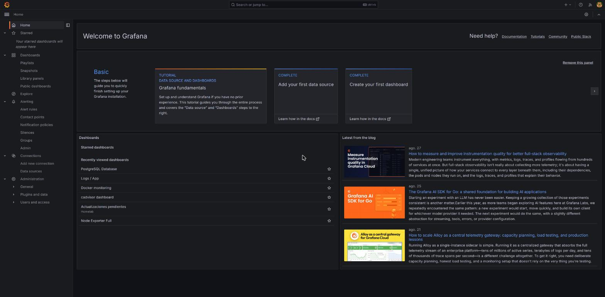

# Grafana — manual de usuario del homelab

Manual paso a paso de Grafana, escrito para alguien que no lo ha usado nunca, orientado específicamente a ver y entender la información de **este** clúster (métricas, logs y alertas de los 7 nodos y los ~30 servicios que corren en él) — no es un tutorial genérico de Grafana.

## Qué es Grafana y para qué sirve aquí

Grafana es la interfaz web donde se visualiza todo lo que el clúster observa de sí mismo. No almacena datos por sí solo — es una capa de visualización y alertado por encima de otras piezas que sí los guardan:

- **Prometheus** — métricas numéricas (CPU, RAM, disco, red, contenedores, PostgreSQL...), guardadas como series temporales.
- **Loki** — logs (la salida de consola de todos los contenedores del clúster).
- **Tempo** — trazas distribuidas (hoy solo las usa `apikey-service`).

Estas tres piezas, junto con Grafana, viven en el stack `pi-obs` (`docker-swarm/stacks/pi-obs/`), desplegado en el nodo `pi-obs` (192.168.1.171). Grafana no recopila nada por sí mismo — solo consulta a Prometheus/Loki/Tempo cuando alguien abre un panel o hace una búsqueda.

## Cómo llegar a Grafana

```
https://grafana.404labo.net
```

Solo accesible desde la LAN o vía Tailscale (mismo criterio que el resto de paneles internos del clúster). El login es una cuenta **propia de Grafana** (usuario `admin`), no está integrado con Authentik SSO todavía — si alguna vez ves un flujo de login distinto (redirigido a `authentik.404labo.net`), es que ese trabajo (mejora 29 del backlog) ya se hizo y este documento está desactualizado en ese punto.



## Qué ya hay desplegado en este clúster

Antes de entrar en el manual, un resumen de lo que ya existe y que irás viendo en detalle en los siguientes documentos — para no confundir "cómo funciona Grafana en general" con "qué es específico de este homelab":

- **3 datasources** aprovisionadas por fichero (`pi-obs/config/grafana/datasources.yml`): Prometheus, Loki, Tempo.
- **5 dashboards ya importados** de la comunidad de Grafana: Node Exporter Full, Docker/cAdvisor, PostgreSQL Overview, Loki Logs, más uno propio del clúster ("Actualizaciones pendientes").
- **8 reglas de alerta** ya activas, agrupadas en una carpeta "Homelab Alerts" (disco, hardware/alimentación, parcheo del SO, batería del SAI), todas conectadas a un canal de notificaciones real: **ntfy** (mejora 4 del backlog, `docs/34-ntfy-notificaciones.md`).

Todo esto se gestiona **por fichero** (aprovisionamiento), no a mano desde la UI — un punto importante que se explica con detalle en el documento 06 de este manual, porque cambia cómo se debe tocar la configuración de este clúster en concreto frente a una instalación de Grafana genérica.

## Cómo está organizado este manual

| Documento | Contenido |
|---|---|
| [01-primeros-pasos.md](01-primeros-pasos.md) | Primer contacto con la interfaz: login, tour de la barra lateral, conceptos clave |
| [02-explorar-metricas-y-logs.md](02-explorar-metricas-y-logs.md) | La vista **Explore**: consultar métricas y logs sin necesidad de un dashboard |
| [03-dashboards-existentes.md](03-dashboards-existentes.md) | Recorrido guiado por los dashboards ya desplegados en este clúster |
| [04-crear-tu-propio-dashboard.md](04-crear-tu-propio-dashboard.md) | Paso a paso: construir un dashboard nuevo desde cero |
| [05-alertas.md](05-alertas.md) | Cómo funciona el alerting aquí (conectado a ntfy) y cómo añadir una regla nueva |
| [06-administracion-y-configuracion.md](06-administracion-y-configuracion.md) | Data sources, carpetas, y por qué gran parte de la configuración no se toca desde la UI |

No hace falta leerlos en orden estricto salvo el 01 primero — pero si es tu primera vez con Grafana, sí conviene seguir la secuencia tal como está.
