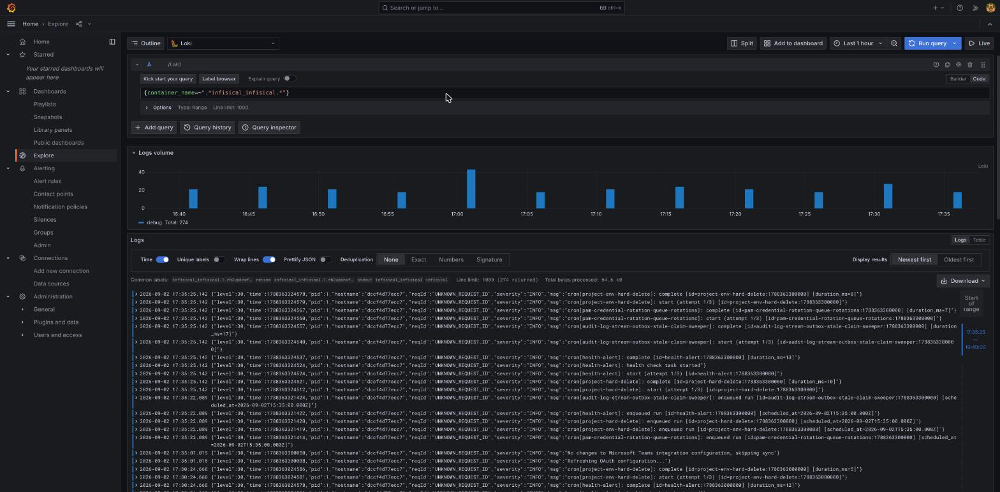
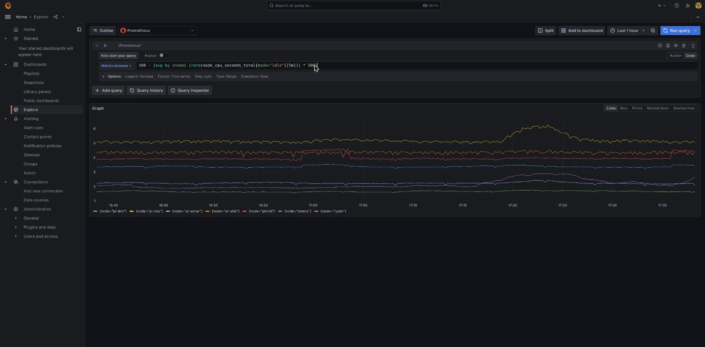

# 02 — Explorar métricas y logs (Explore)

**Explore** es la vista para hacer una consulta puntual — "¿qué está pasando con X ahora mismo?" — sin necesidad de crear ni guardar un dashboard. Es el punto de partida natural antes de construir un panel permanente (documento 04): primero se prueba la consulta en Explore, y solo cuando ya muestra lo que se quiere, se lleva a un dashboard.

Se accede desde **Explore** en la barra lateral, o con el botón "Explore data" que aparece en cualquier datasource.

## Elegir la fuente de datos

Arriba a la izquierda hay un selector de datasource. En este clúster hay tres opciones reales: **Prometheus** (métricas), **Loki** (logs) y **Tempo** (trazas, uso marginal hoy). El resto de este documento cubre las dos primeras.

## Consultar logs (Loki)

Selecciona **Loki** como datasource. El editor tiene dos modos: **Builder** (formularios guiados) y **Code** (escribir la consulta LogQL directamente) — el botón para cambiar está arriba a la derecha del editor. Para alguien que empieza, Builder es más cómodo al principio; Code es más rápido en cuanto se conocen los nombres de las etiquetas.

Cada línea de log en este clúster lleva, como mínimo, las etiquetas `container_name`, `node` y `compose_project` (vienen del driver de logging `loki` que usa cada `docker-compose.yml`, no hay que instrumentar nada por servicio). Algunas consultas típicas, ya en modo Code:

```logql
{container_name=~".*authentik-server.*"}
{node="pi-utils"}
{compose_project="homelab-retaco"}
{container_name=~".*infisical.*"} |= "error"
```

La última añade un filtro de texto (`|= "error"`) sobre las líneas ya filtradas por contenedor — así se combina "qué contenedor" con "qué buscar dentro".

Ejemplo real, tal como se ve en Grafana (logs de `infisical` durante una investigación real de este clúster):



Por encima de las líneas de log aparece un histograma de volumen — útil para ver de un vistazo si hay un pico de actividad (un error repitiéndose, por ejemplo) antes de leer una sola línea.

## Consultar métricas (Prometheus)

Cambia el datasource a **Prometheus**. El lenguaje de consulta aquí es PromQL — más denso que LogQL, pero unas pocas consultas cubren la mayoría de necesidades del día a día en este clúster.

Ejemplo real: porcentaje de CPU usado por nodo, con los 7 nodos en la misma gráfica gracias a que cada métrica lleva la etiqueta `node`:

```promql
100 - (avg by (node) (rate(node_cpu_seconds_total{mode="idle"}[5m])) * 100)
```



Otras consultas útiles ya adaptadas a las etiquetas reales de este clúster:

```promql
# ¿Qué nodos tienen su node-exporter respondiendo ahora mismo?
up{job=~"node-exporter.*"}

# RAM usada, por nodo, en GiB
node_memory_MemTotal_bytes{node="retaco"} - node_memory_MemAvailable_bytes{node="retaco"}

# ¿Cuántos contenedores hay corriendo en total?
count(container_last_seen)
```

## Acotar por tiempo

El selector de rango temporal está arriba a la derecha ("Last 1 hour" por defecto) — cubre desde los últimos 5 minutos hasta rangos personalizados. Para logs, un rango más corto suele ser más legible; para métricas de tendencia (¿ha subido la carga esta semana?), un rango largo es más útil.

## Cuándo usar Explore y cuándo un dashboard

Explore es para preguntas puntuales que no necesitas volver a hacer. En cuanto una consulta empieza a repetirse — "esto lo miro cada vez que reviso el clúster" — es el momento de guardarla como un panel en un dashboard, que es justo lo que cubre el documento 04.
