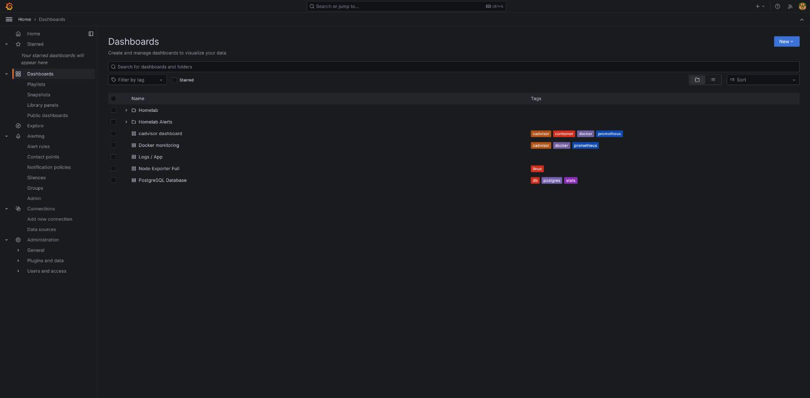
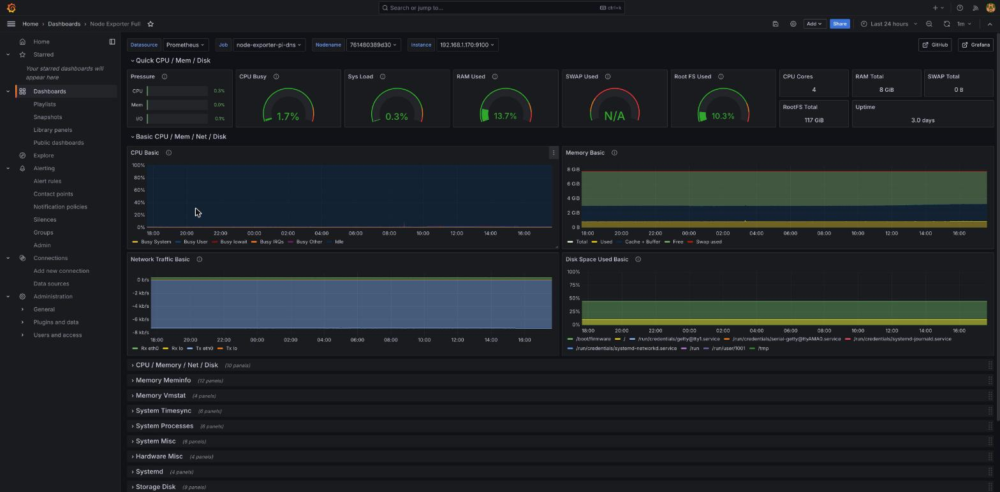
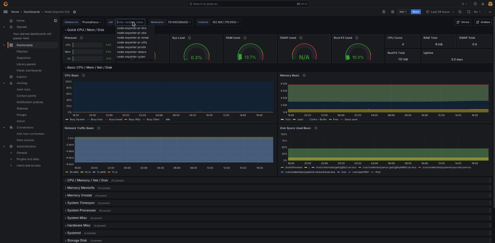
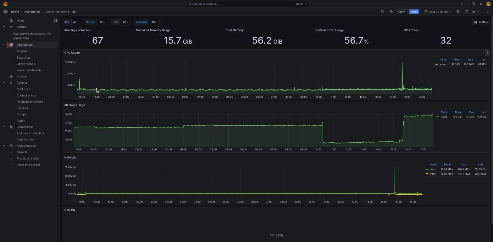
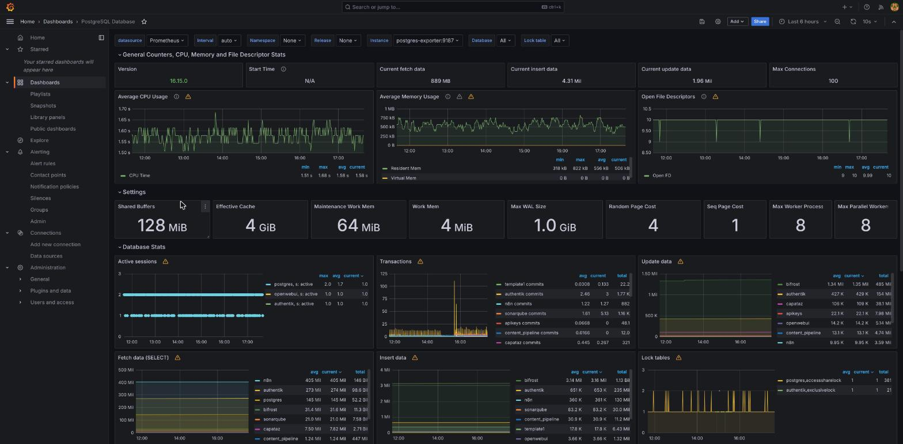
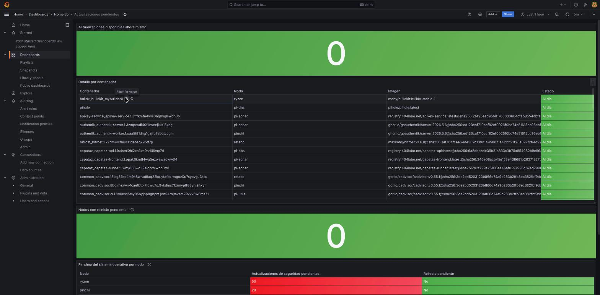

# 03 — Recorrido por los dashboards ya desplegados

Antes de crear nada propio (documento 04), vale la pena conocer lo que ya existe — cubre la mayoría de preguntas del día a día sobre el clúster. Todos son accesibles desde **Dashboards** en la barra lateral:

Dos carpetas (`Homelab`, con el dashboard propio del clúster; `Homelab Alerts`, donde viven las reglas de alerta — ver documento 05) y cuatro dashboards importados de la comunidad de Grafana.com, sueltos sin carpeta.

## Node Exporter Full

El dashboard de referencia para la salud de un nodo: CPU, RAM, disco, red, procesos, temperatura... Un selector arriba a la izquierda (**Job**) elige de qué nodo se están viendo los datos:

Al hacer clic en el selector aparecen los 7 nodos del clúster (los 6 "de siempre" más `pinchi`):

Úsalo para preguntas del tipo "¿por qué `ryzen` va lento ahora mismo?" o "¿cuánto disco le queda a `pi-sonar`?".

## Docker monitoring (cAdvisor)

Vista agregada de **todos los contenedores del clúster** — cuántos están corriendo, memoria/CPU/red totales, con filtros por Job/Service/Host/Container arriba:

Útil para preguntas de conjunto ("¿ha subido el consumo de memoria de golpe?") más que para depurar un contenedor concreto — para eso, mejor Explore con Loki (documento 02) o el propio `docker service logs` por SSH.

## PostgreSQL Database

Métricas de `postgres-main` (el Postgres compartido por casi todo el clúster: n8n, SonarQube, authentik, apikey-service, Capataz...), desglosadas **por base de datos**:

Sesiones activas, transacciones, filas leídas/escritas — todo separado por base (`bifrost`, `authentik`, `n8n`, `sonarqube`...), lo que permite ver de un vistazo qué servicio está generando más carga sobre la base de datos compartida.

## Actualizaciones pendientes (propio del clúster)

El único dashboard construido específicamente para este homelab, no importado — carpeta `Homelab`. Combina dos vigilancias distintas (mejoras 6/8 y 36 del backlog, `docs/16-mantenimiento-actualizaciones.md`): imágenes Docker con una versión más nueva disponible en el registro, y parcheo de sistema operativo pendiente por nodo:

La tabla "Detalle por contenedor" es útil para saber, contenedor a contenedor, si la imagen que corre hoy es la más reciente publicada. La sección inferior ("Parcheo del sistema operativo por nodo") muestra actualizaciones de seguridad de `apt` pendientes y si un nodo tiene un reinicio pendiente — ambas alimentan las alertas del documento 05.

## Logs / App — un caso real de dashboard importado que no encaja del todo

Vale la pena mencionarlo con honestidad: este dashboard importado (ID 13639 de Grafana.com) espera que los logs lleven una etiqueta `app`, que **no existe** en las etiquetas reales de este clúster (aquí se usa `container_name`/`node`/`compose_project`, ver documento 02) — al abrirlo, el selector "App" solo ofrece "None" y no muestra datos. No está roto ni hace falta arreglarlo: para explorar logs en este clúster, **Explore con Loki** (documento 02) es la vía que sí funciona con las etiquetas reales. Se deja como ejemplo de que no todo dashboard importado de la comunidad encaja sin ajustes con el esquema de etiquetas propio de un clúster — antes de asumir que uno importado "no funciona", vale la pena comprobar qué etiquetas espera frente a las que existen de verdad.

El siguiente documento parte de aquí para construir un dashboard propio desde cero.
