# 04 — Crear tu propio dashboard

Este documento construye, paso a paso, un dashboard real desde cero — el mismo que se usó para capturar las pantallas de este manual, guardado en el clúster como `Homelab / Estado del homelab (ejemplo del manual)`. Puedes seguirlo tal cual o adaptarlo desde el primer paso.

## 1. Crear el dashboard vacío

**Dashboards → New → New Dashboard** (o el botón "+" de la barra superior). Arranca vacío, con una única opción:

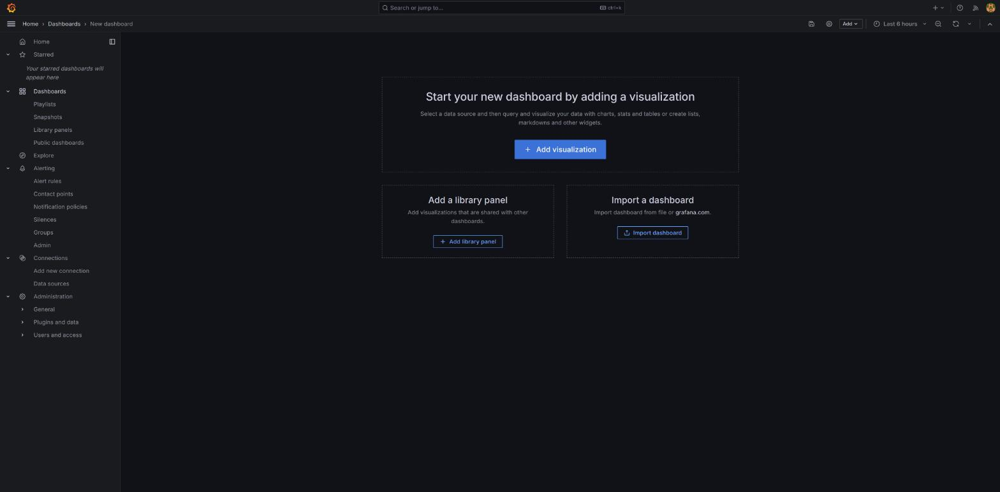

## 2. Añadir el primer panel

**+ Add visualization**. Lo primero que pide es la fuente de datos del panel:

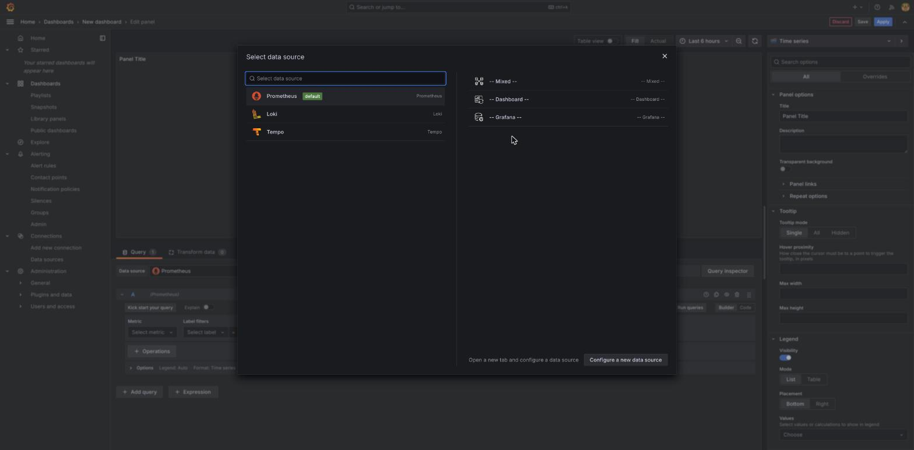

Elige **Prometheus** (es la que se usa para el ejemplo de este documento — para un panel de logs, sería Loki, con el mismo flujo).

## 3. Escribir la query

El editor abre en modo **Builder** por defecto. Para consultas sencillas puede bastar, pero para tener control total conviene cambiar a **Code** (botón arriba a la derecha del editor) y escribir la consulta PromQL directamente:

```promql
sum(up{job=~"node-exporter.*"})
```

Esta consulta cuenta cuántos `node-exporter` de los 7 nodos están respondiendo ahora mismo — un indicador rápido de "¿está todo el clúster en pie?".

## 4. Elegir el tipo de visualización

Arriba a la derecha del panel de edición hay un selector de tipo de visualización (por defecto, "Time series"). Al abrirlo aparecen todas las opciones disponibles:

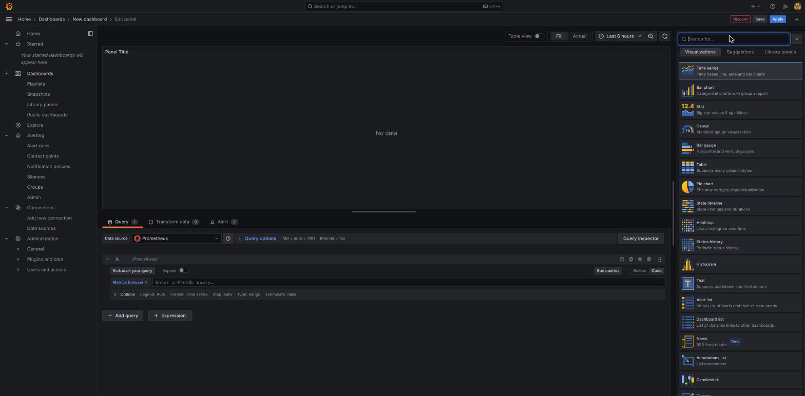

Para un número único como el de este ejemplo, **Stat** es la elección natural — un valor grande, con color según umbral. Para series a lo largo del tiempo (como el ejemplo de CPU del documento 02), **Time series** es lo normal. Para desgloses por nodo/servicio en filas, **Table**.

Con Stat seleccionado y la query aplicada, el panel ya muestra un resultado real:

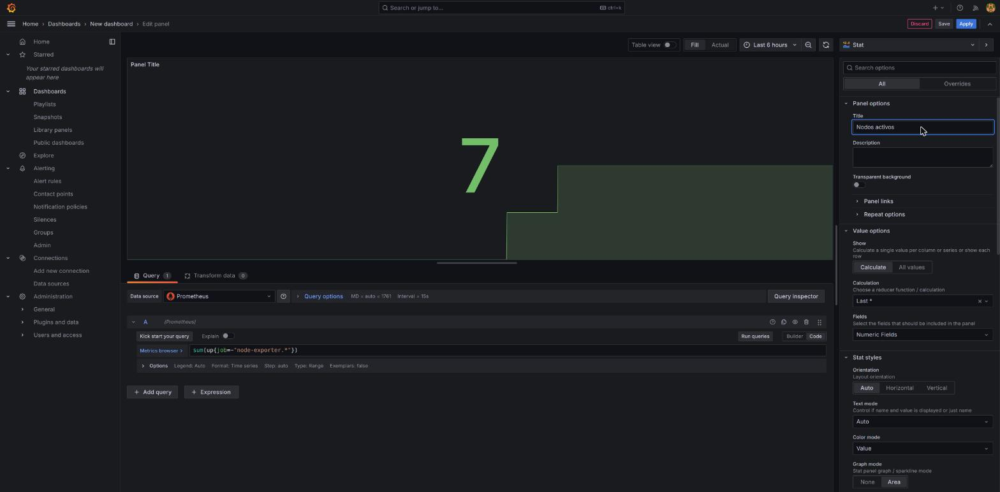

El campo **Title**, en el panel de opciones de la derecha, es el nombre que verá cualquiera que abra el dashboard — en este ejemplo, "Nodos activos".

## 5. Aplicar y ver el resultado en el dashboard

El botón **Apply** (arriba a la derecha) cierra el editor de panel y vuelve a la vista general del dashboard, ya con el panel colocado:

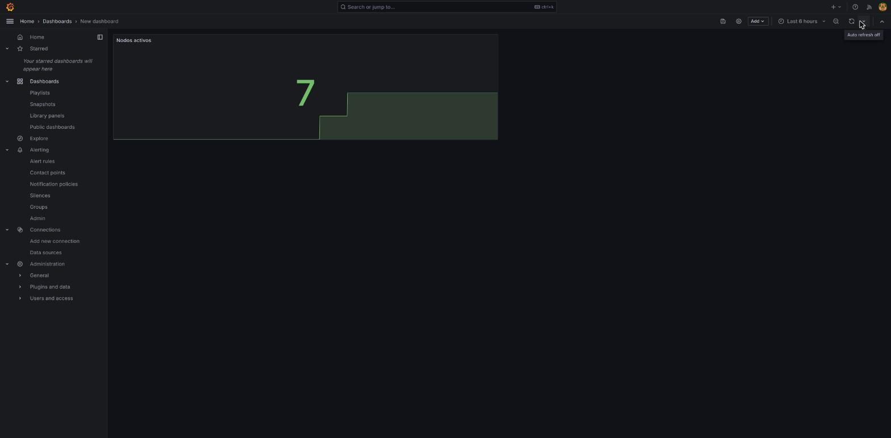

Desde aquí se pueden arrastrar los bordes del panel para redimensionarlo, o pulsar **+ Add** de nuevo para añadir más paneles siguiendo el mismo proceso (pasos 2 a 5).

## 6. Guardar el dashboard

El icono de disco (arriba a la izquierda) abre el diálogo de guardado — pide un título y, sobre todo, **en qué carpeta** vive:

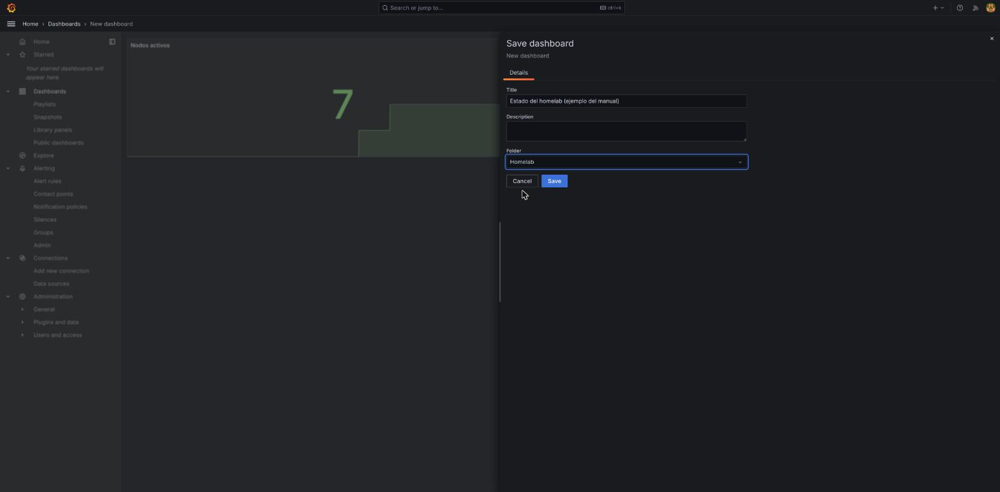

En este clúster, los dashboards propios van en la carpeta **Homelab** (la misma donde vive "Actualizaciones pendientes", documento 03) — mantiene separado lo propio de lo importado de la comunidad.

## 7. Variables — hacer el dashboard reutilizable para los 7 nodos

Sin variables, cada panel queda fijado a un nodo o servicio concreto. Con una variable, un mismo dashboard sirve para los 7 nodos con un simple desplegable. Se configuran en **el icono de engranaje → Variables**:

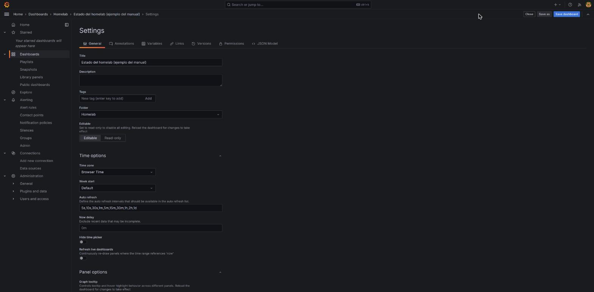

La pestaña **Variables** empieza vacía, con una breve explicación de para qué sirven:

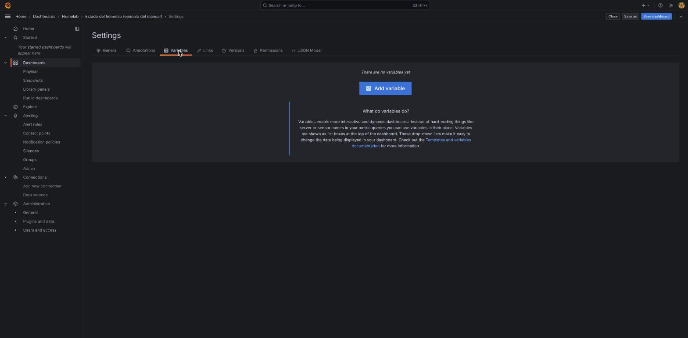

Al pulsar **+ Add variable**, el tipo por defecto es "Query" (el valor de la variable sale de una consulta real, no de una lista escrita a mano) — hay que elegir qué tipo de consulta hacer:

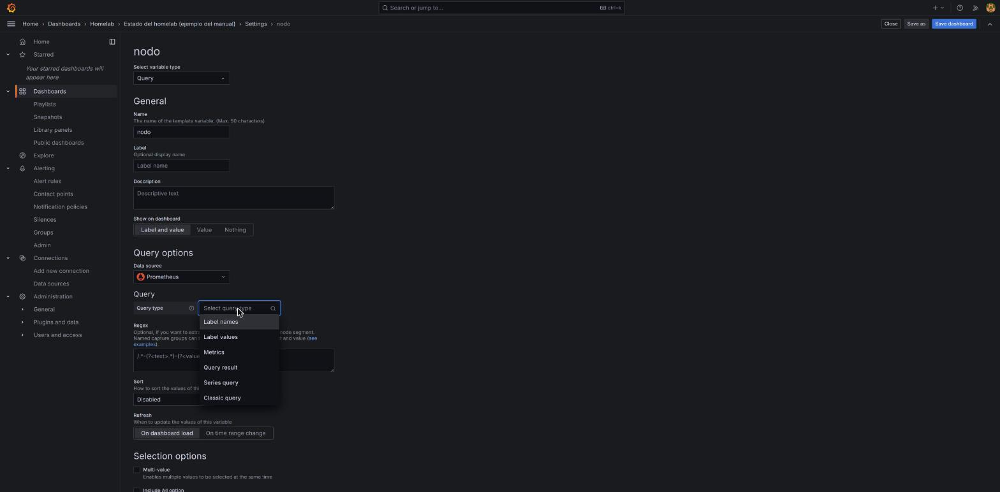

**Label values** es la opción correcta para "dame todos los valores reales que existen para una etiqueta" — en este caso, la etiqueta `node`, que ya usan las métricas de Prometheus en este clúster (documento 02). Con eso configurado, Grafana muestra una vista previa de los valores reales que tomará la variable — los 7 nodos, sin necesidad de escribirlos a mano:

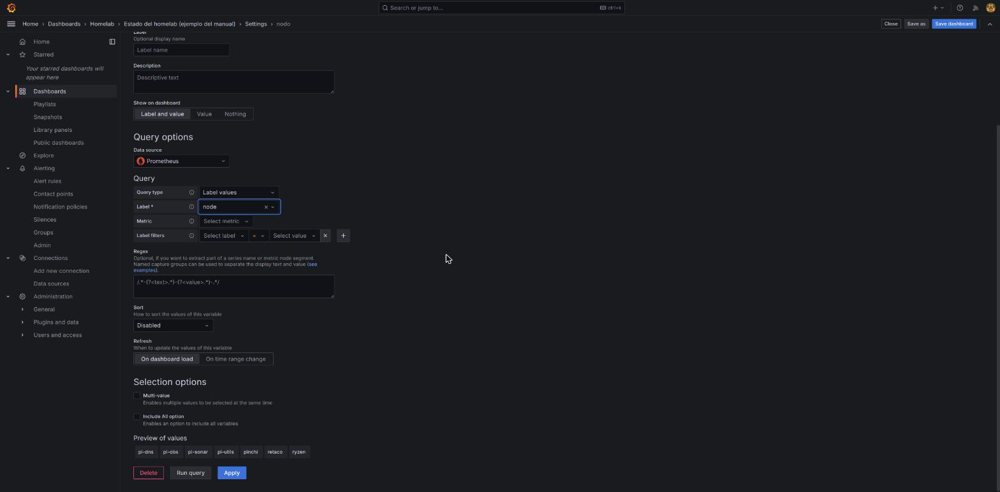

Tras aplicar, la variable queda registrada en la lista, y al guardar el dashboard Grafana pide confirmar el cambio (con un resumen de qué se ha modificado):

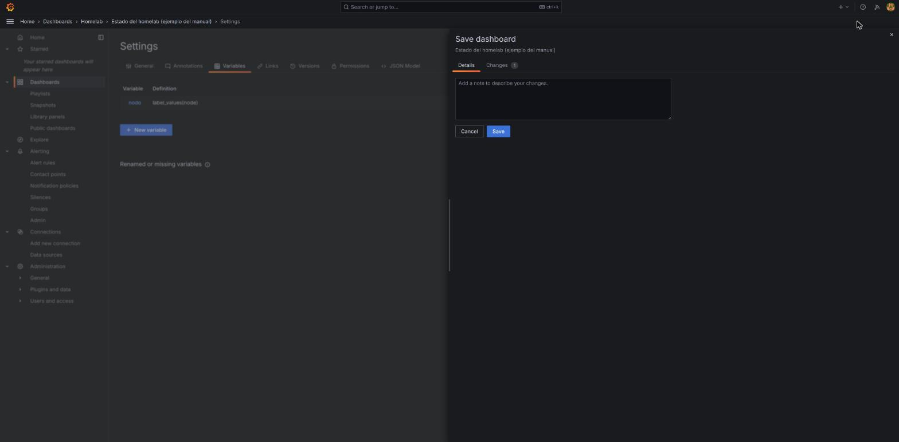

El resultado final: el dashboard ya muestra el selector **nodo** arriba a la izquierda, con los 7 nodos disponibles:

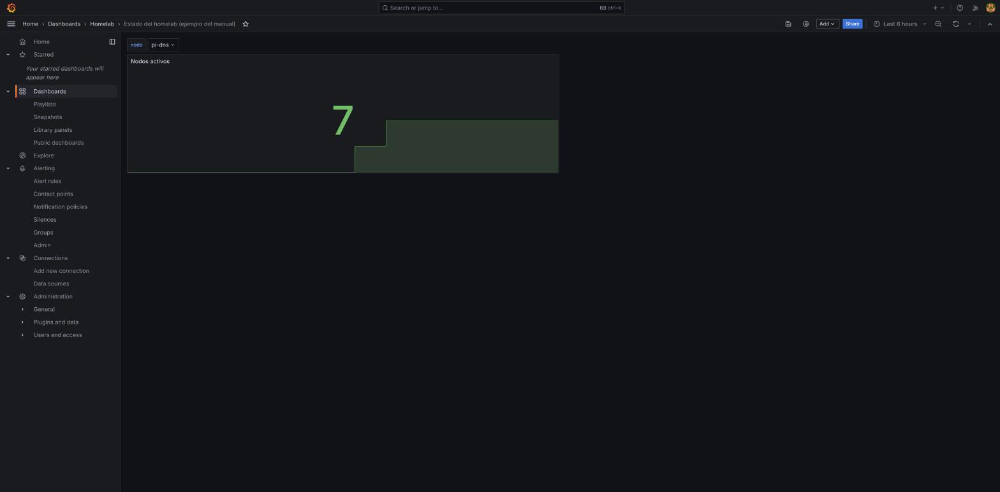

Para que un panel use la variable, se referencia en la query con `$nombre_variable` (en este ejemplo, `$nodo`) en vez de escribir el nombre de un nodo fijo — así el panel cambia solo al mover el desplegable.

## Resumen del flujo

1. Nuevo dashboard → Add visualization → elegir datasource.
2. Escribir la query (Code, no Builder, en cuanto la consulta deja de ser trivial).
3. Elegir el tipo de visualización según lo que se quiera transmitir (Stat para un número, Time series para tendencia, Table para desglose).
4. Aplicar, ajustar tamaño/posición, repetir para más paneles.
5. Guardar en la carpeta correcta (`Homelab` para dashboards propios de este clúster).
6. Si el dashboard debe servir para varios nodos/servicios, añadir una variable en vez de duplicar paneles.

El siguiente documento cubre cómo funcionan las alertas en este clúster — una extensión natural de "tengo un panel que me importa" a "avísame si ese valor se sale de rango".
