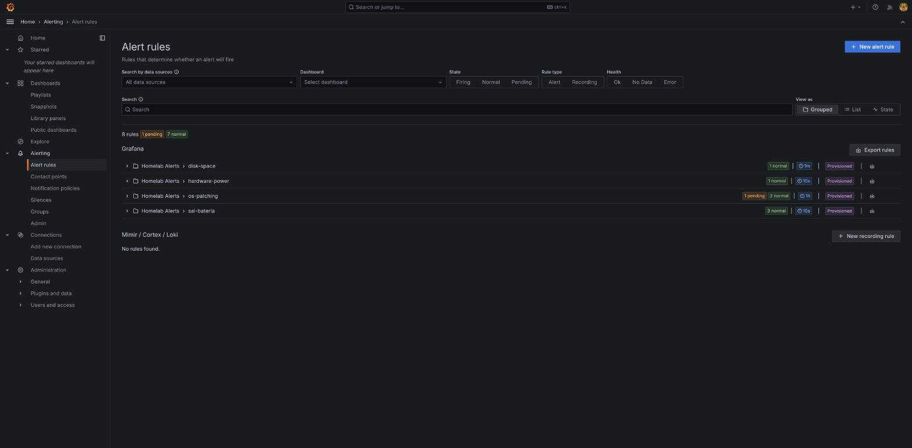
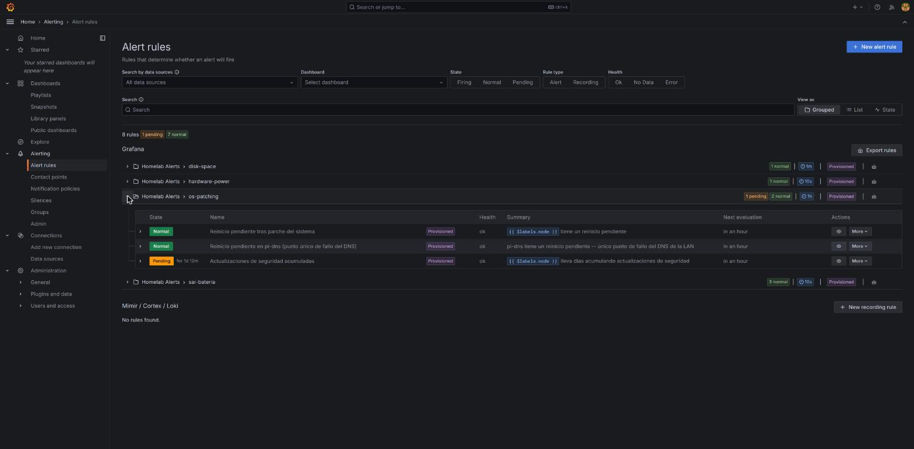
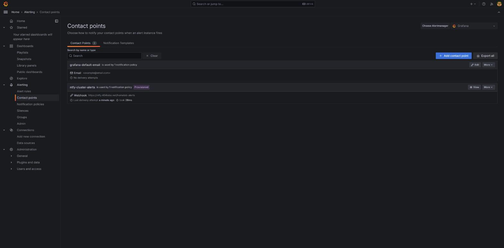
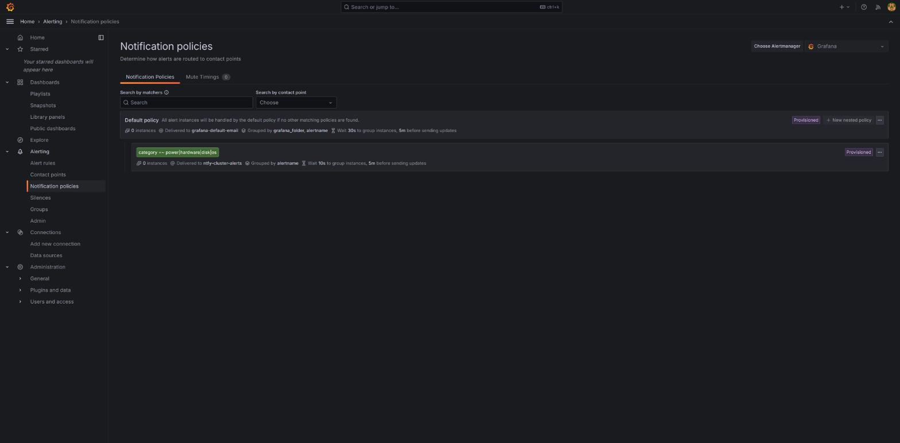

# 05 — Alertas

Grafana no solo muestra datos: puede vigilar una condición y avisar cuando se cumple. En este clúster, el sistema de alertas ya está en producción y conectado a un canal real de notificaciones — este documento explica cómo está montado y cómo añadir una regla nueva.

## Cómo está conectado hoy

El flujo de una alerta en este clúster tiene tres piezas, todas dentro de **Alerting** en la barra lateral:

1. **Alert rules** — la condición que se evalúa (p. ej. "¿el disco de un nodo supera el 85%?").
2. **Notification policies** — a qué contact point va cada alerta, según sus etiquetas.
3. **Contact points** — el destino real de la notificación.

En este clúster, el contact point real es **ntfy** — un servidor de notificaciones push autoalojado (mejora 4 del backlog, `docs/34-ntfy-notificaciones.md`). Cuando una alerta se dispara, llega como notificación push al móvil/escritorio de quien tenga la app de ntfy suscrita al tema del clúster — sin depender de mirar Grafana activamente.

## Alert rules — las reglas ya activas

**Alerting → Alert rules** lista todas las reglas, agrupadas por carpeta:

Las 8 reglas de este clúster viven en la carpeta **Homelab Alerts**, agrupadas por tema: `disk-space` (espacio en disco), `hardware-power` (alimentación/SAI), `os-patching` (parcheo del sistema operativo, mejora 36) y `sai-bateria` (batería del SAI ante un corte, mejora 5). Cada grupo se puede desplegar para ver el detalle de cada regla — estado actual, salud, próxima evaluación:

Este ejemplo real muestra tres reglas del grupo `os-patching`: dos en estado `Normal` y una en `Pending` (llevaba más de un día acumulando actualizaciones de seguridad pendientes por encima del umbral, a la espera de que se cumpla el tiempo mínimo sostenido antes de disparar de verdad — evita avisos por picos puntuales).

## Contact points — a dónde se notifica

**Alerting → Contact points**:

`ntfy-cluster-alerts` es el contact point real de este clúster — un webhook hacia el servidor ntfy propio (`https://ntfy.404labo.net/homelab-alerts`). El campo "Last delivery attempt" confirma si el último envío tuvo éxito, útil para comprobar que la integración sigue viva sin esperar a que salte una alerta real.

## Notification policies — qué regla va a qué contact point

**Alerting → Notification policies** decide, según las etiquetas de cada alerta, a qué contact point se envía:

La política real de este clúster enruta cualquier alerta cuya etiqueta `category` coincida con `power|hardware|disk|os` hacia `ntfy-cluster-alerts` — el resto cae en la política por defecto (email, sin usar en la práctica hoy). Al crear una regla nueva, la etiqueta `category` que se le asigne determina si llegará a ntfy o se quedará silenciosa en la política por defecto — un detalle fácil de olvidar y que vale la pena revisar al dar de alta una regla.

## Crear una regla de alerta nueva

Desde **Alerting → Alert rules → New alert rule**:

1. **Condición**: una query a Prometheus (o Loki) que devuelva un valor, más un umbral (p. ej. `node_filesystem_avail_bytes / node_filesystem_size_bytes * 100 < 15` para "menos del 15% de disco libre").
2. **Evaluación**: cada cuánto se comprueba la condición, y durante cuánto tiempo debe mantenerse cierta antes de pasar a `Firing` (el campo `for`, que evita alertas por picos de un solo instante — mismo patrón visto en la regla `os-patching` de arriba).
3. **Etiquetas**: aquí es donde se pone `category` con un valor que ya recoja la notification policy existente (`power`, `hardware`, `disk` u `os`) para que llegue a ntfy sin tener que crear una política nueva — o un valor distinto, si se quiere una ruta de notificación separada.
4. **Resumen y descripción**: el texto que llegará en la notificación — cuanto más específico, más útil el aviso (compárese con los resúmenes reales ya vistos arriba, que incluyen el nombre del nodo vía plantilla `{{ $labels.node }}`).
5. **Carpeta**: en este clúster, `Homelab Alerts` — mantiene todas las reglas juntas y organizadas.

Tras guardar, la regla nueva aparece en la lista junto a las demás, con su propio estado y salud, exactamente como las capturas de arriba.

El siguiente y último documento cubre la parte de configuración y administración — data sources, carpetas, y una particularidad importante de este clúster: buena parte de lo que se ve en la UI está gestionado por fichero, no a mano.
