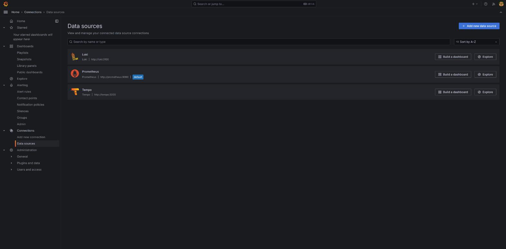
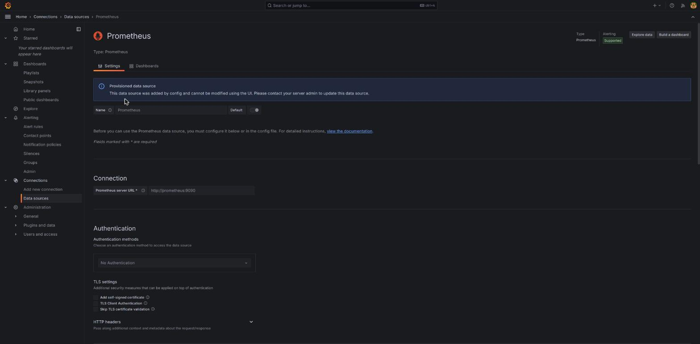

# 06 — Administración y configuración

Lo que cubre este documento normalmente no hay que tocarlo en el día a día — pero conviene saber que existe, y sobre todo entender una particularidad real de este clúster antes de intentar cambiar algo desde la interfaz.

## Data sources

**Connections → Data sources** lista las tres fuentes de datos conectadas:

Al entrar en el detalle de cualquiera (por ejemplo, Prometheus), aparece un aviso que es clave para entender cómo se gestiona la configuración en este clúster:

> **Provisioned data source** — This data source was added by config and cannot be modified using the UI. Please contact your server admin to update this data source.

## Por qué esto es así en este clúster (y qué significa para ti)

Las tres datasources (Prometheus, Loki, Tempo), los dashboards importados y el propio ("Actualizaciones pendientes"), y las 8 reglas de alerta con sus contact points y notification policies — **todo** está definido en ficheros de texto dentro del repositorio de este clúster (`pi-obs/config/grafana/`), montados de solo lectura dentro del contenedor de Grafana. Esto se llama **aprovisionamiento por fichero**, y es deliberado: cualquier cambio hecho desde la UI a una de estas piezas se perdería en el próximo redespliegue del stack, porque el fichero de origen no se habría tocado.

Qué implica en la práctica:

- **Las tres datasources no se pueden editar desde la UI** — hay que modificar `pi-obs/config/grafana/datasources.yml` en el repositorio y redesplegar el stack (`docker-swarm/stacks/pi-obs/`).
- **Las reglas de alerta, contact points y notification policies tampoco** (llevan la etiqueta `Provisioned`, visible en las capturas del documento 05) — se editan en `pi-obs/config/grafana/alerting/*.yml`.
- **Los dashboards importados de la comunidad y el dashboard propio del clúster sí se pueden editar desde la UI** con normalidad — no están marcados como aprovisionados de la misma forma, aunque el dashboard propio ("Actualizaciones pendientes") también tiene una copia real en el repositorio (`pi-obs/config/grafana/dashboards/json/actualizaciones-pendientes.json`) que conviene mantener sincronizada si se le hacen cambios importantes, para no perderlos en un redespliegue futuro.
- **Un dashboard nuevo que crees tú** (como el del documento 04) es libre — vive en la base de datos interna de Grafana, no en ningún fichero del repositorio, y sobrevive a un redespliegue sin problema. Solo hace falta tenerlo en cuenta si alguna vez se hace una restauración completa desde cero: ese dashboard no está versionado en git a menos que se exporte a mano (**Dashboard settings → JSON Model**, copiar y guardar como fichero).

## Carpetas

**Dashboards** muestra la estructura de carpetas — hoy, `Homelab` (dashboards propios) y `Homelab Alerts` (reglas de alerta), vistas ya en los documentos 03 y 05. Una carpeta se gestiona igual que un dashboard: se puede crear una nueva desde **Dashboards → New → New Folder**, moverla, o ajustar permisos sobre ella (**Folder actions → Manage permissions**) — en un clúster de un solo operador, los permisos por defecto (el usuario `admin` con acceso total) no suelen necesitar ningún ajuste.

## Qué hay bajo Administration

La sección **Administration** de la barra lateral cubre usuarios, organizaciones y plugins — en un clúster de un solo operador con una única cuenta `admin`, no hay nada real que gestionar ahí hoy. Se menciona solo para que, si el clúster llegara a tener más de un usuario en el futuro, se sepa dónde crear cuentas nuevas y asignarles permisos.

## Resumen: si algo no cambia al editarlo en la UI

Antes de asumir que la UI está rota, la primera pregunta es: ¿esto es una datasource, una regla de alerta, un contact point o una notification policy? Si es así, el cambio real va en el fichero correspondiente dentro de `pi-obs/config/grafana/` de este repositorio, seguido de un redespliegue del stack `pi-obs` — no en la interfaz de Grafana.
